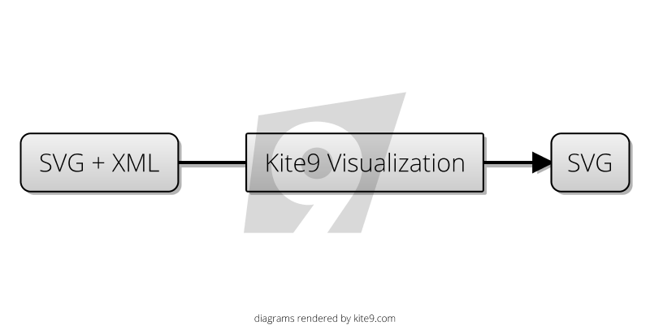
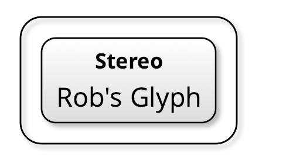

Kite9 is an SVG Visualization Library for converting XML into SVG, useful for creating diagrams and user interfaces.



For examples, head over to the [Risk-First](riskfirst.org) website to see some example Kite9 diagrams.

## Basic Features

- [Sizing Instructions](docs/Sizing.md) Such as `horizontal-align`, `min-width`, `padding` and `margin`.  These are used in HTML CSS, but are now available for use in SVG.
- [Various Element Types](docs/Element-Types.md) such as links, text, containers, decals, and various ways to layout and transform them.
- [Templating](docs/Templating.md).  Use the `kite9-template` CSS directive to specify an SVG template to use to render a piece of XML.
- [Links](docs/links.md). You can link elements together to create graphs.
- [Text Flow](docs/Text.md). You can intelligently size SVG elements according to the text they contain, and flow text within the element a la HTML.
- [Grids](docs/Grids.md).  It's possible to add SVG elements to a grid, and have the grid resize to contain them all.

## Batik

Kite9 is written in Java, and heavily based on [Apache Batik SVG Toolkit](https://xmlgraphics.apache.org/batik/), which supplies parsers for SVG and CSS, as well as conversion from SVG primitives to Java Graphics2D primitives for sizing and layout.

## General Principles

This is a transform process.  The input to the transform in any XML document.  However, in order for any transformation to take place, elements need to be styled using CSS to indicate to Kite9 how to display them.  

For this reason, Kite9 defines plenty of it's own CSS directives, prefixed with `kite9`.  Have a look at the stylesheet example [here](https://github.com/robmoffat/kite9-visualization/blob/master/src/test/resources/stylesheets/designer.css) and it's related 
[template.svg](https://raw.githubusercontent.com/robmoffat/kite9-visualization/master/src/test/resources/stylesheets/template.svg?token=AAitYUArM77qTGIoIE--3CCXRN7Fob1Gks5cfnnxwA%3D%3D)

A CSS stylesheet can be included in SVG using `<style>` and either in-line or `@import`ed, like so:

```xml
<svg:svg xmlns:svg="http://www.w3.org/2000/svg">
  <svg:defs>
    <svg:style type="text/css"> 
      @import url("stylesheets/designer.css");
    </svg:style>
  </svg:defs>
    
<diagram xmlns="http://www.kite9.org/schema/adl" id="The Diagram">
  <context id="Context" rank="0" bordered="true">
    <glyph id="1-rob's glyph">
      <stereotype id="1-rob's glyph-stereo">Stereo</stereotype>
      <label id="1-rob's glyph-label">Rob's Glyph</label>
     </glyph>
  </context>
</diagram>
</svg:svg>
```

With the directives contained in the `designer.css` stylesheet, this SVG+XML can be rendered as:



Note a few features:

 - Drop shadow
 - Sizing of the Glyph element, according to it's text.
 - Centering and vertical flow of text.
 - All with SVG.

## In Action

Take a look at [Risk First](riskfirst.org), which heavily uses Kite9 to lay out diagrams.

## Online

tbc.

## Usage

Kite9 implements Batik's `Transcoder` interface, called `Kite9SVGTranscoder`.

Instructions for using this [are here](https://xmlgraphics.apache.org/batik/using/transcoder.html)

It transcodes XML into SVG, (rather than into JPEG as shown in the example).  You should modify the output filename accordingly.
