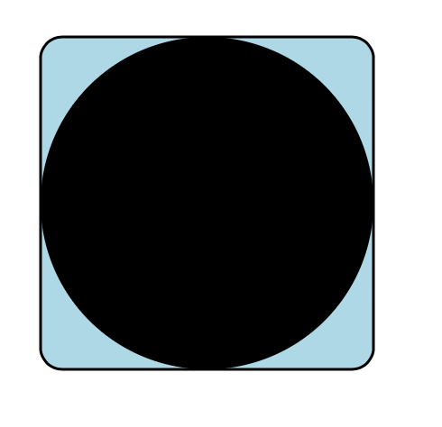

## `kite9-type`

Must be applied to all elements, otherwise an exception is thrown.  Legal values are:

 - `diagram`: indicates that the element is a whole diagram, all the content is processed in one go.
 - `text`: indicates that the text content of the element should be rendered as SVG `text`.
 - `link`: indicates that the element should be rendered as a link between two other elements.
 - `link-end`: part of a link, that tells it where to join to.  
 - `none`: ignore this element from the transform
 - `svg`: element contains SVG that should be output onto the diagram.  The size of the rendered element will be large enough to contain the SVG within it.
 - `container`: element is a container for other elements.  The size of the element will depend on it's contents (possibly other `text`, `svg` or `container` elements).

Generally, you will have an SVG document containing a single `diagram` element. This will contain a nested structure of `container`s, with `svg` and `text` elements inside them.  

### Output

 - When rendered, all elements are turned into SVG `<g>` tags apart from `none` elements, which are not rendered at all.  
 - The original structure of the input XML document is partially preserved in the structure of the `<g>` elements.
 - The original element `id` is kept.
 - The original element tag is added as a class, prefixed with `kite9-`.
 
Example:

```xml
<a style="kite9-type: diagram" id="one">
  <b style="kite9-type: container" id="two">
    <c style="kite9-type: svg" id="three">
      <svg:circle ... />
    </c>
  </b>
</a>
```

Will be rendered as:

```xml
<svg:g class="kite9-a" id="one">
  <svg:g class="kite9-b" id="two">
    <svg:g class="kite9-c" id="three">
      <svg:circle ... />
    </svg:g>
  </svg:g>
</svg:g>
```


## `kite9-sizing`

Currently, this can be either `minimize` or `maximize`.  If minimize, the element will occupy the smallest amount of space in the output.  However, if set to maximize, the element will consume free space around itself as far as it can.

Default is `minimize`.

## `kite9-usage`

When laying out a `container`, usually, the contents are all treated the same way, as regular elements of content which must be contained (see [kite9-layout](#kite9-layout), below).   

However, sometimes, a container might have other element types within it:

- `label`:  the element is a label for the container.  Currently, this is placed along the bottom edge of the container.
- 'decal': a decal is an element placed _over_ the container, and is rendered after the container size is known.  This means the `decal` can "decorate" the container.   Decals don't therefore affect the size of the container.

## `kite9-layout`

For elements with `kite9-type=container`, you can specify how the contents will be laid out.  Currently, the following are supported:
	
 - `horizontal`:  contents are placed in the container in any horizontal order.
 - `vertical`: contents are placed in the container in any horizontal order.
 - `left`: contents are laid out right-to-left;
 - `right`: contents are laid out left-to-right;
 - `up`:  contents are laid out bottom-to-top;
 - `down`: contents are laid out top-to-bottom;
 - `grid`: See [Grids](Grids.md)

If no container layout is specified, there are no constraints about where elements sit within the container, and Kite9 will attempt to minimize links and link crossings between elements within the container and outside it.

## `kite9-transform`

This determines how SVG content is placed within the `<g>` element.  Usually, the `<g>` will get a transform so that the content appears in the right place.

This can be:

 - `none`: No transform, just outputs the SVG.
 - `position`: Positions the 0,0 point of the contained SVG at the top-left corner of the containing element.  This is the default for `kite9-type=text` contents.
 - `crop`: Positions the top-leftmost point of the contained SVG at the top-left corner of the containing element.  This is the default for `kite9-type=svg` and most other things.
 - `rescale`:  This is useful for decals, and it sizes the decal the same as the containing element.
 
## Example 1

This example draws an ellipse inside a light blue rounded rectangle.

The following input contains a diagram, which has a `<rect>` element as a container for the `<shape>` element (which contains a circle).  In order to be able to "see" the container, we add the `<decal>` to it, which is able to display an SVG `<rect>` element, the same size as the circle.  [Templating](Templating.md) allows the `width="#{$width}" height="#{$height}"` settings to be resolved after the main circle is sized.

Second, note how we are using "crop" for the ellipse.  Although it is scaled (with the `scale(3,3)` transform), it still completely occupies the `<rect>`.


```xml
  <svg:svg xmlns:xlink="http://www.w3.org/1999/xlink" xmlns:svg="http://www.w3.org/2000/svg">
   <diagram xmlns="http://www.kite9.org/schema/adl" id="The Diagram">
      <rect style="kite9-type: container;  ">
		<decal style="kite9-usage: decal; kite9-type: svg; ">
		  <svg:rect x="0" y="0" width="#{$width}" height="#{$height}" rx="8" ry="8" style="fill: lightblue; " />
		</decal>
		<shape style="kite9-type: svg; ">
			<svg:g transform="scale(3, 3)">
				<svg:ellipse cx="20" cy="20" rx="20" ry="20" stroke="black" stroke-width="1"/>      
			</svg:g>      
		</shape>    
      </rect>
  </diagram>
</svg:svg>
```

We can output:

```xml
<svg>
  ...
  <g id="The Diagram" debug="position: ; horiz: CENTER; vert: CENTER; sizing: MINIMIZE; layout: null; d-bounds: [0.0,0.0] [153.0,153.0]; " class=" kite9-diagram" kite9-elem="diagram">
    <g style="kite9-type: container;" class="kite9-rect" kite9-elem="rect" transform="translate(15.0,15.0)">
      <g style="kite9-usage: decal; kite9-type: svg; " debug="" class=" kite9-decal" kite9-elem="decal">
        <rect x="0" y="0" width="123.0" style="fill: lightblue; " rx="8" class="glyph-back" ry="8" height="123.0"/>
      </g>
      <g style="kite9-type: svg; " class="kite9-shape" kite9-elem="shape" transform="translate(1.5,1.5)">
        <g transform="scale(3, 3)">
          <ellipse rx="20" ry="20" stroke-width="1" cx="20" cy="20" stroke="black"/>      
        </g>    
      </g>   
    </g>
  </g>
</svg>
```



 
