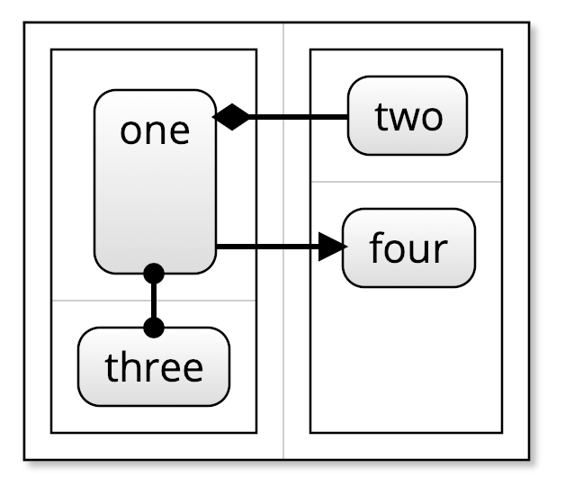

When `kite9-layout: grid` is set for a container, various other properties come into play.

## `kite9-occupies`

_Also:_ `kite9-occupies-x`, `kite9-occupies-y`

Allows you to set, within a grid container, where this element will be.  Can be a single value or from and to indices.

e.g.

```xml

<grid style="kite9-type: container; kite9-
  <element style="kite9-occupies-x: 1; kite9-occupies-y: 2">Some Value</element>
  <element style="kite9-occupies: 1 2 1 1; ">Some Other Value</element>
```


## `grid-size`

_Also:_ `grid-rows`, `grid-columns`

Sets the bounds for the grid element.  If `kite9-occupies` exceeds these, these are ignored.


## Templating With Grids

XPath variables for grids, tbc.  (Would allow you to create nice decals over grids).

## Example

This is a complex example for now.  Here, we have a doubly-nested grid:



More to come.