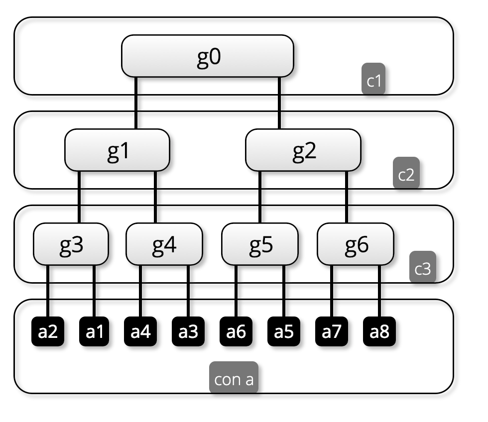
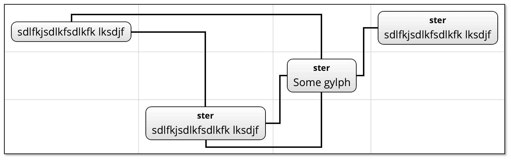
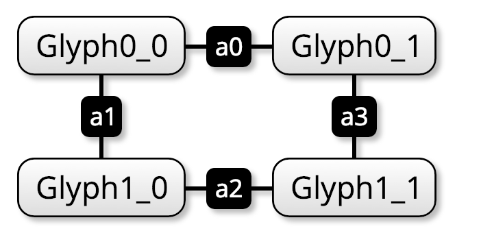
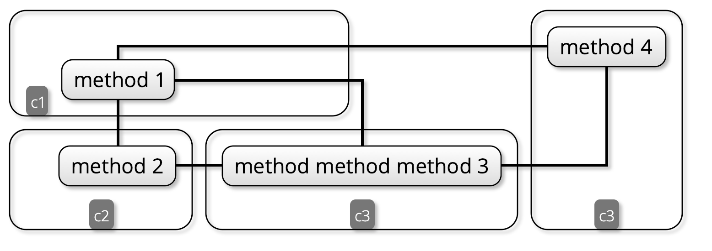
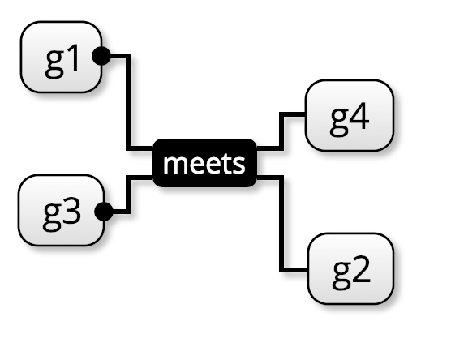

Kite9 uses least-cost optimisation algorithms to place diagram elements to minimize link distances.

It supports labelling of links and decoration of the ends of links, as shown in the following examples:







**Link Syntax is subject to change. **

## Adding a Link / Link End

(Subject to change)

A link needs to have `kite9-type: link` css property set.  e.g.

```xml
<svg:svg>
  ...
  <diagram xmlns="http://www.kite9.org/schema/adl" id="The Diagram">
  <glyph id="one">
    <label id="one-label">One</label>
  </glyph>
  <glyph id="two">
    <label id="one-label">Two</label>
  </glyph>
  <link id="tl1" style="kite-type: link">
    <from reference="meets" />
    <to reference="one" />
  </link>
</diagram>
</svg:svg>
 
Currently, links must be nested as child of the diagram element. 

## Draw Direction

Currently uses the attribute `drawDirection` with value `UP`, `DOWN`, `LEFT`, `RIGHT` or none meaning it can bend.

## Labels

- Labels are defined as sub-elements `<fromLabel>` and `<toLabel>`.  (TO FIX)

## Terminators

- 


## Improvement

Some notes on how this needs to get better:

* Links are pretty hard-wired right now which is bad.   What would be better is if there was a property that could say “find the reference here”, using an XPath maybe.  
* What about labels?  Again, maybe the same thing.
* Terminators should actually just be part of the same xpath?  (Again, doesn’t really matter I guess)

What would they be?

- Could be either an id (#id) or an xpath

- kite9-link-from: ./to[reference]
- kite9-link-to:   ./from[reference]
- kite9-link-from-label: ./fromLabel
- kite9-link-to-label: ./toLabel
- kite9-link-from-terminator: ./to
- kite9-link-to-terminator: ./from
- kite9-link-direction: up, down, left, right or ./@drawDirection

(These could be the defaults)

This is probably a couple hours work change

