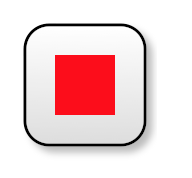

## `kite9-min-size`

_Also:_ `kite9-min-width`, `kite9-min-height`

Allows you to specifiy the size of the rectangular elements (i.e. not links).  In px, in, whatever.

If the contents is too big, the container will grow accordingly (this is a minimum bounds only).

e.g.

```css
box {
	kite9-min-size: 100px 100px;
}
```

## `kite9-margin`

_Also:_ `kite9-margin-left`, `kite9-margin-right`, `kite9-margin-up`, `kite9-margin-down`

Specifies margins around an element.  Sibling elements can't get any closer than this.  If a sibling also specifies a margin, then the larger of the two is used to set the minimum distance.

## `kite9-padding`

_Also:_ `kite9-padding-left`, `kite9-padding-right`, `kite9-padding-up`, `kite9-padding-down`

Specifies minimum distance between the size of an element to it's child elements.


### Example



Is achieved with:

```xml
<svg:svg>
  ...
  <diagram xmlns="http://www.kite9.org/schema/adl" id="The Diagram">
    <rect style="kite9-type: container; kite9-padding: 10px; ">
      <decal style="kite9-usage: decal; kite9-type: svg; ">
        <svg:rect x="0" y="0" width="#{$width}" height="#{$height}" rx="8" ry="8" style="fill: url(#glyph-background); " class="glyph-back"/>
      </decal>
      <shape style="kite9-type: svg; ">
        <svg:rect x="0" cy="0" width="20" height="20" fill="red" stroke-width="0"/>      
      </shape>    
    </rect>
  </diagram>
</svg:svg>
```

- The padding on `<rect>` means that the contained `<shape>` element has a 10px pad around it.

	
	