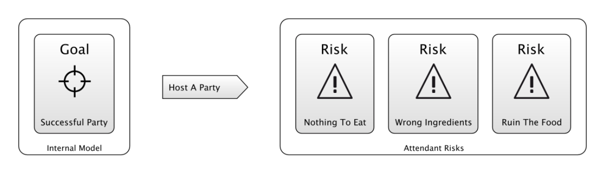

## `kite9-template`

This css directive allows you to replace the element of xml with the one from the template.  For example, in the css stylesheet for the examples, we have:

```css
glyph {
	kite9-type: container;
	kite9-layout: down;	
	kite9-template: url(template.svg#glyph);
	kite9-padding: 6px 10px 6px 10px; 
	kite9-margin: 10px;
	kite9-connection-align: 50%;
}
```

This says that when we render a `<glyph>` element in the output, we should use this part of the template from `template.svg`:

```xml
<template id='glyph'>
  <back style='kite9-usage: decal; kite9-type: svg; '>
    <svg:rect x='0' y='0' width='#{$width}' height='#{$height}' rx='8' ry='8' style='fill: url(#glyph-background); ' class="glyph-back" />
  </back>
  <svg:g class="glyph">
    <contents />
  </svg:g>
</template>
```

This means that as a result of having this in the input xml:

```xml
  <glyph id="1-rob's glyph">
    <label id="1-rob's glyph-label">Rob's Glyph</label>
  </glyph>
```

We get this in the output:

```xml
<g id="1-rob's glyph" class="kite9-glyph" kite9-elem="glyph" transform="translate(15.0,15.0)">
  <g style="kite9-usage: decal; kite9-type: svg; " debug="" class=" kite9-back" kite9-elem="back">
    <rect x="0" y="0" width="99.0" style="fill: url(#glyph-background); " rx="8" class="glyph-back" ry="8" height="29.0"/>
  </g>
  
  <g class="glyph">    
    <g id="1-rob's glyph-label" class=" kite9-label" kite9-elem="label" transform="translate(10.0,6.0)">
      ...
    </g>
  </g>

</g>
```

### `<contents />`

This element in the XML (within the ADL namespace (`http://www.kite9.org/schema/adl`) though arguably should be done by CSS) instructs the templater to put in the original content of the xml element at this point.

This takes an optional `xpath` attribute, which allows you to select a subset of the whole element to place.

As you would expect, this placed content can _also_ be templated in the same way with `kite9-template`.

### Attribute replacement

The templating engine also supports attribute replacement: Where `#{}` is used, an XPath Expression will be resolved.   Additionally, further XPath variables are also set:

 - `$width` / `$height` : the width/height of the containing element (only available to decals, since it isn't known until output).  In pixels
 - `$pt`, `$cm`,`$em`, `$in`, `$ex`,`$px`:  Various client-specific sizes, in pixels.  Therefore, `$px` = 1.  
 
In combination, this allows us to create interesting container shapes like this:

```xml
<template id="action">
    <back style='kite9-usage: decal; kite9-type: svg; '>
      <svg:polygon points='0 0, #{$width - (15 * $pt)} 0, #{$width} #{$height div 2}, #{$width - (15 * $pt) } #{$height}, 0 #{$height}' style='fill: url(#risk-background); stroke: black; stroke-width: 1pt;' />
    </back>
    <front style="kite9-usage: regular; kite9-type: container; kite9-layout: down; 	kite9-padding: 10pt; kite9-padding-right: 40pt; ">
      <title>
      	<contents />
      </title>
    </front>
  </template>
``` 

Note how the `<polygon>` is constructed, dependent not only on the size of the container it is in, but also on the `$pt` size.  (This creates a signpost kind of shape like the ones used [here](https://riskfirst.org/A-Simple-Scenario)).  


 