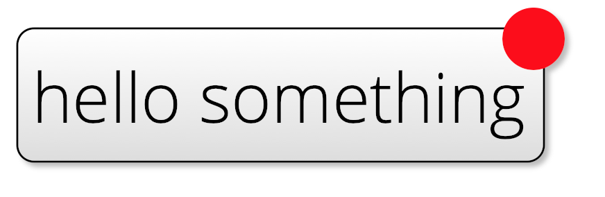
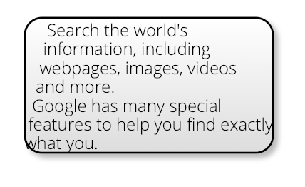

Generally, kite9 will support all the usual SVG CSS attributes for text, such as `font-family`, `font-size` etc.

So you can do things like this:

```xml
<svg>
  ...
  <diagram xmlns="http://www.kite9.org/schema/adl" id="The Diagram">
    <rect style="kite9-type: container; kite9-padding: 10px; ">
      <decal style="kite9-usage: decal; kite9-type: svg; ">
        <svg:rect x="0" y="0" width="#{$width}" height="#{$height}" rx="8" ry="8" style="fill: url(#glyph-background); " class="glyph-back"/>
      </decal>
      <text style="kite9-type: text; font-family:  opensans-light-webfont; font-size: 33px;">
        hello something
      </text>
      <badge style="kite9-usage: decal; kite9-type: svg; kite9-transform: none; ">
        <svg:circle cx="#{$width - (5 * $px)}" cy="5" r="15" fill="red"/> 
      </badge>
    </rect>
  </diagram>
</svg:svg>
```

Note there are two decals here, and they are both sized according to the text "hello something".



## `kite9-text-width`

Not implemented yet, but see below for workaround (just use a rect instead of a path)

## SVG 1.2 Flow Regions

Since batik supports SVG regions, we can use those to flow text like this:



This is achieved by adding a `<svg:flowRegion>` element within the Kite9 text element:

```xml
<svg:svg>
  ...
  <diagram xmlns="http://www.kite9.org/schema/adl" id="The Diagram">
    <rect style="kite9-type: container;  ">
      <decal style="kite9-usage: decal; kite9-type: svg; ">
        <svg:rect x="0" y="0" width="#{$width}" height="#{$height}" rx="8" ry="8" style="fill: url(#glyph-background); " class="glyph-back"/>
      </decal>
      <text style="kite9-type: text; font-family:  opensans-light-webfont; font-size: 8px;  ">
        <svg:flowDiv><svg:flowPara>Search the world's information, including webpages, images, videos and more.</svg:flowPara> <svg:flowPara>Google has many special features to help you find exactly what you.</svg:flowPara></svg:flowDiv>
        <svg:flowRegion>          
          <svg:path d="M100,50L50,300L250,300L200,50z"/>      
        </svg:flowRegion>      
      </text>
    </rect>
  </diagram>
</svg:svg>

You can put in whatever shape you like, and Kite9 will fill it with text, and render it back for the browser to show in regular (non 1.2) SVG.

Also shown in the example above, you can use `<svg:flowDiv>` to break the text up into paragraphs to be flowed.  Again, this is optional.
