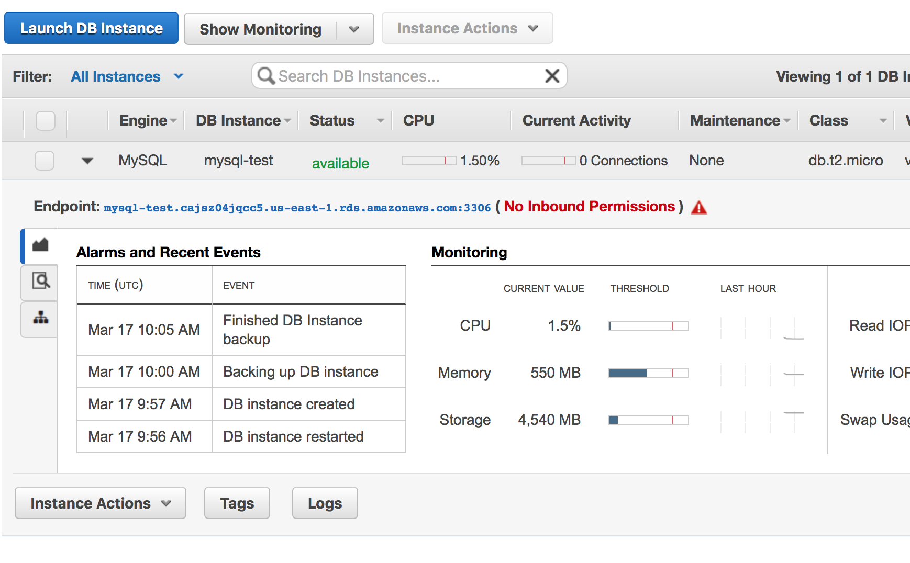
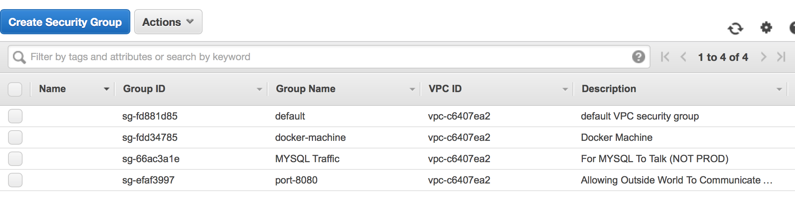

# 5th March 2016:  Sprint 1: Spring Boot, Docker, Amazon ECS #

The goals of this sprint are:

1.  Build a simple Spring Boot application for Kite9 - Redux. 
2.  Check this into Github.
3.  Produce some Github pages containing this blog.
4.  Add some JPA-managed entities, (the same ones as exist in the Grails Kite9)
5.  Add REST support.
6.  Write a test to ensure that:
  - We can persist some entities in the database.
  - We can retrieve the entity.
  - We can delete the entity.
  - Via REST api.
7.  The Test should be dual-purpose: it can be run as a Unit test on my developer machine or run against an integration build.
8.  Deploy Kite9 as a clustered app to some Cloud service.

## Creating a Spring Boot App ##

Spring Boot is a Java framework that does a lot of the groundwork of doing the best practices of
a Java application from the get-go.  It's strongly recommended.  Architecturally, the guiding 
principle of Kite9 Redux is the [12-Factor App](http://12factor.net).  This is well worth a read. 
Spring Boot really helps you to start off on the right track with these guidelines:
 - It builds a standalone JAR file, containing all the dependencies it needs.
 - It does some very intelligent things around configuration, allowing you to derive configuration from environment variables, amongst other things.\
 - It contains sensible default logging (using Apache Commons Logging), which logs to Stdout.
 
## Stuff To Include

[start.spring.io](http://start.spring.io) is a great place to begin building your project.   I created my 
initial project (including a maven `pom.xml`) using that, including the following dependencies:

 - `spring-boot-starter-actuator` : Lots of Spring components around monitoring, health-checking, JMX etc.
 - `spring-boot-starter-data-jpa` : Because, we don't want to write any SQL.. This manages data-sources and so on.
 - `spring-boot-starter-data-rest` and `spring-boot-starter-hateoas` : Provides a REST API for our Domain objects... demonstrated below.
 - `spring-boot-devtools` : Possibly lots of things, but mainly it reloads your application when it sees files change.  Useful for GUI development.
 - `spring-boot-starter-mail` :  We will eventually be emailing people for password resets, etc.
 - `spring-boot-starter-security` : We are going to secure the main web pages of the application.  May happen in this sprint but unlikely.
 - `spring-boot-starter-web` : Embeds the Tomcat servlet engine, so we can serve up web pages. 
 - `spring-boot-starter-websocket` : Websockets are used for server-push messaging to the web client.
 - `h2` : An in-memory database for testing with.
 - `spring-boot-starter-test` : Contains JUnit extensions so that we can build tests that set up the Spring Application Context.
 
## Generated Main Class

Spring Boot provides a single class as the entrance point of your application.  It looks like this:

```
@SpringBootApplication
public class Kite9ServerApplication {

	public static void main(String[] args) {
		SpringApplication.run(Kite9ServerApplication.class, args);
	}
}
``` 

We have here the usual java `main` method, which invokes `SpringApplication`.  This then notices the class
annotation of `SpringBootApplication`, and kicks off a class-path scan looking for application components.

A note about this quickly: if we label a class with `@Component`, then one of those will be instantiated in the application when it starts.
These are usually called 'beans' in the Java world, and you can also use `@Bean` if you prefer that synonym.

By the same token, classed annotated with `@Configuration` will be used to configure Spring.  

## Creating an Entity

So, the first entity will be `Project`.  It's going to look like this:

```java
@Entity
public class Project extends AbstractJPAEntity {
	
	String title;
	String description;
    String stub;
	String secret = createRandomString();
	
	...
```

Projects are primary-keyed with a `Long`.  Because lots of the entities in Kite9 have this, it's in a superclass
called `AbstractLongIdEntity`:

```java
@MappedSuperclass
public class AbstractLongIdEntity {

	@Id
	@GeneratedValue(strategy=GenerationType.IDENTITY)
	Long id;

	public Long getId() {
		return id;
	}
```
 
This also has `equals()` and `hashCode()` methods in there, which use the `id` column.  

## Repositories

In order to build our REST test quickly and easily, we're going to use the built-in repository 
support provided by Spring:

```java
@Component
public interface ProjectRepository extends CrudRepository<Project, Long> {

}
```

This is enough information for Spring Boot to create a repository to serve up Projects when we need them.
Also, because we have enabled REST, it's enough to provide a REST api.  In order to (later) simplify our
security concerns, I want all of the REST resources served from a uri starting with `api`.  This can be done 
with a Spring configuration bean:

```java
@Configuration
public class RestDataConfig extends RepositoryRestConfigurerAdapter {

  @Override
  public void configureRepositoryRestConfiguration(RepositoryRestConfiguration config) {
    super.configureRepositoryRestConfiguration(config);
    config.setBasePath("/api");
  }
}
```

Spring Boot contains a lot of 'convention over configuration'.  By default, it looks for an `@Component` implementing
`RepositoryRestConfigurer`.  If it doesn't find one, it uses a basic `RepositoryRestConfigurerAdapter`.  But, since
we have provided one, it uses ours.

This is a really hard part of Spring Boot to get used to:  *a lot of components* get created for you, by default, and
by-and-large this happens without you seeing it.  A common mistake is to re-define beans that are already going to 
exist with your setup, and then you often end up with multiple beans conflicting with one another.

## Writing A Test ##

Here is the test of our newly-defined Project entity and repository. This test is going to:
 - Create a new project with a POST method.
 - Check that it's returned correctly.
 - Re-retrieve it using a GET request.
 - Then, delete it.

```java
@IntegrationTest
@RunWith(SpringJUnit4ClassRunner.class)
@SpringApplicationConfiguration(classes = Kite9ServerApplication.class)
@WebAppConfiguration
public class TestProjectsRoundTripRest {

	RestTemplate restTemplate = new RestTemplate(new SimpleClientHttpRequestFactory());
	
	@Value("${application.url:http://localhost:8080}")
	private String urlBase;
	
	@Test
	public void testProjectIsReturned() {
		String url = urlBase + "/api/projects";
		Project pIn = new Project("Test Project", "Lorem Ipsum", "tp1");
		ResponseEntity<Project> pOut = restTemplate.postForEntity(url, pIn, Project.class);
		checkEquals(pIn, pOut.getBody());

		// retrieve it again
		Project pGet = restTemplate.getForObject(pOut.getHeaders().getLocation(), Project.class);
		checkEquals(pIn, pGet);

		// delete it
		restTemplate.delete(pOut.getHeaders().getLocation());
	}
```

Some observations:
 - `@RunWith(SpringJUnit4ClassRunner.class)` : Tells JUnit to use the spring runner.  Makes all the other annotations work.
 - `@IntegrationTest` : This tells spring to start up the entire application, not just beans we mention in the configuration.  
 - `@WebAppConfiguration` : Tells spring that the test will use tomcat, so start that.  I have no idea why @IntegrationTest doesn't cover this.
 - `@SpringApplicationConfiguration(classes = Kite9ServerApplication.class)` : Tells it the application we are testing.
 - `RestTemplate` : This is a spring class which handles marshalling and unmarshalling from JSON.  Really handy.
 - `@Value` : We are going to use this later to re-purpose the test to work against the live server.  But, this sets the expected URL for now.

## Security Settings ##

But, it doesn't work.  And the reason is that our REST endpoint is secured by the inclusion of the Spring Security module, and all it's
default beans.  To overcome this, we need to configure Spring to allow unauthenticated HTTP requests:

```java
@Configuration
@EnableWebSecurity
public class WebSecurityConfig extends WebSecurityConfigurerAdapter {

	@Override
	protected void configure(HttpSecurity http) throws Exception {
		http.authorizeRequests().anyRequest().permitAll().and().csrf().disable(); 
	}
```

Rather like the REST configuration, here we are providing another `Configurer`, this time for web security.  Once this is done,
our test goes green.

A more in-depth tutorial covering pretty much the same functionality can be found [here](https://gerrydevstory.com/2015/01/15/restful-web-service-with-spring-data-rest-and-spring-security/).

## Deploying To The Cloud ##

So, we have:  Docker Compose, Docker Swarm, Open Shift, Kubernetes.

Ideally we want to deploy to some *reasonably priced* container server.   And, we want to do this with:
 - A scalable database, based on something that Hibernate supports
 - Some processing nodes
 - A load-balancer.
 
We want to do this *within maven*, so we don't really want to have to install loads of rubbish on our box.  

## Fabric8.io Docker Maven Plugin ##

Ideally, it would be nice to orchestrate Docker from within Maven by using [docker-compose](https://docs.docker.com/compose/).   This allows you to describe the 
containers in a cluster of servers, and the networking between them.  However, there is currently no support for this in Maven.

What there is, though, is the [Fabric8 Maven Plugin](http://fabric8io.github.io/docker-maven-plugin).   While docker-compose uses a YAML file format, Fabric8
uses the pom.xml file, and you describe the images in your cluster there.  Using this, we can create the following workflow:

1.  Run Maven, which
2.  Builds our code
3.  Runs Unit Tests
4.  Creates a Spring-Boot Executable Jar
5.  Creates a Docker Image containing this Jar
6.  Starts a Docker Container running this image
7.  Runs Integration Tests against the container.
8.  Stops the Container.

Additionally, we should be able to get Maven to deploy our service to AWS in the same way.

The Fabric8 Config looks like this:

```xml
<plugin>
	<groupId>io.fabric8</groupId>
	<artifactId>docker-maven-plugin</artifactId>
	<version>0.14.2</version>
	<configuration>
		<images>
			<image>
				<name>com.kite9/k9-server</name>
				<alias>k9-server</alias>
				<build> *build details here* </build>
				<run> * run details here* </run>
			</image>
			...
		</images>
	</configuration>
</plugin>
```

### Docker Environment Setup ###

Both the build and create steps rely on you having `DOCKER_HOST` configured correctly on your machine.  

For me, this looks like this:

```
> env | grep DOCKER
DOCKER_HOST=tcp://192.168.99.100:2376
DOCKER_MACHINE_NAME=default
DOCKER_TLS_VERIFY=1
DOCKER_CERT_PATH=/Users/robmoffat/.docker/machine/machines/default
```

I can set these up locally using `docker-machine`, which allows me to choose which Docker service I'm talking to:

```
docker-machine env default
export DOCKER_TLS_VERIFY="1"
export DOCKER_HOST="tcp://192.168.99.100:2376"
export DOCKER_CERT_PATH="/Users/robmoffat/.docker/machine/machines/default"
export DOCKER_MACHINE_NAME="default"
# Run this command to configure your shell: 
# eval $(docker-machine env default)
```

### The Build Step ###

Invoking `mvn install docker:build` builds the image, and adds it to our Docker Repository.   To do this, it 
creates the directory `target/docker/com.kite9/k9-server/build` and puts in there our `JAR` file and a `Dockerfile`.  

The Dockerfile looks like this:

```
FROM java:8
EXPOSE 8080
COPY maven /app/
ENTRYPOINT ["java","-jar","-Djava.security.egd=file:/dev/./urandom","/app/k9-server-2.0.1-SNAPSHOT.jar"]
```

But this is actually generated by the plugin from the `<build />` section of our image configuration, which looks like this:

```xml
<build>
	<from>java:8</from> (1)
	<ports> 
		<port>8080</port> (2)
	</ports>

	<entryPoint> (3)
		<exec>
			<arg>java</arg>
			<arg>-jar</arg>
			<arg>-Djava.security.egd=file:/dev/./urandom</arg>
			<arg>/app/${project.build.finalName}.${project.packaging}</arg>
		</exec>
	</entryPoint>
	<assembly> (4)				 				
		<basedir>/app</basedir>
		<descriptorRef>artifact</descriptorRef>
	</assembly>
</build>
```

1.  Tells docker to start with the Java 8 image (which it will download from somewhere to create the base container).
2.  This tells it to export Port 8080, which is our Tomcat port.   
3.  This tells it how to invoke the java Jar.
4.  This tells it to add the jar file produced by the project, and put it in the `/app` directory.

There's a fairly clear correspondence from this to the `Dockerfile`.

### The Create Step ###

`mvn docker:create` will additionally create a running container containing this image.  This step is configured like this:

```
<run>
	<labels>
		<environment>local</environment>
	</labels>
	<envPropertyFile>${project.basedir}/src/docker/${env.DOCKER_MACHINE_NAME}.properties</envPropertyFile> (1)
	<extraHosts>
		<host>mysql:Robs-MacBook.local</host> (2)
	</extraHosts>
	<ports>
		<port>8080:8080</port> (3)
	</ports>
	<wait> (4)
		<log>Started Kite9ServerApplication</log> 
		<time>30000</time>
	</wait>
	<log /> (5)
</run>
```

1.  Tells it where to get environment variables from.   These are basically setting up the datasource.  
2.  Because here we tell the container that 'mysql' means 'Rob's Macbook', it's able to access the MySQL service running locally, 
by using the hostname `mysql` in the connection URL.
3.  This exposes the internal port, 8080, as port 8080 on the Docker Host.  We are going to connect to this to test the service.
4.  This tells it to wait until the service is running (it looks in the log file until it sees the messsage).   This is so we 
don't start the integration tests too soon.
5.  This outputs the Log to `stdout`, so we can see it from maven.

## Integration Testing Against The Docker Container ##

I wanted to be able to run my integration tests (as above), in Eclipse, but also run them in maven using the Docker container.
The easiest way to achieve this was to test for the `DOCKER_HOST` variable: if set, assume the container is running and use that.

To do this, I created an abstract base class for other tests to extend:

```java
public class AbstractDockerIT {
	
	private static ApplicationContext ctx;

	public String getDockerHostName() {
		if (!System.getenv().containsKey("DOCKER_HOST")) { (1)
			if (ctx == null) { (2)
				System.setProperty("spring.profiles.active", "dev");
				ctx = SpringApplication.run(Kite9ServerApplication.class);
			}
			return "localhost";
		} else {
			String name = System.getenv().get("DOCKER_HOST");
			name = name.substring(name.lastIndexOf("/")+1);
			name = name.substring(0, name.lastIndexOf(":"));
			
			return name; (3)
		}
	}

	@AfterClass
	public static void dispose() { (4)
		if (ctx != null)
			SpringApplication.exit(ctx);
	}
}
```

It provides a simple test `(1)`, and if the variable is not set, it instantiates the Spring application `(2)`.
If it is set, it extracts the hostname from `DOCKER_HOST` and returns it `(3)` (this is a URL).

`(4)` provides a sensible shut-down after the test is run.  For running lots of tests, this is not a great solution, 
but for running individual tests this gives you the flexibility of running them without starting Docker, which is 
quite useful, especially for debugging, as everything is in the same JVM. 

## Docker on AWS ##

Having got everything working fine locally, it remains to deploy the service onto AWS, which now has both
[docker support](http://www.docker.com/aws) and [MySql support](https://aws.amazon.com/rds/mysql/).  

[ECS](https://aws.amazon.com/ecs/) seems to be the service I need.

Also, the current deal is that it's free for micro-sized services for one year, which should be about the amount of time it
takes to get to the end of the development plan.

### Step 1: Sign-Up

Completed the sign-up forms, credit card details etc.  

### Step 2: The Amazon CLI

This seems like an unnecessary step, but I can't log into the Amazon cloud from my Docker clients without having the [Amazon CLI](http://docs.aws.amazon.com/cli/latest/userguide/installing.html)
installed.  This really sucks:  I am not going to be able to expect this to be there from within Travis, say, so let's hope this step
is somehow temporary.

This all turned out to be a lot of bother:  I ended up:
 - creating a new user "Rob" (using Amazon's IAM service)
 - giving that user "Administrator" policy.
 
Later (if I get to deploying using Travis), I will create a special user for Travis with a more limited policy. 

I run `aws configure`, and answer the questions (providing us-east-1 as my region).
 
This creates a directory, `~/.aws` which contains `config` and `credentials` files, matching the ones I entered at the command line.

### Step 3: Docker Machine On AWS

Rather that navigate through a load of Amazon-specific terms and screens, I am going to try and use `docker-machine` to set up my 
containers.  Luckily, this is well documented [here](http://networkstatic.net/docker-machine-provisioning-on-aws/)

 - I need my VPC (Virtual Private Cloud) name, which is provided on the Amazon Web Console.  This is: vpc-c6407ea2.  This virtual cloud is
 what ties everything I'm using from Amazon together.  But, potentially I could have a few of these (dev and prod, say), so I need to give this as an argument.
 - I also need the secret key / access key from the earlier steps too.
 - Need to supply a [zone](http://docs.aws.amazon.com/AWSEC2/latest/UserGuide/using-regions-availability-zones.html).  Zones are different data-centers in the same region.  So you can create redundancy by using different zones.  

So I did something like:

```
docker-machine -D create --driver amazonec2 --amazonec2-access-key XXX --amazonec2-secret-key XXX  --amazonec2-vpc-id vpc-c6407ea2 --amazonec2-zone b aws-machine
```

After much chuntering away, it finished.   If I go back into the management console, I can see my docker machine running on an amazon instance:


This is not *quite* what I had in mind - I was expecting it to come up on the Amazon ECS (Container Service), but never mind: this will do for now.


### Step 4: Deploying Kite9 To Amazon

Now I have my new docker machine:

```
localhost:k9 robmoffat$ docker-machine ls
NAME                  ACTIVE   DRIVER       STATE     URL                                           SWARM   DOCKER    ERRORS
aws-machine           -        amazonec2    Running   tcp://52.87.193.159:2376                              v1.10.3   
default               *        virtualbox   Running   tcp://192.168.99.100:2376                             v1.10.3   
```

Let's deploy to it:

```
mvn install docker:build -DskipTests  < Should connect to the docker machine and create the image
```

... and this worked like a dream.   `mvn docker:create` would have worked too, but we don't have a database connected on Amazon, so let's try and resolve that:

### Step 5: Creating a MySQL Instance on Amazon

This was pretty easy to do via RDS.  I just followed the Steps, chose MySQL, and hey presto:



So that I could connect to it from my command-line MySQl, I changed the Security group to include 'Default' as well as 'docker-machine', but obviously, in production, you probably wouldn't want to expose the SQL
back-end like this.  Or, maybe you would.  I don't know.

```
> mysql -u xxx -pxxx -H mysql-test.cajsz04jqcc5.us-east-1.rds.amazonaws.com -P 3306
ERROR 1045 (28000): Access denied for user 'xxx'@'localhost' (using password: YES)
```

However, even after doing this, I get an access denied for mysqlroot.  After much screwing around, it turns out that the network settings need to have this port [opened up to external IPs](http://serverfault.com/questions/263260/why-cant-i-connect-to-amazon-rds-after-setting-it-up).

 - Network Groups
 - Add New Rule
 - Add Inbound for Port 3306
 
... and I'm in.

### Connecting It To My Instance

In fact, security groups turn out to be the key to all of this:

 - I have a aws-machine security group, which opens the docker port for me to connect to.
 - I have a second (default) security group, which I've enabled all traffic inbound on, and now everything works ok.
 
What I really need is to lose the second one, and add a rule saying "Incoming HTTP" traffic.  Let's try that:



And it works!  I can successfully connect to my aws instance on port 8080!

Running my full build, from startup to shutdown also works:

```
ver-2.0.1-SNAPSHOT.jar
[INFO] Installing /Users/robmoffat/Documents/k9/k9-server/pom.xml to /Users/robmoffat/.m2/repository/com/kite9/k9-server/2.0.1-SNAPSHOT/k9-server-2.0.1-SNAPSHOT.pom
[INFO] ------------------------------------------------------------------------
[INFO] BUILD SUCCESS
[INFO] ------------------------------------------------------------------------
[INFO] Total time: 31.372 s
[INFO] Finished at: 2016-03-17T13:50:57+00:00
[INFO] Final Memory: 30M/279M
[INFO] ------------------------------------------------------------------------
```

This is slightly less than perfect, though, because:

 - **We're using MySQL**.  Amazon recommends their own version of this, called Aurora.  I should change over and see if it still works.
 - **We're running on a Single Instance of EC2**: Ideally, we would be on a cluster.
 - **The instance is Opaque to Amazon**:  So, if it goes down, or something, we won't know.  This is definitely not prod-ready provisioning.
 
The improved way to do this might be to use a single docker-compose script and some Dockerfiles.  However, support is not quite ready for this in the fabric8 Maven Plugin, and support for this on AWS has only been around since October.  So, this can definitely wait for now, although I have written a docker-compose file which could be used for this.  
 
But still, the sprint is done!  (One day ahead of schedule)


 
 