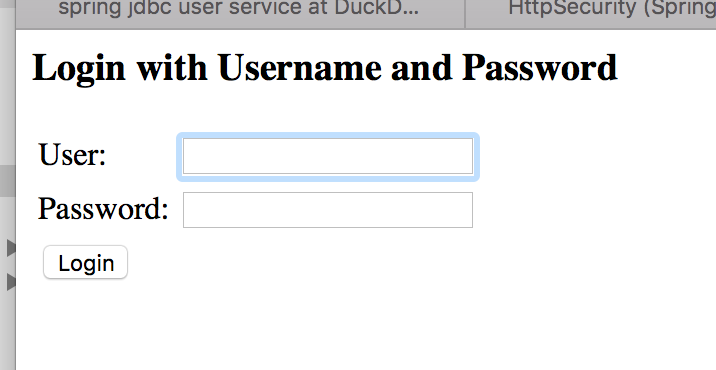

# 3rd April 2016: Sprint 4: Security #

## Goals of the Sprint: 

- User entity, creatable, queryable via rest, tested.  DONE
- Sign Up API:  *Name*, *Email Address*, *Password*.  This would send an email out to *confirm* the email address.  DONE
- Secure the application, with at least one secure page. DONE
- Log-in Form (don't bother styling it just yet) DONE
- A special URL would confirm the email, being a hash of some secret salt and their details.  DONE
- Password reset  DONE
- Limiting the projects you can look up, based on who you are. (NOT REACHED)


## Prelude: [HATEOAS](http://projects.spring.io/spring-hateoas/)

What confused me initially was that the Spring-Data-Rest module, while it seems central to doing REST with Spring, is actually 
not.  Spring WebMVC contains all of the Rest functionality including the `@RestController` annotation, which we end up not using.

Specifically, WebMVC contains the RestTemplate class, which we use on the client side a lot.  Also, `Jackson` is brought into 
WebMVC to do JSON marshalling and unmarshalling.

Built on top of WebMVC is Spring HATEOAS.  This defines three key classes - Resources<> and Resource<> and Link, which allow you to return 
HAL format content to the client.  HAL is basically a standard for doing HATEOAS.  That is, it's a standard for your JSON objects to
go back and forth.  It really should be called the Spring HAL project instead of HATEOAS, because this is what it's really about.  

Then, you have Spring-Data-JPA.  This defines the `Repository` class, and builds automatic repositories for you using JPA. You can
annotate the repository interface with tags like `@Query`, and it implements the methods for you.   Really nice.

So, Spring-Data-Rest sits on top of all of these: it exposes endpoints using a WebMVC controller.  The endpoints are for a Spring-Data-JPA
repository, and it's in HAL format, so it uses the Spring HATEOAS classes.  

Knowing this up-front would have saved *a lot* of trouble.


### Configuring the REST Template.

Because `RestTemplate` is part of WebMVC, it needs to be taught about Spring HATEOAS when you start it up, and that's 
done using the `Jackson2HalModule`, and setting up the media types, like so:

```java
	protected RestTemplate getRestTemplate() {
		RestTemplate template = new RestTemplate(new SimpleClientHttpRequestFactory());
		MappingJackson2HttpMessageConverter converter = getJacksonConverter(template);
		
		ObjectMapper mapper = converter.getObjectMapper();
		mapper.configure(DeserializationFeature.FAIL_ON_UNKNOWN_PROPERTIES, false);
		mapper.registerModule(new Jackson2HalModule());
		
		template.setErrorHandler(new SilentErrorHandler());
		return template;
	}
```

Ideally, (to use HAL format, and therefore follow HATEOAS principles) we should be returning subclasses of `Resource` or `Resources` from all our controller
end-points.  Luckily, Spring converts the objects this way for you (automatically).   

So, if we return `User`, actually what gets sent back is a `Resource<User>` JSON representation.

A collection of `Document` classes would be `Resources<Resource<Document>>`.  This allows you to encapsulate the embedded collection of 
`<Resource<Document>>` objects, and allows each to have `Link`s.

All of this generic typing confuses the hell out of Jackson though:  because of erasure, it would only know to convert a `Resource<?>`
by default (which would get you nowhere - there are no type identifiers in HAL+JSON.  So, they introduce a specific class for this:

```
	public static TypeReferences.ResourceType<User> USER_RESOURCE_TYPE = new TypeReferences.ResourceType<User>() {};
```

You pass this into the `RestTemplate` and it knows how to deserialize generics.

## Step 1: User Entity.

This is already in the system, from sprint 1, but not tested (so, assume broken).   I am going to change it around a bit though:

```java
@Entity
public class User extends AbstractLongIdEntity {

	
	/**
	 * Users can call themselves anything.  We'll use email address to log in.
	 */
	private String username;

	
	private String password;
	
	/**
	 * Users have to provide a unique email address.  But, we will validate that it belongs to them 
	 * as well.
	 */
	@Column(unique=true, length=70, nullable=false)
	private String email;

	/**
	 * This will be used as an API key, when calling the REST services.
	 */
	@Column(length=32, nullable=false)
	private String api;
	
	private boolean accountExpired = false;
	private boolean accountLocked = false;
	private boolean passwordExpired = false;
	private boolean emailable = true;
	private boolean emailVerified=false;
```

We're going to need a slightly different REST api, but for now, let's just use a `CrudRepository` subclass.  

So, if I query the endpoint /users, I get back:

```
{
  "_embedded" : {
    "users" : [ {
      "username" : "test1",
      "password" : "blah",
      "email" : "test1@kite9.com",
      "api" : "19griouprbiam29uiq30h81m",
      "accountExpired" : false,
      "accountLocked" : false,
      "passwordExpired" : false,
      "emailable" : true,
      "emailVerified" : false,
      "_links" : {
        "self" : {
          "href" : "http://localhost:8080/api/users/1"
        },
        "user" : {
          "href" : "http://localhost:8080/api/users/1"
        }
      }
    } ]
  },
  "_links" : {
    "self" : {
      "href" : "http://localhost:8080/api/users"
    },
    "profile" : {
      "href" : "http://localhost:8080/api/profile/users"
    }
  }
}
```

Really, we *never* want people to query users via the REST URL in this way.  What are the operations we actually do want?

- Unsecured: 
 - **Create User**:  it should be possible to post in a new user, with an email, username and password.
 - Probably some static pages, error pages etc.

- Password Secured (i.e. Form-Based):
 - **Get API Key**:  returns the API key, when you give the email address and password (i.e. log in).   Can only log in if account not locked, expired, and password not expired.

- Api-Key Secured:
 - **Update User**:  change the username, email, password etc, using the api key as verification it's you.
 - **Validate Email-Send**: Sends you an email with a link to validate your email address.
 - **Validate Email**: you provide some proof-of-address.
 - **Password Reset Request**: you provide an email, and it sends a password reset email, and sets "passwordExpired" to true.  It also changes the password to something random.   
 - **Update Password**: you provide a new password, and a proof-of-address.
 - and pretty much the entire rest of the application. 

## Step 2: Implementing Sign-Up etc.

[Spring-Data-Rest](http://projects.spring.io/spring-data-rest/) project allows you to define a `Repository` interface, and then it will map this to some HTTP end-points 
using a special dynamic controller.

However, we are going to have to customize this, as described above:  we definitely don't want people screwing with each other's
accounts.

`CrudRepository` defines far too many methods: such as `deleteAll()` and `count()`, which we don't want to give out to everyone, 
so I am going to define a stripped-down interface.  So long as these methods match up to ones in the `CrudRepository` interface,
they will be created dynamically by Spring-Data-JPA (and then exported by Spring-Data-Rest).

```java
public interface UserRepository extends Repository<User, Long>, UserRepositoryCustom { (1)
		
	/**
	 * Re-declaration of the method from {@link UserRepositoryCustom}, to hook it up.
	 */
	@SuppressWarnings("unchecked")
	public User save(User entity); (2)
		
	/**
	 * This returns just your (logged in) user
	 */
	@Query("select u from User u where u.email = ?#{ principal }")
	public Iterable<User> findAll(); (3)
	
	/**
	 * Returns your (logged in) user only. 
	 */
	@Query("select u from User u where u.id = :id and u.email = ?#{principal}")
	public User findOne(@Param("id") Long id); (3)

	/**
	 * Removes the user permanently.
	 */
	@Transactional
	@RestResource(exported=false)
	@Modifying(clearAutomatically=true)
	@Query("delete from User where id = :id  and email = ?#{principal}")
	void remove(@Param("id") Long id);  (3)
	
	/**
	 * Re-declaration of the method from {@link UserRepositoryCustom}, to hook it up.
	 */
	public void delete(Long id);  (2)
	
	@RestResource(exported=false)
	public User findByApi(String api); (4)
	
	@RestResource(exported=false)
	public User findByEmail(String email); (4)
	
	@RestResource(exported=false)
	Iterable<User> save(Iterable<User> entities); (5)
	
}
```

1.  Note I am extending UserRepositoryCustom.  This allows me to add my own implementations to some methods, which I'll come to later.
2.  Methods marked (2) are automatically exposed as REST endpoints.  I am implementing custom versions of these (see below).
3.  Methods marked (3) are also automatically exposed.  However, by providing @Query() I am overriding the basic implementation.  The queries
ensure that only your current user is ever affected (more on this below).
4.  Any methods starting `findBy...` are automatically created for you.  By adding the annotation, they are *not* exposed over REST, which would basically
allow you to look up anyone's user.
5.  This is a save method, provided automatically by Spring-Data-JPA, which will be used by our custom (access controlled) save, under-the-hood.

### UserRepositoryCustom and UserRepositoryImpl

The convention is, that if you provide an interface and a class so-named, Spring-Data-Rest will bake these into your Repository implementation dynamically.

My interface looks like this:

```java
public interface UserRepositoryCustom {

	/**
	 * Public API - doesn't need security. You can call this with curl like:
	 * 
	 * <pre>
	 * curl -v -H "Content-Type: application/json" -d '{ "username" : "bob", "password": "pass", "email" : "rob@kite9.com" }' http://localhost:8080/api/users
	 * </pre>
	 */
	public <X extends User> X save(User entity);
	
	/**
	 * Provided for internal methods to use, no security.
	 */
	public User saveInternal(User entity);
	
	/**
	 * Removes the user permanently.  
	 * If the user can't be deleted, their account is set to expired.
	 * e.g. curl -v -H "Authorization: KITE9 some-code" -X "DELETE" http://localhost:8080/api/users/3
	 */
	public void delete(Long id);

}
```

Because `save()` is used for creating a user or updating one, you need to make sure that if you're updating, you're logged in 
*as the user being updated*.  But, if you're creating a new one, you don't need to be logged in at all.  (I guess some kind of
CAPTCHA might be a good idea to prevent spam, but we'll cross that bridge when it happens).

### Deleting and Test Data

The docker tests I'm writing should run on any Kite9 instance, so it's vital that they clean up after themselves.   If a user 
gets left in the database, then by the above logic, a test that creates a new user will fail.  

However, in a production system, we don't want to delete *real* users, who might want to re-activate their accounts.  

Our `delete()` method applies the `accountExpired` flag, first, and then only deletes if the user isn't a foreign key elsewhere:

```java
public class UserRepositoryImpl implements UserRepositoryCustom {

	...

	public void delete(Long id) {
		// this should always work
		userRepository.expire(id);
		try {
			// this works if the user isn't on any projects.
			userRepository.remove(id);
		} catch (Exception e) {
			LOG.info("User can't be deleted outright, expiring: "+id);
		}
	}
```

### Testing

So, we can create new users with the following piece of code:

```java

	protected ResponseEntity<Resource<User>> createUser(RestTemplate restTemplate, String username, String password, String email) throws URISyntaxException {
		String url = urlBase + "/api/users"; 
		User u = new User(username, password, email);
		RequestEntity<User> re = new RequestEntity<User>(u, HttpMethod.POST, new URI(url));
		ResponseEntity<Resource<User>> uOut = restTemplate.exchange(re, USER_RESOURCE_TYPE);  (1)
		return uOut;
	}
	
	@Test
	public void testCreateUserRestAPI() throws URISyntaxException {
		RestTemplate restTemplate = getRestTemplate();
		
		String username = "Kite9TestUser";
		String password = "Elephant";
		String email = "test-user4@example.com";
		
		ResponseEntity<Resource<User>> uOut = createUser(restTemplate, username, password, email);
		User u = uOut.getBody().getContent();
		String url = uOut.getHeaders().getLocation().toString();
		
		Assert.assertEquals(HttpStatus.CREATED, uOut.getStatusCode());
		Assert.assertEquals(username, u.getUsername());
		Assert.assertNotNull(u.getApi());

		...
		
	}
	
	
```	


1.  This is really the only complex piece here: we exchange a `RequestEntity`, which is basically the HTTP Request (including all it's headers, and body),
and we get back a `ResponseEntity<Resource<User>>`, which is unmarshalled from the HTTP Response, which will contain response headers, and a HAL+JSON
response body containing a serialized version of our `User` object.
  
### Use Principal In Queries

This is jumping ahead, but let's get it out of the way:  In the Repository API, I can define an `@Query` like:

```java
@Query("select u from User u where u.email = ?#{ principal }")
```

This bit `?#{ }` means *use a SpEL expression*.  And in order to be able to access `principal` from a SpEL expression, we need this, which comes built into spring:

```java
	@Bean
	public SecurityEvaluationContextExtension usePrincipalInQueries() {
		return new SecurityEvaluationContextExtension();
	}  
```
  
## Step 3:  Securing the Application

### Encrypting The Password

It's a bad idea to store passwords as plaintext in the database, so I am going to hash them and store that.  

My code to do this looks like this:

```java
	public static String generatePasswordHash(String password) {
		BCryptPasswordEncoder encoder = new BCryptPasswordEncoder();
		return encoder.encode(password);
	}
```

This uses the standard Spring BCrypt encoder, which is designed for passwords.

This is done in our `UserRepositoryImpl` method each time we save the user:

```java
	@SuppressWarnings("unchecked")
	@Override
	public User save(User newUser) {
		String email = newUser.getEmail();
		String password = newUser.getPassword();
		User u = userRepository.findByEmail(email);
		String passwordHash = Hash.generatePasswordHash(password);

		if (u != null) {
			ensureCorrectUserLoggedIn(email);
			u.update(newUser);
		} else {
			u = newUser;
			u.setPassword(passwordHash);
			u.setSalt(User.createNewSalt());
		}

		userRepository.saveInternal(u);
		return u;
	}
```

### Servlet Filter For Handling Authentication

Spring comes built in with Basic and Form-Based authentication, and we're going to allow these (and test them).  However, 
first, here is the definition for a servlet filter to handle KITE9 API based-authentication:

This is a filter I have designed, to cope with situations where the `Authorization` http header field is set with a value starting with 'KITE9' (and then the API key... for now.  Possibly we will
encode this in some way later.)

This has some code like this: 

```java
	@Override
	protected void doFilterInternal(HttpServletRequest request, HttpServletResponse response, FilterChain filterChain) throws ServletException, IOException { (1)
		String header = request.getHeader("Authorization");

		if (header != null && header.startsWith(KITE9_AUTH_PREFIX)) {
			String apiKey = header.substring(KITE9_AUTH_PREFIX.length());  (2)
	
			try {
	
				if (authenticationIsRequired(apiKey)) {
					ApiKeyAuthentication authRequest = new ApiKeyAuthentication(apiKey);
					authRequest.setDetails(authenticationDetailsSource.buildDetails(request));
					Authentication authResult = authenticationManager.authenticate(authRequest);
					SecurityContextHolder.getContext().setAuthentication(authResult);
				}
	
			} catch (AuthenticationException failed) {
				SecurityContextHolder.clearContext();
				authenticationEntryPoint.commence(request, response, failed);
				return;
			}
		}

		filterChain.doFilter(request, response);  (3)
	}
```

1. Because it extends `OncePerRequestFilter`, this is the only method that needs to be implemented.  
2. It looks for the apiKey, and if one exists, it creates an `ApiKeyAuthentiation' object.  This is just a simple implementation of Spring's `Authentication` interface, and that's used by an `AuthenticationProvider`.
3. This continues on the request chain, for the main processing of the servlets.

### Configuring URL Pipeline

To configure this in the servlet filter pipeline, I need to change my `WebSecurityConfig` configuration.

I need to be able to:

 - Have the new authentication filter
 - Allow access to 'user' urls, without the filter, but 
 - only allow accesss to api methods behind the authenticated role.

```java
@Configuration
@EnableWebSecurity
public class WebSecurityConfig extends WebSecurityConfigurerAdapter {
	
	protected void configure(HttpSecurity http) throws Exception {
		LoginUrlAuthenticationEntryPoint entryPoint = new LoginUrlAuthenticationEntryPoint("/login");   (1)
		Kite9ApiKeyBasedAuthenticationFilter kite9ApiFilter = 
				new Kite9ApiKeyBasedAuthenticationFilter(authenticationManager(), entryPoint);       
		
		http.addFilterAfter(kite9ApiFilter, BasicAuthenticationFilter.class);	//  API-key approach (2)
		http.csrf().disable();
		http.formLogin();  (3)
		http.authorizeRequests()   (4)
			.antMatchers("/api/users/**").permitAll()
			.antMatchers("/api/profile/**").permitAll()
			.antMatchers("/api").permitAll()
			.antMatchers("/**").authenticated();
	}
```

1.  In the case of login failures, this is where the kite9ApiFilter will send you.
2.  Configuring the Kite9 login filter as part of the servlet chain.
3.  Also allowing form login - although this will need more configuration later.
4.  This says:  allow any public api URLs for anyone, anything else needs authentication.  Again, more work will be needed here.

### UserAuthenticationProvider

This provides the linkage between our `User` class and Spring Security.  Since we have `Kite9Authentication`, and we want to 
support form-based and basic authentication, we need to support `UsernamePasswordAuthenticationToken` too:

```java
	@Override
	public boolean supports(Class<?> authentication) {
		return authentication.equals(ApiKeyAuthentication.class) || authentication.equals(UsernamePasswordAuthenticationToken.class);
	}

	@Override
	public Authentication authenticate(Authentication authentication) throws AuthenticationException {
		if (authentication instanceof ApiKeyAuthentication) {
			return handleApiKeyAuthentication(authentication);
		} else if (authentication instanceof UsernamePasswordAuthenticationToken) {
			return handleFormBasedAuthentication(authentication);
		}
		
		return null;
	}
```

API-Based auth looks like this:

```java

	private Authentication handleApiKeyAuthentication(Authentication authentication) {
		Kite9Authentication apiKeyAuthentication = (Kite9Authentication) authentication;
		User u = userRepository.findByApi((String) apiKeyAuthentication.getCredentials());
		WebSecurityConfig.checkUser(u, true);
		return new Kite9Authentication(u, Collections.singletonList(WebSecurityConfig.KITE9_USER));
	}
```

And I can use this in a test now:

```java
	protected ResponseEntity<Resources<User>> retrieveUserViaBasicAuth(RestTemplate restTemplate, String password, String email) throws URISyntaxException {
		String url = urlBase + "/api/users";
		HttpHeaders headers = new HttpHeaders();
		String auth = email + ":" + password;
		byte[] encodedAuth = Base64.encode(auth.getBytes(Charset.forName("US-ASCII")));
		String authHeader = "Basic " + new String( encodedAuth );
		headers.set( HttpHeaders.AUTHORIZATION, authHeader );
		RequestEntity<Void> entity = new RequestEntity<Void>(headers, HttpMethod.GET, new URI(url));
		ResponseEntity<Resources<User>> uOut = restTemplate.exchange(entity, USER_RESOURCES_TYPE);
		return uOut; 
	}
```


Form-based authentication is like this:

```java
	private Authentication handleFormBasedAuthentication(Authentication authentication) {
		User u = userRepository.findByEmail(authentication.getName());
		WebSecurityConfig.checkUser(u, true);
		String givenPassword = (String) authentication.getCredentials();
		if (Hash.checkPassword(givenPassword, u.getPassword())) {
			return new Kite9Authentication(u, Collections.singletonList(WebSecurityConfig.KITE9_USER));
		} else {
			throw new BadCredentialsException("Bad Login Credentials");
		}
	}
```

And in a test I can do:

```java

@Test
	public void testFormBasedLogin() throws URISyntaxException {
		...
	
		pOut = formLogin(restTemplate, email, password);  (1)
		Assert.assertEquals(HttpStatus.FOUND, pOut.getStatusCode());  (2)
		Assert.assertEquals(urlBase+"/", pOut.getHeaders().getLocation().toString());  (3)
		List<String> cookie = pOut.getHeaders().get("Set-Cookie"); (4)
		Assert.assertNotNull(cookie);
```

1. Does a HTTP Form-Post, of the username and password (see below)  
2. From the response, we can check the HTTP-Status.
3. It should tell you the page to go to next.
4. And, we can retrieve the cookie to use later: `headers.add(HttpHeaders.COOKIE, cookie);` 

## Step 4: The Login Form

This is slightly more complex, since we need to have put together some forms.  However, Spring seems to contain most of this
stuff automatically due to the `http.formLogin();  ` in the web configuration, and if I try to access a protected resource, I get this:



When I log in using this, I get access to my protected page.  The test uses the following code to post the form: 

```java

	protected ResponseEntity<String> formLogin(RestTemplate restTemplate, String user, String password) {
		List<HttpMessageConverter<?>> converters = restTemplate.getMessageConverters(); (1)
		converters.add(new FormHttpMessageConverter());
		MultiValueMap<String, String> map = new LinkedMultiValueMap<>(); (2)
		map.add("username", user);
		map.add("password", password);
		map.add("submit", "Login");
		HttpHeaders headers = new HttpHeaders();
		headers.setContentType(MediaType.APPLICATION_FORM_URLENCODED); (3)
		HttpEntity<MultiValueMap<String, String>> in = new HttpEntity<MultiValueMap<String,String>>(map, headers);
		ResponseEntity<String> s = restTemplate.postForEntity(urlBase+"/login", in, String.class); (4)
		return s;
	}
```

1.  This method posts a form login using a username and password.  We need to add the `FormHttpMessageConverter` to the `RestTemplate` instance, since it doesn't come baked-in (I guess you don't expect form data with REST).
2.  The fields of the form start off as a map...
3.  Here we are adding a HTTP header to say that it's URL-encoded form-data (which is managed by the `FormHttpMessageConverter`)
4.  ... and the map is converted and sent using the rest template.

## Step 5: Validation Emails

The next two parts took a *long while* to figure out:  the problem was, I expected to be able to extend the behaviour of 
my Spring-Data-Rest repository with the extra behaviours I needed, and, I had the Spring project dependencies all wrong 
(see the first part).  This meant I was really confused about this.

The answer was simply to define a new class called `UserController`, which would handle all the custom behaviours I needed.

### Sending Emails

Sending the email in Spring boot is easy, so long as you configure a mail host.  This is the code:


```java
	@Autowired
    private JavaMailSender mailSender; (1)

	/**
	 * Sends a generic email to the user, containing a URL to click on.
	 */
	private NotificationResource sendTemplatedEmail(User u, String responseUrl, String template, String subject) { (2) (3)
		MimeMessagePreparator preparator = new MimeMessagePreparator() { (4)

            public void prepare(MimeMessage mimeMessage) throws Exception {
                mimeMessage.setRecipient(RecipientType.TO, new InternetAddress(u.getEmail()));
                mimeMessage.setFrom(new InternetAddress("support@kite9.com"));
                mimeMessage.setSubject(subject);
				mimeMessage.setText(template.replace("{username}", u.getUsername()) + responseUrl);  
            }
        };
        
        mailSender.send(preparator);  (5)
        
        LOG.info("Emailed "+u.getEmail()+" with url: "+responseUrl);
	
		return new NotificationResource("Please check your email for a message from Kite9 Support.");
	}
```
		
Here are some notes on the above:

1.  Adding this is all the code you need, but to configure mail support in Spring Boot, but you also need `spring.mail.host=localhost` or similar in your application properties (this is in `application-dev.properties`).
2.  Note the passing through of the `User` class.
3.  We have another method to create the URL for the response, see below.
4.  `MimeMessagePreparator` is a template for email messages.   
5.  This bit sends the message.	

### Dockerizing Email Gateway

The only problem with this is that 'localhost' is not going to fly within Docker.  Instead, we need to create a further docker image as the mail server:

```
    <image>
            <name>com.kite9/k9-mailer</name>
            <alias>mailer</alias>
            <alias>k9-mailer</alias>
            <build>
                    <from>alterrebe/postfix-relay</from>
            </build>
           
            <run>
                   <envPropertyFile>${project.basedir}/src/docker/${env.DOCKER_MACHINE_NAME}.mail.properties</envPropertyFile>
                   <log />
                   <ports>
                           <port>25:25</port>
                   </ports>
                   <wait>
                           <log>success: postfix entered RUNNING state</log>
                           <time>30000</time>                                                      
                   </wait>
            </run>
    </image>
```

This adds the extra image into the docker configuration in the maven pom.xml, along with our existing image.   Since there is a dependency between k9-server and k9-mailer, 
we need to add this to the server, too:

```
       <links>
         <link>k9-mailer</link>
       </links>
```

This *dependency* means that the k9-mailer gets started first, and then the k9-server is started once it's ready.

### REST Endpoints

There are two for the email process: 

1.  One to request an email-address validation email, and, this then has a link in it which you click.  
2.  The link is the second endpoint, and it should set the email to then be valid.

In order that people don't fake the response, we're going to add a validation code to it, like this:

```java
	
	/**
	 * If a party knows the user's details (including their private API key) then they can
	 * validate an email address this way.   Is this something we want?
	 */
	public static String generateValidationCode(User principal, String path) {
		String email = principal.getEmail();
		String api = principal.getApi();
		String salt = principal.getSalt();
		String source = email+"|"+api+"|"+salt+"|"+path;
		LOG.info("Hashing: "+source);
		String code = Hash.generateHash(source);
		return code;
	}
```

So, the validation code is just a hashing of the user's details, along with 'salt', which we will change randomly each time
we issue a code.	
  
So to map our endpoints, we have:

```java
@Controller
@RequestMapping(path="/api/users")
public class UserController implements ResourceProcessor<PersistentEntityResource>{

	...

	@RequestMapping(path = URL_PREFIX+EMAIL_VALIDATION_REQUEST_URL, method=RequestMethod.GET) 
	public @ResponseBody NotificationResource emailValidationRequest(@PathVariable("email") String email) {
		...
	}
	
	@RequestMapping(path = URL_PREFIX+EMAIL_VALIDATION_RESPONSE_URL, method=RequestMethod.GET) 
	public @ResponseBody NotificationResource emailValidationResponse(@RequestParam("code") String code, @PathVariable("email") String email) {
	  	...
	}
```
	
To follow the HATEOAS model, these are proper HAL / REST endpoints, which return a `NotificationResource`:

```java
public class NotificationResource extends ResourceSupport {

	private String message;

	...
		
}
```
	
When Spring WebMVC encounters the `@ResponseBody` annotation, it knows that the return value from the method needs to be sent back 
as the HTTP response.  Because we have Spring-HATEOAS on the command line, and because `NotificationResource` extends `ResourceSupport`,
it knows how to serialize the response using Jackson, and mark the content-type header as `application/hal+json'.

Because all of this is handled automatically, our implementation is very focused:
	
```java
	@RequestMapping(path = URL_PREFIX+EMAIL_VALIDATION_REQUEST_URL, method=RequestMethod.GET) 
	public @ResponseBody NotificationResource emailValidationRequest(@PathVariable("email") String email) {
		User u = userRepository.findByEmail(email);
		if (u == null) {
			throw new HttpException(HttpStatus.BAD_REQUEST, "User not found");
		}
		if (u.isEmailVerified()) {
			throw new HttpException(HttpStatus.BAD_REQUEST, "Email is already validated");
		}

		String code = generateValidationCode(u, EMAIL_VALIDATION_RESPONSE_URL);
        String responseUrl = createUserControllerUrl(u.getEmail(), code, EMAIL_VALIDATION_RESPONSE_URL);
		return sendTemplatedEmail(u, responseUrl.toString(), emailValidationRequestTemplate, "Kite9 - Email Validation Request");
	}
```
	
### Exception Handling

Spring contains a mechanism whereby you can create an exception and add the `@ResponseStatus` annotation to it.  If the
servlet filters then catch this exception, they look at the code and the message in this annotation, and concoct a HTTP 
response accordingly.  However, this is painful, as it means you have to create different exceptions for every little thing. 
 
To avoid this, I created the `HttpException` class, and added the following handler for it:

```java
@Configuration
public class WebConfig extends WebMvcConfigurerAdapter {

	private static final Log LOG = LogFactory.getLog(WebConfig.class);

	/**
	 * Handles conversion of HttpException into a message and a http status.
	 */
	@Override
	public void configureHandlerExceptionResolvers(List<HandlerExceptionResolver> exceptionResolvers) {
		super.configureHandlerExceptionResolvers(exceptionResolvers);
		exceptionResolvers.add(new HandlerExceptionResolver() {
			
			@Override
			public ModelAndView resolveException(HttpServletRequest request, HttpServletResponse response, Object handler, Exception ex) {
				if (ex instanceof HttpException) {
					try {
						response.sendError(((HttpException) ex).getStatus().value(), ex.getMessage());
					} catch (IOException e) {
						LOG.error("Failed to process HttpException", e);
					}
					
					return new ModelAndView();
				}
				
				return null;
			}
		});
	}
}
```

On the plus side, this means I don't need a whole variety of exceptions. But, it's not very 'java-ery', and I can see why this
hasn't been included out-of-the-box.  I might change this later, as it kind of breaks the whole `try {} catch () {}` process 
as you can't disambiguate one exception from another.

### Links

Since the idea of HATEOAS is that your application is navigable, I wanted to add links to the User resource when it was queried so that you can see how to request 
an email validation or password reset (see below).

To do this, `UserController` implements `ResourceProcessor<PersistentEntityResource>`, which gives you (a bit) of 
control over the marshalling process to turn the user into JSON:

```java

	/**
	 * This actually works a lot better than using the HATEOAS methodOn and Link objects.
	 */
	public static String createUserControllerUrl(String email, String code, String path) { (1)
		String url = ControllerLinkBuilder.linkTo(UserController.class).toString();
		return url + "/"+email+path+(code != null ? "?code="+code : "");
	}

	@Override
	public PersistentEntityResource process(PersistentEntityResource resource) {
		if (resource.getContent() instanceof User) {
			User user = (User) resource.getContent();
			String email = user.getEmail();
			if (!user.isEmailVerified()) {
				Link l = new Link(createUserControllerUrl(email, null, EMAIL_VALIDATION_REQUEST_URL), VALIDATE_REL);  (2)
				resource.add(l);
			}
			
			Link l = new Link(createUserControllerUrl(email, null, PASSWORD_RESET_REQUEST_URL), PASSWORD_RESET_REL);  
			resource.add(l);
		}
		
		return resource;
	}
```
  
1.  This constructs a link within the application.  Spring HATEOAS comes with something called `EntityLinks`, but I found that actually it was a bit unweildy, 
since I couldn't exclude the codes when needed.  Also they relied heavily on proxying and reflection, so just creating a single link involved lots of class construction!
2.  This adds the email validation link, if it hasn't been validated already.  

Note the `VALIDATE_REL`, a Rel is a short code for the link, by which it can be retrieved.  So you get something back like this:

```
{
  "username" : "bob",
  "password" : "$2a$10$sU8FVDF395EY0DZgsdzSCeRd2Vpp3WLxGUdVzgfXHEjVCtJnJAjbS",
  "email" : "rob@3kite9.com",
  "api" : "dkl74fvfhlv7rd9aq7kc0gj6oq",
  "salt" : "eupi0vlsp5",
  "accountExpired" : false,
  "accountLocked" : false,
  "passwordExpired" : false,
  "emailable" : true,
  "emailVerified" : false,
  "_links" : {
    "self" : {
      "href" : "http://localhost:8080/api/users/2"
    },
    "user" : {
      "href" : "http://localhost:8080/api/users/2"
    },
    "validate" : {
      "href" : "http://localhost:8080/api/users/rob@3kite9.com/email-validation-request"
    },
    "password-reset" : {
      "href" : "http://localhost:8080/api/users/rob@3kite9.com/password-reset-request"
    }
  }
}
```

In the test, I can then do this, to get the Rel:

```java
	Resource<User> resource = uOut.getBody();
	Link l = resource.getLink(UserController.VALIDATE_REL);
	String href = l.getHref();
```

Initially, I had assumed that `@ExposesResourceFor` and `@EnableEntityLinks` would somehow fill in the resource links for you.
This was wildly off-beam.  It's all manual as far as I can see.


## Step 6: Password Reset

So the process of resetting a password is to email a link which you can use to reset with.   This means that the user really needs to have confirmed their email
before being able to use this.  So, using this *without* confirming the email should result in an error of some kind.

This is going to follow pretty much the same pattern as the email validation though:

```java

	@RequestMapping(path = PASSWORD_RESET_REQUEST_URL, method=RequestMethod.GET) 
	public @ResponseBody ResponseEntity<String> passwordResetRequest(String email, HttpServletRequest request) throws IOException {
		...
	}
	
	
	@RequestMapping(path = PASSWORD_RESET_RESPONSE_URL, method=RequestMethod.GET) 
	public @ResponseBody ResponseEntity<String> passwordResetResponse(@RequestParam("code") String code, @RequestParam("email") String email, @RequestParam("password") String newPassword) throws IOException {
		...
	}
```
	
However, there is also a form to fill in with the new password.  This looks like this:

```java
	@RequestMapping(path = URL_PREFIX+PASSWORD_RESET_FORM_URL, method= {RequestMethod.GET}) 
	public void passwordResetForm(@RequestParam("code") String code, @PathVariable("email") String email, HttpServletResponse response) throws IOException {
		String url = createUserControllerUrl(email, null, PASSWORD_RESET_RESPONSE_URL);
		String html = passwordResetForm.replace("{code}", code).replace("{url}", url).replace("{email}", email);
		response.setContentType(MediaType.TEXT_HTML_VALUE);
		response.getWriter().write(html);
		response.setStatus(HttpStatus.OK.value());
	}
```	
	
So this is still in the `UserController`, but isn't a REST endpoint - it just returns a simple web form.  I didn't 
use any JSPs, Thymeleaf templates or whatever - this is all a decision for another day, and this form will probably
go when we start to use React proper.

## Step 7:  Limiting the Projects

Ok, so to implement this step would not be too hard, but would require some extra work on the other domain objects - 
specifically, I would need to add `ProjectRole`.   Since we've done the work already on the `User` entity, I think
it's time to stop.

Time's up, it's 18th April today which means I'm a day late to finish the sprint (and a step short).


