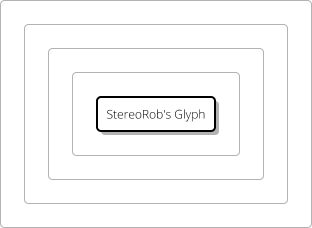
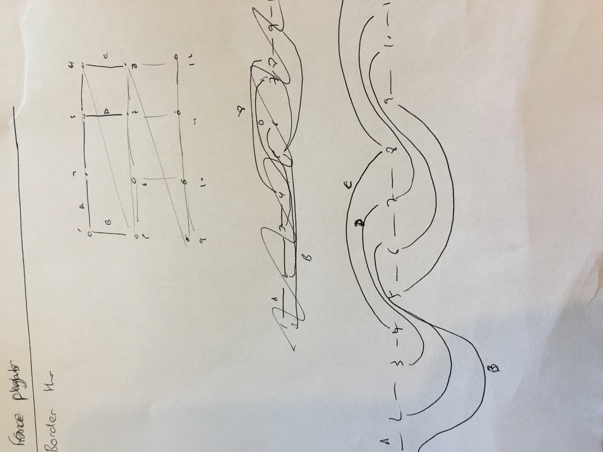
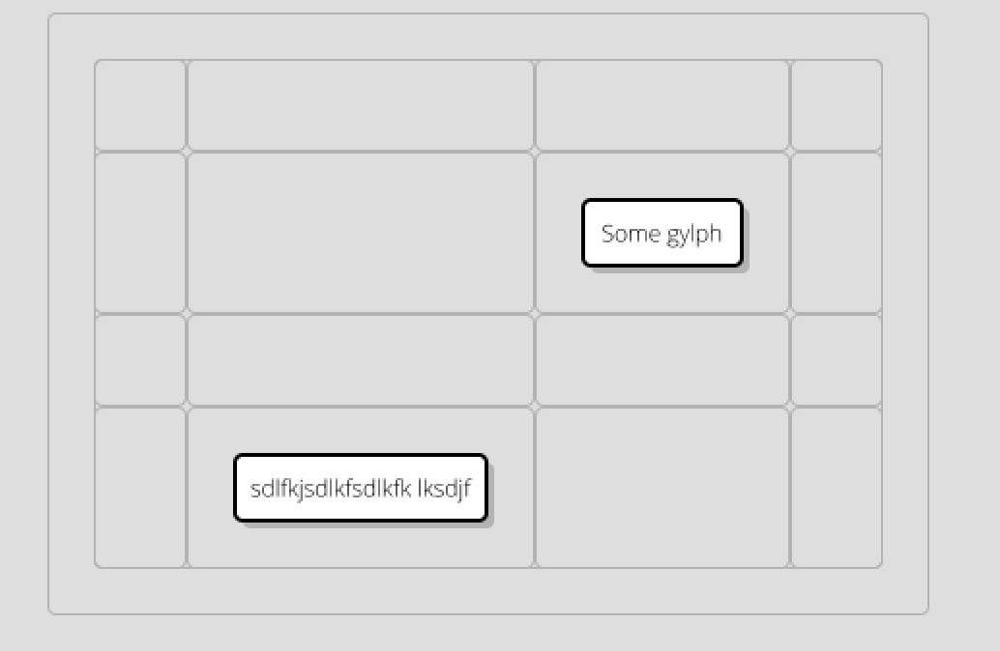
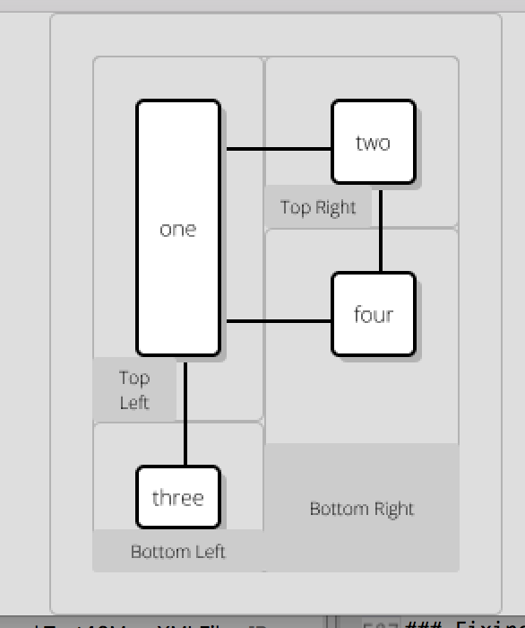

# 8 August 2016 : Sprint 8 - Overhaul Object Model - Containers

- everything should be (`DiagramElement`s) and `Container`s.  Links should be reformatted.    DONE
- Ideally, we are backwards-compatible with what came before.  So, you can load up the original diagram xml  DONE
- We should be able to use `GRID` layout for Containers. DONE

## Step 1: Fixing the Inheritance Hierarchy

### What We have now

Really, it's just too crazy and needs simplifying.  Let's sort this out now:

- `DiagramElement`: The top.  Everything that is drawn should be one of these.  Ideally, they will eventually be immutable. 

- `PositionableDiagramElement`:  This means it has `RenderingInformation`.  Probably not many exceptions to this either.  **REMOVE**

- `CompositionalDiagramElement`:  Means it has a parent.  So, anything that's not a Link. I don't really see the point to this now.  **REMOVE**

- `IdentifiableDiagramElement`: has an ID, so things can reference it.   **REMOVE**

- `Label`: Doesn't really add anything, other than telling you it's not going to have links.   **REMOVE IN FUTURE SPRINT**

- `Connected`: Has Links.

- `Contained`: Part of the hierarchy? Has a container  **REMOVE**

- `Container`:  Has an array for contents, and a layout.

- `Leaf`:  I guess, things that are Contained but not containers.  **REMOVE SOON**

- `ShapedDiagramElement`: Has a shape  **REMOVE**

- `StyledDiagramElement`: `getStyle()`  **REMOVE**

- `TextContainingDiagramElement`:  has `getText()`

- `Leaf` indicates that the element doesn't contain anything with links.  Clearly, Glyph and Arrow (which currently implement this) are
going to be able to have containers, so this needs to go.   **REMOVE**

- `SymbolTarget`: this should be removed. Symbols should be just instances of Parts.  **REMOVE**

- `LinkTerminator`: this really is the end of a Link.  It should replace the 'from' and 'to' in the link.

#### What We Need

Represents everything in the diagram hierarchy, that can be drawn / identified etc.

- `DiagramElement`:  should have `getParent()` and `getID()`, `getStyle()`,  `getShapeName()` and `getRenderingInformation()`.

##### `Connected` vs. `Label` vs `Connection`:

i.e role it has in planarization

- `Connected`: has `getLinks()` and some helper methods.
- `Label`:  definitely *isn't* connected to anything.
- `Connection`: for a connection

##### Things That Can Be `Label`s Or `Connected`s

Broadly, what method is used for deciding the size/shape of the object:

- `Container`: has an array of contents, size of the shape is derived from the contents.
- `FixedSize` or maybe `Shape`:  this includes shapes (e.g. `CompositionalShape`) and symbols.  Has no containers (or any xml content other than class). i.e. a terminal element  (in css, `type: fixed-size`)
- `Text`:  contains text, and must be big enough to hold the text, but can be asked to render into a larger space. `Arrow` could be one of these. i.e. a string. (in css, `type: text`).
- `Decal`: something that overlays a `DiagramElement`, doesn't change shape or size.  Has a fixed position wrt the owner element.  Used for ports.  May only accept at most a single connection on each side.  (We'll sort these out in the next sprint) (in css, `type: decal`)  \

... but these things are really not the classes of diagram elements, merely properties of the way they are drawn:  A `Text` element could have a `Decal`, so
we would need `getContents()` on it.

So, we need to somehow extract this part out, eventually.


##### Other Things That Can Be Drawn

- `LinkEnd`: for the end of a link?
- `Terminator`: for the end of a connection too.

### Epiphany

Since the nature of what an element *is* on the diagram is entirely governed by the Stylesheet, we have to make a separation.  Instead of returning *XML* elements, we
need to load up the XML, and then *interpret* the elements, based on what properties they have in the CSS.

This means, we need to divorce `XMLElement` and `DiagramElement` from each other.  Also, we probably shouldn't have setters on the `DiagramElement`s.  So, all the old
stuff like `Glyph` and `Context` will be `XMLElement`s, as will `Diagram`.  There will be a method on `Diagram` called `getContents()` which returns a list of
actual `DiagramElements`, derived from the looking at the styles of the individual objects... and then off we go.  

### Immutability

It would be nice if, from that point on, `DiagramElement`s were immutable.  I don't know if this is achievable.  Let's see how far we can get.  The only problem is likely
to be `RenderingInformation`.  Let's see how this goes, it might be possible somehow.

### `XMLElement`

Now looks like this:

```java
public interface XMLElement extends Element, Iterable<XMLElement> {
	
	public String getID();

	public void setTagName(String tag);
	
	public ADLDocument getOwnerDocument();
	
	public void setOwnerDocument(ADLDocument doc);
	
	public int getChildXMLElementCount();
	
	//public DiagramElement getDiagramElement();

}
```

Where `Element` is the DOM element.   I fixed up the compilation of most of the tests in visualization, so that
we can at least build XML documents using `Glyph`, `Arrow`, `Diagram` etc.   

### `GenericXMLElement`

This now takes the place of `Glyph`, `TextLine` etc, which are all moved into the src/test/java of visualization.
We've completely divorced the XML structure from the rendering approach (for good or ill).  

The good part of this is that we can now use stylesheets to define the behaviour of the elements in the diagram.
This means that Kite9 is getting more "programmable", but the expense is another layer of indirection.

### `DiagramElementFactory`

This converts from an XML element to a `DiagramElement`, with the new hierarchy defined above.  

### `DiagramElementType`, `EnumManager`, `DiagramElementSizing`

Layout type for Containers is now a *style*, and so we need to be able to return it using Batik's CSSEngine.  For this
reason, I've added `EnumManager`, which converts between a Java enum, and a CSSStyle.  So, when you retrieve the style you 
get an enum.  This is also used for the element type, using the `DiagramElementType` enum:

```java

public enum DiagramElementType {

	DIAGRAM, CONTAINER, TEXT, FIXED_SHAPE, UNSPECIFIED, LINK, LINK_END, NONE, TERMINATOR
}
```

So, the stylesheet is responsible for identifying the `DiagramElementType` used for each XML element, which is then used by the 
`DiagramElementFactory` to construct the correct java object.

Similarly, if the element is `Label` or `Connected`, it will need to be sized, somehow, so this is indicated with `DiagramElementSizing`:

```java

public enum DiagramElementSizing {

	CONTAINER, TEXT, FIXED_SIZE, DECAL, UNSPECIFIED
	
}

```

### `Connection`s

In the `Connection` object, we have `getFrom()` and `getTo()`, which are the only methods which, instead of returning
some nested structural data, are actually returning a reference to a diagram element elsewhere in the XML structure.  Here is the
implementation:

```java

	private XMLElement getToElement() {
		Element toEl = theElement.getProperty("to");
		String reference = toEl.getAttribute("reference");
		ADLDocument owner = theElement.getOwnerDocument();
		XMLElement to = (XMLElement) owner.getChildElementById(owner, reference);
		return to;
	}
	
	private Connected to;

	@Override
	public Connected getTo() {
		return to;
	}
```

So this works fine, using the `getChildElementById()` method on the `DOMDocumentImpl`.  But a `Connected` object has 
the `getLinks()` method, which works in the reverse direction.  From `AbstractConnectedXMLDiagramElement`:

```java
	/**
	 * Call this method prior to using the functionality, so that we can ensure 
	 * all the members are set up correctly.
	 */
	protected void initialize() {
		ADLDocument doc = theElement.getOwnerDocument();
		Collection<XMLElement> references = doc.getReferences(theElement.getID());
		links = new ArrayList<>(references.size());
		for (XMLElement xmlElement : references) {
			DiagramElement de = xmlElement.getDiagramElement();
			if (de instanceof Connection) {
				links.add((Connection) de);
			}
		}
	}
```

### `Connected`

Since we have now got rid of `Contained`, `Connected` needs to take it's place in the Planarization.  Since planarization is 
basically all about creating the planar embedding of all the `Connected` objects, this makes sense.

### `Container`s

This actually just fell into place by setting up the stylesheet:

```css
context {
	type: container;
}
```

It now looks like this:



So, I've added the screenshot to show that actually, things don't look all that great.  But, this is down 
nearly entirely to the stylesheet now, so it's something we should realistically be able to improve.

*However*, doing so would be a waste of time, as later on we are going to convert output entirely to SVG.  
So, it would be almost wasted effort to do so.  

### `Label`s

Before I go on, let's just think about this:   `Label`s need to *not have* connections.  So, they 
are clearly different from `Text` or `Container`.  But, we do want labels to have complex, content.  

This is a problem, because we want to be able to re-use our content structures.  e.g. *composed* labels 
should be allowed.

So, either we have to:

- Have a separate set of classes for label, so that we can ensure we don't accidentally try to connect to them
- Do some kind of special hierarchy tests with labels.  
- Have both composed / non-composed
- Have a flag to say when an element is a connection.

This all sounds slightly complex.  First, how do we identify a label?  Clearly, the stylesheet indicates it.  Then, 
we know we have one.  So, it's easy to identify a label.  

*I like* having a class, which tells me which elements are `Connected`.  This gives us much more type-safety.

So, this means that when we create labels, we have to do something special. either something is `Connected`, or 
it's a `Label` (see above).

The problem is, our class hierarchy and `DiagramElementFactory` don't really represent this yet.   

So, I have reverted for now to text-only labels.  These work fine.  We need to allow labels to express the
`sizing` css directive, like `connected` elements do.

### Hinting

I've spent a bunch of time fixing up the tests after this refactoring.  Obviously, Glyph layout is
broken, so that doesn't help. 

But, only `Test45Hinting` is broken: hints can't be written as the XML is fairly immutable now.  
I've @Ignored this, and commented out the hinting code, it needs rethinking.

Really, Hints should re-order the container contents, and then we should as far as possible respect the container ordering when we 
render, unless a better option comes along.  

Also, ports should allow people much more control over the positioning of links, which will help.

So, this needs some more thought:  the ordering in the diagram should affect the original XML that is going to get writen out, 
leaving our main `DiagramElement` layer immutable.

## Step 2: CSS For Layout

### Grid CSS

Let's have a simple grid layout, where elements in the grid occupy one or more squares of the grid.  You define how big the 
grid is going to be using css up-front:

```css

glyph.full-spec {
	type: composed;
	layout: grid;
	grid-size: 3 4;							// defines a 4x4 grid, from x1-x4 and y1-y4
	
	path: M x0 y0 H xe V y3 H x0 z;			// basically a rectangle. xs is an alias for x0 and xe is an alias for whatever the last one is (y3 in this case)
	padding: 6px 6px 6px 6px;				// leaves padding around the rectangle 
}

glyph stereotype {
	type: text;								// defines a label
	layout: right;
	occupies-x: 0 1;						// might be a better way to define position than the single 'occupies'
	occupies-y: 0 1;					
}

glyph symbols {
	type: container;
	layout: right;
	occupies: 1 0 2 0;
}

glyph label {
	type: text;
	layout: center;
	occupies: 0 1 2 2;
}

glyph body {
	type: container;
	layout: down;
	occupies: xs y2 xe ye; 
}

```

Notably, we are not worrying about minimum sizes of grid squares, or ordering of elements in the grid.  Or making sure certain parts of the grid
are occupied. 

It's assumed that the grid will be an actual grid and not flex around in any crazy way.  (This simplifies definition)

So within a particular `type`, we can have various `layout`s.  Obviously, this makes things more complicated, because certain types won't afford
certain layouts.  e.g. layout center is not going to work for a container (I would think).  *Unless* we have horizontal and vertical layout options.  
Which might be a good idea.  

Ideally, we should *not* be binding these concepts together.  `layout` and `type` and some grid size detail, and maybe other things.  But maybe, for both 
a container and a glyph, the concept of `layout` is separate from the concept of `type`:   although glyph elements are *named* whereas container elements are
*a list*, they should both be able to define their `occupies` or `x-position` values.

So... 

All we really need to do is to create a container with a grid, right?  

### Changing `RHDPlanarizationBuilder`

The first step is to introduce the idea of `GRID` layout to the `GroupPhase`.  This was pretty simple, and is encapuslated into `GridPositioner` and `GridPositionerImpl` classes.  
Grids are trivial to group (almost not worth bothering... maybe remove later?).  So, implementing this was fine.

### Building A Test

Added `Test51Grid`.

### Subdividing Integer Ranges

This is turning out to be a problem in more than one place: we have a range (0-1 or 0-1000, say), and we want to be able to fit stuff inside this hierarchically, 
and get a position back.  Problem is, we can't use `float`, `double`, `int` or whatever, as they have bounds on their precision.  What we need is some kind of thing
called a `Subdivision`, which we can divide as many times as we like.  

Also, somehow, this should represent 'space' in a meaningful way.  In the end, I decided to use `BigFraction`.  This has arbitrary precision, but at the same time is 
very meaningful at the lower levels (1/2, 0, 1 etc)

### Container Vertices

One problem which already exists in Kite9, is that we like to give container's vertices a bit of "border" away from their contents.  This makes it much easier to do positioning correctly.   
However, it's a problem because all the careful work we do in the gridding phase to line everything up is irrelevant when we use fractions to reposition everything.

If we have a glyph placed above a container at 0-.5, and then a glyph *inside* the container below it placed at 0.12-0.5, then there is a bias occurring, and this 
will increase the more we nest containers. 

So, the solution to this is to make the fractional change *very small* between the container and it's border.  But, the smaller you make it, the larger the fractions 
grow and the sooner you run out of capacity in `double`.  (And the quicker `BigFraction`s will get bigger.)

So, this is not really a solution *at all*:  Kite9 is guaranteed, at some depth to run out of precision just using a double.  And, it has a fixed padding size, 
which again, will eventually mis-align with the parent.  

To fix this, we should determine the size of the padding algorithmically, based on the smallest grid in the layout.  And, by using BigFraction, when we divide the space up asymptotically, 
we will never run out of space, but, the more nesting we have, the more the fractions will grow.  However, we will have made it so that:

- Leaf elements are always aligned, irrespective of container depth
- There is always space for more containers
- We lose the need to have crazy small fractions mostly, unless diagrams get really big.

So, this sounds like a big win.

We know that around each glyph, we would have some space to play in.  We can use the container depth to work out 
how close to the glyph the vertices go:

```
pos = buffer / (depth+1)
```

We should *ignore* grid-containers when working this out:  all the containers within a grid should basically be the same depth.

Another factor here is that we would need to work out the size of the smallest grid-square (both dimensions, individually).  Once this is done, we can use this 
to size our `buffer`.

Because this is implicated in gridding, is it something we need to fix now?  Arguably, yes, because it will make reading the positioning diagram much easier.
So, I fixed that up, which means that container border vertices are always based on the size of the smallest grid square.

### A Further Issue

One result of this change is that actually, we end up with a small problem:  because Grids are based on fractions, but the positioner is based on bisections,
we end up with the grid not bearing much relationship to the contents within it.  

Secondly, the way we use grids is not *completely* bisections, either:  we use bits of padding on the tops and bottoms to create decent separations from other elements,
which is used in the layout part of the RHD algorithm.

Using fractions is a great thing to avoid creating too many vertices, however using fractions for positioning is a fail.  What we should do instead is
work out where the mid-point between the containers is, and place the elements there.    So, to do this, I created a method in `GridPositionerImpl`:

```java

	public OPair<Map<BigFraction, Double>> getFracMapForGrid(Container c, RoutableHandler2D rh, ContainerVertices containerVertices);
```

Where the pair of `Map`s returned show you how to translate from a fraction to a proportion of the grid in `Bounds` terms.

### ContainerBorderEdge

Having constructed all of the vertices, and made sure we are re-using them where possible for multiple sub-containers (or whatever), we now need to join them
up.  

The first problem here is that now, an `Edge` can potentially have more than one different underlying element, and we have *a lot* of code that looks at the `getUnderlyingElement()`
method.

To fix this, we are going to use the outer-most container as the underlying `DiagramElement`, then we can add some extra methods to `ContainerBorderEdge` to give you back what you need:

```java

public class ContainerBorderEdge extends AbstractPlanarizationEdge {

	Container cide;
	Collection<DiagramElement> containers;
	String label;
	
	public ContainerBorderEdge(Vertex from, Vertex to, String label, Direction d, boolean reversed, Container cide, Collection<DiagramElement> containers) {
		super(from, to, null, null, null, null, null);
		this.cide = cide;
		this.label = label;
		this.drawDirection = d;
		this.reversed = reversed;
		this.containers = containers;
	}
	
	public ContainerBorderEdge(ContainerVertex from, ContainerVertex to, String label, Direction d) {
		this(from, to, label, d, false, getOuterContainer(from, to), new HashSet<>());
	}
```

As we define `ContainerBorderEdge`s, we need to give it the information about which (two) containers it borders.  Also, it knows what the lowest-level, outer container is.  
This works well, and labels are correctly placed for the inner containers.  

Having done this part, `test_51_1_SimpleGrid` is now correctly rendering!. So, we are making great progress here.


### `test_51_3_GridWithMissingBits`

This test complicates matters by introducing a missing square and labels.  The missing square gets completely ignored in the vertex placement process.  This is 
because we don't change the contents of the container to add the new, "virtual" container.    We *can* add it in, but this is going to break the rule
of immutability.  But, I'm going to do that for now.  

### `test_51_4_Supergrid`

This is just really the same as `test_51_3_GridWithMissingBits` but actually, it didn't just work.  For some reason, the edges of the grid get directed all around in the 
wrong directions.  This seems to be largely to do with the fact that the `ContainerEdgeRouter` was written at a time where we allowed container edges to bend.

However, now, they don't bend:  they are always straight lines between the corners.  This actually simplifies *a lot* container edge routing:  during this phase, 
there will be no crossing over other container edges, and there will only ever be under/over links, as this diagram shows:



For this reason, it seems a good idea to rewrite a lot of the router, to minimise the number of things it considers.  Actually, this was pretty simple,
and just involved changing some of the methods in `ContainerEdgeRouteFinder`.  

So, this test works fine so long as the containers have labels.  When they don't the containers within the grid don't get sized properly (it seems like the
edges don't even get separated from each other).  

#### Segments

After this, (and some fixes to labelling) the test worked, but we have a situation where now `Segment` only has a single underlying element, but we actually need 
it to handle more than one (maybe):

```
SEGB Segment: 1 has underlying [diagram:'diagram':DiagramImpl] on side LEFT
SEGB Segment: 2 has underlying [diagram:'diagram':DiagramImpl] on side RIGHT
SEGB Segment: 3 has underlying org.kite9.diagram.visualization.planarization.grid.GridTemporaryConnected@9bab6d37 on side LEFT
SEGB Segment: 4 has underlying tl-|-tr on side null
SEGB Segment: 5 has underlying [context:'br':ContainerImpl] on side RIGHT
```

In this, we have incorrectly identified segment 3 as having a `GridTemporaryConnected` as it's underlying, so padding is broken.  (Fixed).  The
correct underlying should be the grid container itself.  Segment 4 is also suspect, because it's using a temporary element too. (Fixed).

So, now, we get this:



And, after a bit more work, this:



However, despite this working, there is a problem with it:  

```
GS   Inserting with Illegal: [MO: 42 27 (2)  28(4): t= LINKED i=2.0 a=2.0 t=6.0ags=1 od=1, p=1000 a=[24[1[glyph:'one':TextImpl]( c: [context:'tl':ContainerImpl],X_FIRST_MERGE)],[22[2null( c: [context:'tl':ContainerImpl],X_FIRST_MERGE)],[16[6null( c: [context:'tr':ContainerImpl],Y_FIRST_MERGE)],[5null( c: [context:'tl':ContainerImpl],Y_FIRST_MERGE)]:X_FIRST_MERGE]:X_FIRST_MERGE]:X_FIRST_MERGE] ad=RIGHT lr=2147483647]
```

### Fixing Up All The Tests

Apart from a few Grid tests, pretty much everything else fails.  The trick now is to fix up all the tests.  Obviously, easier said than done.

Some remaining issues:

- 15: container bounds illegal:  *Turned out that I'd not initialized the borderTrimArea for containers * 
- 12_9: a and b must share a container:  *Removed test to check ordering of elements.  Seemed excessive.  Will find out if so*
- 46_6 etc.  getDirectionForLayout() - not compiling yet: *Fixed this by adding a check for `GRID` layout and throwing an exception for now*.
- 37_23: -labelling issue, where we can't find a place for a label.  * This was caused by some `Dart`s having an underyling of `Container` 
(those created by ContainerCornerVertexArranger, while others with `ContainerBorderEdge`, (created with `MappedFlowGraphOrthBuilder`).  Changed to just use `ContainerBorderEdge`, since
this is more specific.

#### 37_13 Contradiction 

*Planarization seems completely different here to the checked in version.*

Thoughts:

1.  For 37_13, positions looks correct.  The class hierarchy is correctly represented.  Somehow, edge insertion is where it falls down.
4.  Looking into 37_13 more closely, it seems like we try (and fail) to add a Directed downward edge between m1/rel_implements and m1.  This fails because the distance is short.
(We've had this problem before).  But, it seems like it tries to insert *two versions* of this edge.  In any case, they should both work:
	1. [auto:4/[V:m1/rel_implements]-[V:m1]] underlying auto:64
	2. [auto:5/[V:m1]-[V:m/rel_implements]] underlying auto:67  (so, actually, it is different)
	
The first goes in fine, the second doesn't.  

m1 vertical bounds: 4080-.4688
V:m/rel_implements: .7753-.8360

But, maximumBoundedAxis distance: 0.30649206293902 (sounds right)

So the problem is that it is trying to go below a big, long vertex to the left.  Now, we are on the right, and it's not in our way, but somehow, the changes to 
sort order have caused this.  I have made a mistake - I need to reinstate the special sort ordering machine we built.

I've added some comments about why the 'old style' sorting is not sufficient, hopefully this will be enough to prevent me from removing this in future.


#### 38_14

- 38_14 "not dealt with this" - *We end up trying to set a contradiction on a layout edge, which shouldn't happen.*

To fix these, I am going to store the logs, and compare with the master revision from before sprint 7.

1.  For 38_14, there is an immediate difference in the LeafGroup construction: on master, one of the directions on the arrows is relaxed *even at the leaf-group stage*.  I don't know
how this could happen.  These are the connections to id_54.   *The reason for this is that in the XML, the element is specified as being contradicting, but we ignore this when we load it up!*
2.  For 38_14, we end up relaxing one of the *layout* constraints, which should never happen.  *Except when we are inserting using an illegal*.  

With these two facts understood, it should be easy to solve now:  I just need to get the `<contradicting>true</contradicting>` working.

*Or do I?*

On second thoughts, the XML should *not* be responsible for saying whether something is contradicting or not.  It has no idea.  So, we won't do this.  (We'll remove 

For part 2 of this problem - this is caused by having a cycle in the links.  So, it ends up creating a mess, rather than just saying one of the links is contradicting.
To fix this better, we need to move onto Test33 and see what's going on there.

Turns out, `rank` is broken as a concept, which means that we are not prioritising later links over earlier ones (fixed).

### Back to Supergrids

At this point the tests are pretty much working.  However, looking back at the grid code, things aren't looking so great.  Where we are now, is that the container vertices
are being positioned correctly.  Their positions are being determined by the containers, and the contents of the containers.

However, if the containers don't contain anything, we have a problem.   51_5 is currently a test where we have spanning squares,
things taking different sizes on the grid.  However, as a concept, this is not going to work at all with directed edges.  We have no way 
of correctly planarizing spanning squares, and you can create situations like the zig-zag paving test with them.

So really, if you want to implement odd arrangements of grid squares with different sizes, you'd have to subdivide the grid with extra 
containers.  

So, I am going to change 51_5 and other tests like it to use a nested container approach.  This works fine - we have left and right containers, and then inside
each, top and bottom.  Vertices are shared all over the place - each of the four containers uses the central vertex in the middle.   

*However*.   The problem comes with 51_7, which is the same, but with directed edges joining the contents of top-left with bottom-right.  

By having a single `ContainerVertices` implementation for the whole grid-hierarchy, we are actually making a mistake.  What we need are separate grid vertices, but
with some shared elements, but what we get is everyone again sharing the central vertex.  The difference is that in this use-case, they shouldn't.

The culprit in this is the `GridPositionerImpl` class, which is not clever enough to realise that it's dealing with a hierarchical grid system, in which:
- There is some kind of grid, which
- Can be reused in a `SubWindowContainerVertices`, which 
- Uses four corner points from the parent and
- Places all of the vertices (irrespective of level) with a fractional map.

What this means is:
 - Any given grid, we should be able to set the positions correctly for that grid.

We are going to come up against an interesting case, which is that sometimes, we are going to need to merge vertices if we do this.  In the example above, we could
have two vertices at 1/2, but they are placed differently on the page (fine).  However, with 51_5, we would get two vertices at 1/2 (left and right), but they 
would overlap one another.  

*If the vertices have the same ordinal position, and overlap, they should be one vertex*.

How can we achieve this?

For this, we would need to detect any overlapping vertices in the `ContainerVertices` object, and remove them, *before* we add them to the planarization.  
Container vertices for the first-level subwindow should be added to the parent.

(Grouping issue moved into [Sprint 12](sprint_012.md))

### Grid Containers With Connections

What Works:

 - Seems we can create a container, and have it link to a vertex somewhere.  It can be connected.
 - Having the super-container link to a vertex somewhere - this doesn't work, because the vertex often overlaps with other vertices around the edge of one of the inner containers
 - Seems to get confused when creating directed edges.

I've changed the test now so that there are 9 different variations on it, covering all the alternatives of 
directed, undirected, inside, outside, etc.  

Some work, some don't.  The problems basically all come from creating the container vertices to join them, and 
in drawing the edge of the container around all these vertices.

### Adding Edges

The problem with the `EdgeRouter` class is that it routes edges.  But edges join vertices. And, we need to add a connection, which doesn't use a
vertex, it uses a pair of diagram elements.

However, if the edge has an *underlying*, we can figure out what it connects to using that.

One thing we had to do was modify `Vertex` to have multiple underlying parts, for all the containers that they might now represent:

```java
public interface Vertex extends Comparable<Vertex>, ArtificialElement, Positioned, Routable {
	
	...

	public boolean isPartOf(DiagramElement de);
	
}
```

For most implementations, we simply return the underlying.  But, for ContainerVertex, we return multiple containers.

This matches up with `ContainerBorderEdge` described earlier, which also knows about it's containers.  Similarly, when we bisect a container using 
`EdgeCrossingVertex`, we need to keep track on this element what containers it is part of.

## Loose Ends

1. This sprint has taken a massive amount of time.  It's due as usual to edge cases.  But, I also need to get into the habit of running the tests after
every small change.
2. When we lay out the diagram and it has horiz/vertical components, and they move, we change the *actual XML of the diagram*.  I don't think this really 
happens anywhere else.  Perhaps we should *stop* doing this for now, and treat the diagrams as immutable again?

It's now 25th November.  This has taken nearly 3 months to do.  How do I make this faster?