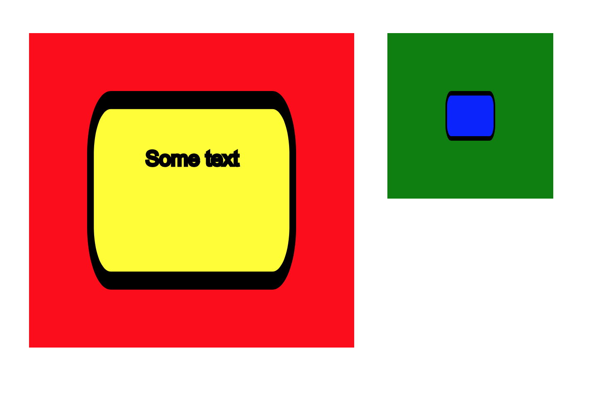
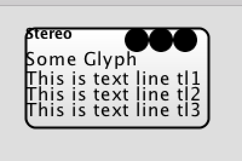
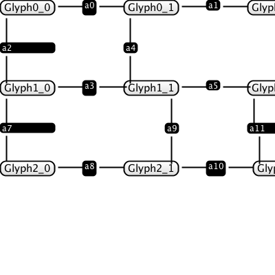

# 18 January 2017 - Sprint 011:  SVG As The Output Format

- Split tests into planarization, orth, compaction, display so we can add SVG to the display ones only.  DONE
- Update test results to check SVG, where necessary.  Don't use this for all tests, just some.  DONE
- this means converting our displayers to use SVG rather than Graphics2D.   DONE 
- Test against SVG content, make sure it's deterministic.   DONE
- In order that we can properly take advantage of fills, we need to start using SVG as the output format. DONE
- "Common" section of the diagram, containing things to reference. DONE
- Better to get this out of the way early.


## Prelude

Ok, so we have an element (say a `Text` `DiagramElement`) which we want to render.   This will be turned into
SVG by applying the stylesheet, and rendering it into a number of elements in a number of layers.

A single diagram element can turn into multiple SVG elements.  So, we should hold them together 
with a group.  (We already do this, really)

And, the groups should be further layered to enforce drawing order.

Finally, we will have the special "flannel" layer and "container" layers, which will provide 
drop-containers and interactivity.  

*Any* SVG CSS will be allowed to be applied, so, this means animations will work, background images, etc.

So, we need to cover off a lot of that in the tests.

Also, we are going to need a "common" area of the diagram, where we can define fill patterns and so on.  
This is a key part of SVG.

## Palettes

From the point of view of a palette, it seems really cool to pull a  load of XML out of one document (i.e the palette)
 and stick it into another and off we go.

However, in practice, this obviously won't work, unless the representations are completely the same, or at least, reversible.

*Can we create an augmented SVG, that allows us to drop from one place into another?*

Answer: no.  The output from rendering *is just different*.  You've got layers, etc.  Isn't this going to
make it really hard to work with palettes?  Yes.   Well.   Maybe.

I guess the way a palette works is that you drop an element from one place into another.    So, when we add
a palette into a diagram, we are basically adding a bunch of `defs`.  These `defs` get copied across to the diagram.


## `use`

SVG already provides facilities for this, via the `<use>` tag.  Out of the box, we wouldn't support this. 

- **A palette is an XML file**, an output format that we produced, that can be shown on the screen.
- **There should also be a stylesheet**:  A stylesheet can define some `<defs>` somehow, which are used by the palette? 
- When you copy a bunch of XML onto your document, defined as SVG, can you edit it?   The obvious answer is
no:  it's static SVG.  We're not building an SVG editor after all. 
- But, we're kind of headed this way:  we have colour-pickers, we want to be able to upload background images.  Where 
will it end?

## Containment

Our own XML specifies the container hierarchy.  This is a big part of knowing what to render.  However, when we convert to 
SVG, this is always lost.  Also, you can't (I think) support both containment and animation, so obviously containment has to go.

But, well we need to have this specified in the diagram, otherwise copying and moving won't work, so I think the `flannel` layer
(which should be called `control`) will manage this... somehow. (maybe we'll have some extra tags or attributes to do this?).

In fact, I think maybe the control layer should contain the snippet of the original XML that represents the shape from the 
original diagram.  That way, we can reconstruct the original XML when we do the palette copy.

So, the control layer is for behaviours (`onclick`, `mouseover` etc) as well as important meta-data about the structure of the diagram.

## Text

Take this example diagram:

```xml
<?xml version="1.0" encoding="UTF-8"?>
<diagram xmlns="http://www.kite9.org/schema/adl" id="The Diagram">
  <arrow id="One" rank="0">
    <label id="auto:0">One</label>
  </arrow>
  <arrow id="Two" rank="1">
    <label id="auto:1">Two</label>
  </arrow>
</diagram>
```

We're now at the stage where we need to consider the label and the arrow as separate parts.  Currently, our displayer is treating both at the same
time.  We shouldn't do this anymore.  

But, how to achieve this?
- Often, displayers are asked to size up their content.  This is ok where we know exactly what the content is, and this is what we've relied on in the past.
- Containers also have the problem of working out their sizes.  Most of what we are doing seems to be moving things in the direction of being more like containers. 
- Sizing is only used in 3 places:
	- `LabelInsertionOptimisationStep` (for working out the size of a label)
	- `BasicVertexArranger` For setting the sizes of the darts around a vertex.  Happens after orthogonalization.
	- `VertexArrangementOrthogonalizationDecorator`: Which basically calls the above.

So, it seems like we need to do some work on deciding what to represent in the diagram, and how to represent it, post orthogonalization.


# Step 1: Displayers

We need to refactor displayers so that we have an ordered list of layers, and each displayer knows how
to draw a layer (or layers?).  

We have the following layers:

```java

public enum GraphicsLayerName {

	BACKGROUND, SHADOW, MAIN, FLANNEL, WATERMARK, COPYRIGHT, DEBUG
}
```

We at minimum need to create a `text`-element displayer which handles:
- the `shadow` layer
- the `main` layer
- the `flannel` layer

And, for the `diagram` element, we need to handle `background`, `watermark`, `copyright` layers.

As a test, we should be testing the *actual content of the SVG diagram*.

# Step 2:  Random SVG

[This page](https://developer.mozilla.org/en-US/docs/Web/SVG/Element) covers details about all of the different SVG elements.  

Now, since we are using CSS attributes to determine content, it seems perfectly reasonable that we will be able to nest any of this stuff within
one of our elements.  

It would be nice if we had a component that was a container for SVG. i.e:
- It has a minimum size
- It's rendered in SVG as a group
- Within the XML, it contains some SVG instructions, which get piped into the output.
- Potentially, maybe we can expand the size of the group later. 

This would be useful for things like the background image, and also the horizontal line (or any other fixed shapes
that we want to output- ports, perhaps).

Later, we might be able to extend this to cover terminator shapes.  For now, I think it's enough to just create one.

In order to do this, we need a way to pipe SVG into the output of the diagram.  And, we need to be able to specify
that certain XML elements are just "straight" SVG.  

**How can this work?**  I am guessing one of two ways:

## Can we simply pass SVG straight through to the output context, unmodified.  (as XML)?

So, once we have *interpreted* the input XML, and attached CSS styles to it, are we in a position to simply transform that into SVG?  If it's *already SVG*, then,
we are done.  (We would need to "flatten" the styles in order to get rid of the need for the CSS stylesheet... hmmm.)  Alternatively, we could translate the stylesheet 
so that it's also available on the client side.  This wouldn't be a total disaster if we used classes.

*Can the path be a CSS attribute?*  No.  

## We could interpret the SVG using Batik, and then output it to the graphics context, to be converted back to SVG.

Let's discuss which is best.  The first way is probably less of a problem.  However, transforms probably *are* going to be needed:  you might need to move an
element, or apply some stylesheet settings.   (Are we going to have the stylesheet set for the client elements?  Surely, we are using the stylesheet to transform
the *input*, not the *output*.   The output is the result... 

Ok. In that case, we are going to need to interpret the SVG into (whatever it should be) and then output it.  Is that even going to work? 

Probably not.

## Transforms

We need 3 transforms (i.e displayers):  

1.  Has some text in it, and can work out the size of itself based on the text, and turn that into some SVG `<text>` tags (within a group at a specific position on scree).
2.  A fixed-size shape.  Turns this fixed-size shape into some SVG on screen (SVG is passed through from the contents of it). 
3.  A (decorated) flexible shape.  For a given size, creates an SVG `<path>` element in a number of diagram layers.  Paths all have `d=` attributes.

## Building Tests

1.  We need a test of an element that contains an embedded piece of SVG.  DONE
2.  We need to see if we can add all the random SVG things to one of our existing elements (background, other CSS etc).
3.  Can we embed some *styled* text within a glyph, and get it sized correctly?

## How Much Batik?

 - We need Batik to interpret the DOM and create our Stylesheets.  That's great.
 - The next thing Batik does, is create a `BridgeContext`.  From this, it converts the DOM into `GraphicsNode`s.  (Each bridge function handles a different element).
 - Each graphics node *knows how to display itself*.  That is, *paint* to the Graphics2D output.
 - Additionally, Batik contains a Graphics2D implementation which can itself output SVG.

### Question 1:  Are our elements merely new XML elements?  If they are, we could supply some new `BridgeContext`s in order to display them.  Is this a good idea?

Ok, let's think about that.  Firstly, it means that all Kite9 diagram elements would essentially be the same (they already are, anyway).  So, we would be defining
a new namespace which exists within Batik's SVG one.  (Er, we already have).

We could then register a Bridge Context which takes *my* elements and then runs the whole Kite9 process over them.  If we did this, what would we gain?  \
 - First, all the normal rules of SVG would be upheld (transparency, etc).  
 - Second, we could plug into the normal SVG pipeline nicely.
 - We'd only need to write a couple of BridgeContexts, and everything would display nicely.
 - BridgeContexts would, however, need to be happy with multiple layers.  (These are handled I guess by `GraphicsNode`s).
 - So, each of my `DiagramElement`s would have a BridgeContext...  
 - Generally, it would be easy to determine where they would be, and create the layout.  Would the outline of a glyph actually just be a correctly scaled path?
 - All external resources would be flowing through the `UserAgent` abstraction.
 - Kite9 elements would be able to contain SVG elements.  But not vice-versa (for now).
 - Luckily, we are able to get the `DiagramElement` for a given `XMLElement`...
 
### Question 2:  How to extend the Bridge Context?  

 - I've seen this documented on the internet.
  
### Question 3:  Ok, how to proceed, then?

 - We start with the diagram element - you have to have that for Kite9 processing.   (Step 1).  
 - Each diagram gets processed by the appropriate bridge element (`Kite9Bridge`)
 - We create some separate classes for this:  let's try to set up the Batik context to output diagram elements (as groups).
 - So, we're going to transform the way the new primitives tests work.
 - We *don't* add processing of text - we just work out how big the contents are and display them inside the group.
 - `Renderer` class is the base class for rendering a GVT tree into an output.  
 - `SVGAbstractTranscoder` takes an `SVGOMDocument` and creates a `BridgeContext` with it.
 - It creates a `GVTBuilder` and calls `builder.build(ctx, svgDoc);`
 - Then, calls Renderer.setTree or something to set the GVT Tree on the renderer.
 - `Renderer.repaint` to output it... `renderer.getOffScreen()` to get result.
 
First, I created `test_54_3_TestTranscoder`, which demonstrates Batik converting a simple SVG document into PNG.
Now, can I get it to recognise Kite9 elements inside that?  Problem here is that a lot of the Batik code doesn't
have rendering anything other than SVG in mind.  

This means that I need to extend their elements a lot of the time, which is tricky:  I already have my own inheritance
hierarchy, which doesn't include `SVGSVGElement`.  I've constructed a `Kite9BridgeContext`, which is basically
used for 'driving' the conversion process between the XML DOM and the Batik `GraphicsNode`s.  

However, what immediately becomes obvious is that if I want my XML elements to play nice with Batik's approach to 
rendering, the whole DOM is going to have to implement the right interfaces, and currently this doesn't happen.

For the purposes of Kite9, our elements are *new classes within the hierarchy of SVG*, and so should implement the 
expected SVG interfaces.    (Done)

Second, my Kite9 `<diagram>` element really should extend their `<svg>` element - can we achieve this?  If so, we 
can render the initial diagram without writing anything in the way of new code.  Then, what's next?   All of the other Kite9
elements should (by default, I guess) extend out the SVG `<g>` element, since they all need to make (at least one) group.

Let's consider an alternative, quickly:   what if my <diagram> element could be nested *inside* the SVG element?
 - This would be good from the point of view that, the SVG element is really a placeholder for some SVG, and has no content,
 whereas a diagram is actually something that exists within an SVG document.
 - Also, from the point of view of being more Batik-y, and closer to what they expect the extension points to be.
 
### Integrating Further

I have some tests working: I can now take *my* Kite9 SVG elements and get Batik to output them.  That's a start.  Next, I need to 
be able to handle Batik having *nested* SVG elements within mine:   if I can get that working, then it's really only one step from 
there where I can say:  set the size of my SVG element to contain the Batik ones.

This pushes me towards the belief that most of my elements will be groups:  I can position them wherever on the page.  But, maybe that's
just the starting point.  I should be looking at shapes too, embedded within them?

# Step 3:  Scaling Containers

In order to check that elements are sized correctly, with SVG contents, we need to be able to see them a bit better.
For this, we're going to need to create borders.

## Problem

At the moment, we can run `size` in the displayer, and work out how big a container is, based on it's contents.  This is a 
problem if the contents *themselves* depend on the size of the container.  So, we need to be specific about this:  either, you're 
`StaticSVG`, and you can be sized, or you are a `Container`, and your size is dependent on contents.   

So, let's create the static SVG element right now so we can move beyond that problem.  (Creates `FixedSizeGraphics`)

## Scaling Containers

So, let's say the container has some SVG inside it.  Really, we want this to scale to be the same size as the container itself.
The obvious way to do this is to put a transform on the group element for both position and size (unlike `FixedSizeGraphics`, which 
we just transform position).  This introduces a second problem: transformations compound on each other.  So, we can't respect the 
containment ordering of groups the way they are represented in SVG.  

There are two ways around this:

1.  Use two SVG groups per ADL element:  one to contain the ADL structure, one to contain SVG.  Only the nested SVG one would have
a transform.   This is kind of OK, because you would be positioning elements correctly, but there would be twice the number of
groups that you need.  

2.  Do what we do in the diagram editor at the moment, and flatten the structure.  ADL elements are *not* nested in SVG groups, 
they are ordered according to depth within a single group.  This reduces the number of groups, and has been proven to work, so this 
is what we should do, however, we lose the information about the structure of the diagram itself.

The only problem with (2) is that we have to now interrupt the logic of the `GVTBuilder` component.  So, maybe we should try (1)?
Thinking ahead a bit further, we are going to run into `GraphicsLayer`s, soon, how does this affect things?  For the diagram, we are going
to want to construct a number of layers, and then populate them.  I have a feeling this will mean changing the `GVTBuilder` too.

Looking at the code of `SVGAbstractTranscoder`, it doesn't appear that there's any way I can really change `GVTBuilder`.  Is there an 
alternative to doing this?

One approach is to avoid the use of `isComposite()`, which handles the construction of the tree based on the group structure.  If my 
bridge elements actually set `isComposite()` to false, we would end up creating the group structure ourselves.

## Identifying Groups

If we want to do (1) or (2) above, then we need to be able to indentify groups properly after the transform.  The only problem is that 
`SVGGraphics2D` (which we are using to output our SVG) doesn't *directly* support a "createGroup" method or anything:  instead, groups are
constructed *as needed* by `DOMGroupManager` and `DOMTreeManager`.   By "as needed", what I mean is that as you construct SVG primitives in the
DOM, it tries to preseve as many attributes as possible from one SVG element to the next, by the use of groups. 

This means (I think) that there will only really be *two layers* of groups. The `DOMTreeManager` manages the `topLevelGroup`, while the `DOMGroupManager`s
manage a procession of sub-level groups, changing groups when they determine that enough of the attributes have changed between elements.
 
However.  We need to change this approach so that we have multiple top-level groups:  one for each of the Kite9 diagram elements.  I *think* this 
really means we have to mess hard with the `DOMTreeManager`, and keep changing the top-level group within it.  

We kind of did this before for `SVGRenderer`, so let's do it again here, with a simple `Deque`, in `GroupManagingSVGGraphics2D`:

```java
public class GroupManagingSVGGraphics2D extends SVGGraphics2D implements GroupManagement {

	private Element realTopLevelGroup;
	private Element currentSubgroup;

	@Override
	public void createGroup(String id) {
		Element newGroup = currentSubgroup.getOwnerDocument().createElement("g");
		currentSubgroup.appendChild(newGroup);
		newGroup.setAttribute("id", id);
		this.currentSubgroup = newGroup;
		setTopLevelGroup(newGroup);
	}
	
	public void finishGroup(String id) {
		if (!id.equals(currentSubgroup.getAttribute("id"))) {
			throw new Kite9ProcessingException("Was expecting current group with id: "+id);
		}
		
		Element parent = (Element) currentSubgroup.getParentNode();
		setTopLevelGroup(parent);
		this.currentSubgroup = parent;
	}
```

## Getting the Translation Right

First thing I notice is that if I scale an element, it also scales the stroke-width.  So, it seems like scaling is out, right?
What should I do instead?  Well, the other options are (I guess) more complex:  I can either scale the stroke back down (seems like
an easy out) but even then the radii on the borders are wrong.... 

So, it seems like we need something *cleverer*.  Values (sizes, positions) on the SVG elements are set up and held in `SVGLength` objects and the like,
which are returned from the classes like `SVGOMRectElement`.  In practice, Batik handles these with base classes and 'animated' subclasses.

These object implementations know how to retrieve the values from the underlying XML document using the `revalidate()` method.  But actually, there are (probably)
lots of cases where we *will* want the whole background to scale with the size of the cell, so I am thinking really that what we need is a special version of SVGPath
that knows about it's container (the original idea).

So, let's just focus on fixing the translation first.  Unfortunately, this is complicated by needing to understand the bounds of the contents: with Kite9 elements 
involved, it's pretty much impossible to know what the contents' bounds are.  Maybe we need to change CompositeGraphicsNode to ignore Kite9 elements?

*You can't reliably give the bounds for an element when it has unsized sub-elements within it*.  So, I had to add some functionality for 
sizing *just the SVG*, which allows me to work with fixed bounds.  This is in `IdentifiableGraphicsNode.getSVGBounds()`.

Having figured that out, the next challenge was that the affine transforms are compounded in graphics nodes.  I had to keep this in mind when setting
up the transforms for nested elements.  However, eventually I was able to create the below:



In this, we have multiple nested elements (and text), which are scaled according to affine transforms on the various groups.

# Step 4: Proper Paths

From [Sprint 8](sprint_008.md) we have the following definition for grids:

```css
glyph.full-spec {
	type: composed;
	layout: grid;
	grid-size: 3 4;							// defines a 4x4 grid, from x1-x4 and y1-y4
	
	path: M x0 y0 H xe V y3 H x0 z;			// basically a rectangle. xs is an alias for x0 and xe is an alias for whatever the last one is (y3 in this case)
	padding: 6px 6px 6px 6px;				// leaves padding around the rectangle 
}

glyph stereotype {
	type: text;								// defines a label
	layout: right;
	occupies-x: 0 1;						// might be a better way to define position than the single 'occupies'
	occupies-y: 0 1;					
}
```

## A Variable-Sized Path `GraphicsNode`

For the above to work, we need two things:

1.  A new path-parser, which can handle extra variables.
2.  A context containing those variables, which is set up according to either the element itself, or the parent element.

To do (1), we need to subclass `SVGPathElementBridge` to create a new `ShapeNode`.  There is a problem here
that the bridge is responsible for parsing the path and creating the shape, but obviously, we aren't going to know the exact
dimensions of the shape until we've called `draw()` on the parent element of the shape. 

The way the `ShapeNode`s work is that they create a `ShapePainter` instance and use it to display the shape on the `Graphics2D`.
`ShapePainter` uses the normal AWT `Shape`, with it's path iterator etc.   So, the way to go about this is to create a shape which
has the context defined with some variables.

### The XML

In the CSS above, we add the path to the `<glyph>` element, and it will render.  But currently, we are using the `Kite9DiagramGroupBridge` for 
*any* Kite9 element, turning them all into SVG `<g>` elements.  All of the actual content, we are using SVG.   We're going to want to minimize
the amount of XML later though.  For example:

 - We might want to automatically add the text `GraphicsNode` to our group, without any extra XML.  (`type: text` in the SVG)
 - We need the path to work (above).   (`type: composed`, or anything else)
 - But, we might need to add extra paths... so we'd need other elements for those.   (maybe `type: fixed;`)
 
... I can't think of any more examples.  It's just all text and graphics at the end of the day.   So, it feels like we might need to create 
more than one `GraphicsNode` from a given XML element?  I think a `Bridge` implementation should be ok to do this.  

The easiest thing to start with is to override the `SVGPathElementBridge` to create `ScalablePathElementBridge`.  From here, 
we can override some of the behaviour of regular SVG paths and introduce our new variables.  Can we render this, for instance:

```java
	private String scalablePath() {
		return "<svg:path d='Mx0 y0 H x1 V y1z' />";
	}
```

The problem I now have is that at the time of building the shape, I don't know how big it's supposed to be.  Somehow, I need to defer it, so I can build it
at a time when I *do* know.  The best way to achieve this might be to set a simple initial path, and then overwrite it with the correct path once we have it.

Problem with this is that the `CSSEngine` seems to be disposed of by the time I come to write the `GraphicsNode`s.  This is *kind of* OK, except that I really hadn't
finished using it.  So, Kite9 does it's arranging, but then the SVG path is lost.  How should this work?

What needs to happen is that Kite9 *reconstructs* the shapes for the scalable paths sometime after it has sized everything, but *before* the process of drawing the 
`GraphicsNode`s to the output.

### Reconfiguration

`DiagramElement`s are now in control of the various `GraphicsNode`s which represent their layers.  This means that we need to be able to use the `Bridge` over and
over again for the elements in order to construct these layers.

However, for the `DiagramImpl` itself this is a problem - we want to use the `Bridge` to construct the `CompositeGraphicsNode` which holds the entire diagram (i.e.
all the layers).  For the layers within `DiagramImpl` (and within any other element), we're going to construct a temporary `<g>` element, and then use this to 
create the `CompositeGraphicsNode` for each layer.

This now means that Kite9 is in control of the creation of the `GraphicsNode`s, and can do this anytime we call:

```java
public interface HasLayeredGraphics extends DiagramElement {
	
	public GraphicsNode getGraphicsForLayer(Object l);
	
	public void eachLayer(Function<GraphicsNode, Void> cb);
	
	/**
	 * Returns just the bounds of the SVG elements.
	 */
	public Rectangle2D getSVGBounds();
}
```

Now, the next problem is back to the scalable path:  we need Kite9 to create `DiagramElement`s for scalable paths, so that it can position them, and also so we
can defer their 'drawing' (i.e. creating `GraphicsNode`s from them).  

Additionally, we have a second, related issue:  at the moment, we are interleaving SVG and `DiagramElement` XML in the same place.  However, this won't get rendered
in the correct order.  We have `FixedSizeGraphics`, but really we also need to implement `ScaledGraphics` the same way.

So, in future, we need to make sure we don't interleave both SVG and Kite9 XML at the same level. 

### `Decal`

One element I've wanted to introduce for a while is the `Decal`, which is a piece of ornamentation over another element.  Now, we can.  `Decal` has a single method:

```java
public interface Decal extends DiagramElement {

	public void setParentSize(double[] x, double[] y);
}
```

And `Decal`s are going to be the basis of the adaptive graphics element. They have zero size for compaction purposes, but on display, take the size of the container.
The container sets the sizing information for itself, so that when we call `getGraphicsForLayer`, we can get the decal to return something related to the size of the container.

The simplest implementation for `Decal` is to use SVG:

```java
public class AdaptiveScaleSVGGraphicsImpl extends AbstractRectangularDiagramElement implements ScaledGraphics, Decal {

	@Override
	public void setParentSize(double[] x, double[] y) {
		// iterate over the contained svg and overwrite any variables
		performReplace(theElement.getChildNodes(), x, y);
		RectangleRenderingInformation rri = getRenderingInformation();
		RectangleRenderingInformation parent = getContainer().getRenderingInformation();
		rri.setSize(parent.getSize());
		rri.setPosition(parent.getPosition());
	}

	private void performReplace(NodeList nodeList, double[] x, double[] y) {
		for (int i = 0; i < nodeList.getLength(); i++) {
			Node n = nodeList.item(i);

			if (n instanceof Element) {
				performReplace(n.getChildNodes(), x, y);
				for (int j = 0; j < n.getAttributes().getLength(); j++) {
					Attr a = (Attr) n.getAttributes().item(j);
					performValueReplace(a, x, y);
				}
			} 
		}
	}

```

What this does is resolve references in the contained SVG to {x0} {y1} etc. and replace them with the measurements from the container element.  i.e. we change the XML
*before* we create the `GraphicsNode`.  To do this, we can simply iterate over the attributes of the SVG.

# Step 5: Proper Glyphs

## Text

At this point, it should be possible to (laboriously) create a proper glyph using SVG and Kite9.  Later, we'll add some CSS shortcuts to generate elements automatically
which should make things much easier.   But, let's try this first.

First thing, let's fix the problem of rendering text.  At the moment, Batik is turning all text into `GlyphVectors`, and this gets rendered as one big path in the SVG 
output file.  This isn't great- it means that a lot more data is going to get pushed from server to client, and also, it makes testing harder.  Further, it's a problem
best solved up-front if we are going to do work on positioning text properly.  

Batik uses a `TextPainter` implementation in each `TextNode` for outputting the text to the `Graphics2D` output.  The `TextPainter` in turn chops up the text into runs,
and uses a `TextLayoutFactory` for converting these runs into `TextSpanLayout` implementations, which handle the actual
drawing.  It wasn't too hard to overwrite the `draw()` method to use `Graphics2D.drawString()`.

The only problem with this is that the text colours don't seem to be set properly.  Now, I could spend ages figuring this out, but I'm not sure it's worth it.  We 
just need to set the `fill` attributes like everything else does:  `fill` is the only attribute used by SVG text.   So, we end up overriding the `draw` method like this,
in `TextBridge`:

```java
@Override
				public void draw(Graphics2D g2d) {
					Paint basePaint = g2d.getPaint();
					TextPaintInfo tpi = (TextPaintInfo)aci.getAttribute (GVTAttributedCharacterIterator.TextAttribute.PAINT_INFO);
			        if (tpi == null) return;
			        if (!tpi.visible) return;

			        Paint  fillPaint   = tpi.fillPaint;
			        
			        if (fillPaint != null) {
		                g2d.setPaint(fillPaint);
						g2d.drawString(aci, (float) getOffset().getX(), (float) getOffset().getY());
		            }

				        
					g2d.setPaint(basePaint);
				}
```


At this stage, fonts are not a solved problem - we'll get to this.

## Fills

On the *writing* side, fills are handled in Batik by the `SVGGeneratorContext`, which is responsible for dictating styling, fonts, and how fills 
are translated from `awt` constructs into SVG ones.   

On the *reading* side, the SVG XML is converted (via Bridges) into things like Batik's own `LinearGradientPaint`.  

Luckily, we already wrote a plug-in for the `SVGGeneratorContext` that handles paint, the `GradientExtensionHandler`, which I was able
to make work with Batik's gradients rather than `awt`s very simply.   We'll eventually need to do the same thing with images,
but it's not strictly necessary just to get Glyphs working again.

## Glyphs

### Basic Glyph

The simplest Kite9 Glyph is a round-cornered box with some text in the middle.  Let's see if we can create a nice one 
of those using what we've created so far:


The XML to generate this was:

```xml
<svg:svg xmlns:xlink='http://www.w3.org/1999/xlink' xmlns:svg='http://www.w3.org/2000/svg'>
  <svg:defs>
    <svg:linearGradient id='gg' x1='0%' x2='0%' y1='0%' y2='100%'>
      <svg:stop offset='0%' stop-color='#FFF' />
      <svg:stop offset='100%' stop-color='#DDD' />
    </svg:linearGradient>
  </svg:defs>
  <diagram xmlns='http://www.kite9.org/schema/adl' id='one' style='type: diagram; padding: 10px'>
    <glyph id='g1' style='type: connected; sizing: minimize; padding: 8px 10px 8px 10px;  '>
      <back id='back' style='type: decal; sizing: adaptive; '>
        <svg:rect x='0' y='0' width='{x1}' height='{y1}' rx='8' ry='8' style='fill: url(#gg); stroke: black; stroke-width: 2px; ' />
      </back>
      <label id='label' style='type: connected; sizing: fixed'>
        <svg:text style='font-size: 15px; stroke: black; font-face: sans-serif; '>Some Glyph</svg:text>
      </label>
    </glyph>
  </diagram>
</svg:svg>
```

### More Complex Glyph

What about a glyph with text-lines, stereotype and symbols?  Can we do this?  To achieve this, we are going to need to use a container with a grid.  I think this
is worth trying right now, before we consider optimising the XML, so let's do that next.   55_2 defines this:

```xml
<svg:svg xmlns:svg='http://www.w3.org/2000/svg'>
  <svg:defs>
    <svg:linearGradient id='gg' x1='0%' x2='0%' y1='0%' y2='100%'>
      <svg:stop offset='0%' stop-color='#FFF' />
      <svg:stop offset='100%' stop-color='#DDD' />
    </svg:linearGradient>
  </svg:defs>
  <diagram xmlns='http://www.kite9.org/schema/adl' id='one' style='type: diagram; padding: 10px'>
    <glyph id='g1' style='type: connected; sizing: minimize; layout: grid; grid-size: 2 3; padding: 8px 10px 8px 10px;  '>
      <back id='back' style='type: decal; sizing: adaptive; '>
        <svg:rect x='0' y='0' width='{x1}' height='{y1}' rx='8' ry='8' style='fill: url(#gg); stroke: black; stroke-width: 2px; ' />
      </back>
      <stereo id='stereo' style='type: connected; sizing: fixed; occupies: 0 0'>
        <svg:text style='font-size: 12px; font-weight: bold; stroke: black; font-face: sans-serif; '>Stereo</svg:text>
      </stereo>
      <symbols id='symbolsContainer' style='type: connected; sizing: minimize; layout: horizontal; occupies: 1 0 '>
        <symbol id='s1' style='type: connected; sizing: fixed;'>
          <svg:circle cx='0' cy='0' r='10' />
        </symbol>
        <symbol id='s2' style='type: connected; sizing: fixed;'>
          <svg:circle cx='0' cy='0' r='10' />
        </symbol>
        <symbol id='s3' style='type: connected; sizing: fixed;'>
          <svg:circle cx='0' cy='0' r='10' />
        </symbol>
      </symbols>
      <label id='label' style='type: connected; sizing: fixed; occupies: 1 1 0 1'>
        <svg:text style='font-size: 15px; stroke: black; font-face: sans-serif; '>Some Glyph</svg:text>
      </label>
      <text id='textContainer' style='type: connected; sizing: minimize; layout: vertical; occupies: 0 1 2 2 '>
        <text-line id='tl1' style='type: connected; sizing: fixed;'>
          <svg:text style='font-size: 15px; stroke: black; font-face: sans-serif; '>This is text line tl1</svg:text>
        </text-line>
        <text-line id='tl2' style='type: connected; sizing: fixed;'>
          <svg:text style='font-size: 15px; stroke: black; font-face: sans-serif; '>This is text line tl2</svg:text>
        </text-line>
        <text-line id='tl3' style='type: connected; sizing: fixed;'>
          <svg:text style='font-size: 15px; stroke: black; font-face: sans-serif; '>This is text line tl3</svg:text>
        </text-line>
      </text>
    </glyph>
  </diagram>
</svg:svg>
```

Using the PNG renderer, this renders as something like this:



Clearly, margins and padding are not really being respected in this version.  Do I care about this now, or will it do?
I think it might be best to leave this now and move on - the point is proven, even if rendering isn't perfect.

# Step 6: Definitions

The XML above was *ok*, but it's not where we want to be as a final destination- it's hardly *minimal*.  We'd like something like:

```xml
<svg:svg xmlns:svg='http://www.w3.org/2000/svg'>
  <diagram xmlns='http://www.kite9.org/schema/adl' id='one'>
    <glyph id='g1'>
      <label id='label' text='Some Glyph' />
    </glyph>
  </diagram>
</svg:svg>
```

Which is going to involve a bit more extremes of stylesheeting.  

In SVG, it's possible to define a filter or texture in one place, and then re-use it across the whole diagram.  If we import an element using a palette
then it's important we also bring in the `defs` from it. 

We have various elements which we might want to reuse:

- `defs`:  e.g. gradient fills, or any SVG elements which are general rather than specific.  These are likely to come from a palette.
- `binary`:  e.g. backgrounds, images, fonts.  These are going to be referenced in stylesheets or in the XML on the palette, and we want to reference the same.
- `stylesheets`: The palette is likely to use a stylesheet for it's layout.  A palette is going to be a Kite9 XML document, rather than an SVG document.
- `javascript`: Behaviours apply to the *transformed* SVG version of the XML document, but apply to the Kite9 XML document.

So, how to be explicit about reuse?

- If we use stylesheets for this, it *feels wrong*, as stylesheets are for style.
- Also, we can't store XML in a stylesheet, just directives.  Trying to make them more than they are is crazy.
- But, we need to consider what's going to happen:
  - Someone loads a palette.
  - They drag an element off the palette into the diagram
  - Then, the element is in the diagram too.   Will it change appearance in the new context?   
  - How do we set up the behaviours on the diagram, how do they interact with the stylesheet.
  
## Principles

1.  Stylesheets are for Styles

We don't store XML in them.  But, we are likely to want to give some 'template' contents for an XML element.  I think the best way to do this is with a `url()` 
in the stylesheet.  This way, we can pull a fragment of XML in from somewhere, and use it as the content of the diagram element.  Ideally, we will add this
to the `defs` section, so that it can be re-used by other elements.  We're going to need a test for this kind of cross-referencing within a document.  (And probably, 
versioning is going to be important).

2.  The Palette will define all of the XML we need.  

Either in its `defs` section, or the main section, and we'll just pull it in (copy it).  If it's using a `def`, we'll have to copy that in too... and make the URL
non-local at the same time.

3.  There needs to be an Empty Document template.

- This will contain the basic behaviours (a list of javascript files) and the stylesheets ( a list of CSS files).   
- Behaviours will be attached to SVG elements using CSS classes, and some kind of jQuery-like way of attaching behaviours.
  
4.  Each Behaviour in a separate Javascript file.

 - We could use at-rules in the stylesheet to specify these behaviours.
 - Or, we could list them all at the top of the XML document, like a regular web page.
 - We can use class matching to attach these to SVG primitives.
 
## Building an Example

### `template`

We need to add a CSS directive for `template`, which can set up an `<svg:use>`.   IE doesn't support `use` when it refers to
documents outside the current URL.  But do we even want to do that anyway?  Let's decide later.  

But, is this good enough?  What if it's a label, and we want to replace some text?  In these cases, it's not enough to
have the rendered `<use>` in our output:  we need to resolve that and turn it into real XML.  So, the templates need to be
resolved at draw time and turned back into normal XML.  This is going to be done by the `Kite9BridgeContext`, like so:

```java

	/**
	 * This needs to copy the template XML source into the destination.
	 */
	public void handleTemplateElement(XMLElement in, DiagramElement out) {
		Value template = out.getCSSStyleProperty(CSSConstants.TEMPLATE);
		if (template != ValueConstants.NONE_VALUE) {
			String uri = template.getStringValue();

			try {
				// identify the fragment referenced in the other document and
				// load it
				URI u = new URI(uri);
				String fragment = u.getFragment();
				String resource = u.getScheme() + ":" + u.getSchemeSpecificPart();
				ADLDocument templateDoc = loadReferencedDocument(resource);
				Element e = templateDoc.getElementById(fragment);

				Node copy = copyIntoDocument(in, e);
				
				// ensure xml:base is set so references work in the copied content
				((Element)copy).setAttributeNS(XMLConstants.XML_NAMESPACE_URI, XMLConstants.XML_BASE_ATTRIBUTE, resource);

			} catch (Exception e) {
				throw new Kite9ProcessingException("Couldn't resolve template: " + uri, e);
			}
		}
	}
```

The `BridgeContext` has a class called `DocumentLoader` for the purpose of loading referenced resources.  This *seems* like the right place, but I guess 
alternatively, the code could go in a `Bridge` instance.  However, `Bridge`s are for converting from XML to `GraphicsNode`s, and this is actually mucking about
with the XML itself, so it seems like it would be the wrong place.

In the test, 56_1, we are actually trying two imports:  one of a Kite9 XML element, and one of an SVG element.  Further, we are going to 
use the `<defs>` from the template too, so those will need to be imported across.  One problem is that when we copy across the XML from one document to another,
any references (like the reference to the Glyph's background texture) which are local are going to be wrong.

Luckily, XML has the `xml:base` attribute, so we can set this for all the copied content in order to fix the references, which is in the code above.

## Fixing Up The Tests

At this point, Glyphs are looking OK.  So, in order to complete work on these, we need to sort out the stylesheet properly and then run all the
tests.  *We can't make everything look perfect yet*, because we aren't supporting fonts - that's in the next sprint.  So, for now, we should
just concentrate on getting the tests running and not worry too much about Symbols/Glyphs/Margins and so on.

### Links

Links should be represented by a single 'path' element, so let's try and render these next.  But first, what does the XML look like for one?

```xml
<svg:svg xmlns:xlink='http://www.w3.org/1999/xlink' xmlns:svg='http://www.w3.org/2000/svg'>
  <stylesheet xmlns='http://www.kite9.org/schema/adl' href="file:/Users/robmoffat/Documents/adl-projects/kite9-visualization/target/classes/stylesheets/designer.css"
    xml:space="preserve " />
  <diagram xmlns="http://www.kite9.org/schema/adl" id="The Diagram">
    <glyph id="one" rank="0">
      <stereotype id="auto:0">Stereo</stereotype>
      <label id="auto:1">One</label>
    </glyph>
    <glyph id="two" rank="1">
      <stereotype id="auto:2">Stereo</stereotype>
      <label id="auto:3">Two</label>
    </glyph>
    <arrow id="meets" rank="2">
      <label id="auto:4">meets</label>
    </arrow>
    <link id="meets-one" rank="3">
      <from reference="meets" />
      <to reference="one" />
    </link>
    <link id="meets-two" rank="4">
      <from reference="meets" />
      <to reference="two" />
    </link>
  </diagram>
</svg:svg>
```

This contains no information about `terminator`s.  But, we have added this code to artificially create them if they don't exist:

```java
	private Terminator getTerminator(XMLElement el) {
		if (el == null) {
			el = (XMLElement) theElement.getOwnerDocument().createElement("terminator");
			theElement.appendChild(el);
		}
		return (Terminator) el.getDiagramElement();
	}
```

So, in order to turn a `RouteRenderingInformation` into a `GraphicsNode`, I co-opted the existing `SVGShapeBridge` functionality, and
created `Kite9RouteBridge` like this:

```java
public class Kite9RouteBridge extends SVGShapeElementBridge {

	private Connection c;
	
	public Kite9RouteBridge(Connection c) {
		super();
		this.c = c;
	}

	@Override
	public String getLocalName() {
		return null;
	}

	@Override
	protected void buildShape(BridgeContext ctx, Element e, ShapeNode node) {
		RoutePainter rp = new RoutePainter();
		Shape s = rp.drawRouting(c.getRenderingInformation(), rp.NULL_END_DISPLAYER, rp.NULL_END_DISPLAYER, rp.LINK_HOP_DISPLAYER, false);
		node.setShape(s);
	}

}
```

`RoutePainter` is the old code used to convert the `RouteRenderingInformation`, just packaged up to output a `GeneralPath`.  Easy ish.

### The Viewport

Next, let's try and get some tests working that don't rely on exact SVG positioning, i.e. most of them.  I've picked o Test10CrossingEdges` to
start with, and they are looking pretty bad:



One key problem here that I need to solve is that the entire viewport is off.  This needs to be fixed.  Luckily, the size of the output image
is held in the `BridgeContext`, so it's an easy job to get the `Kite9DiagramBridge` to write back the size after it's rendered a diagram.

### `TurnLink`s

For entirely unconnected reasons, it's complaining about things having turns which should be `TurnLink` objects.  This is because we
turn everything into XML before we render it, and it loses the information about turn links there.  I can fix this fairly easily I think.

This is easy to fix by using an XML attribute to hold the type of test we are doing:

```java

	public TurnLink(XMLElement from, XMLElement to, String fromStyle, XMLElement fromLabel, String toEndStyle,
			XMLElement toLabel, Direction drawDirection) {
		super(from, to, fromStyle, fromLabel, toEndStyle, toLabel, drawDirection);
		setAttribute(LINK_TEST, TURN);
	}
	
```

### XML Examples

Unfortunately, our new XML format is not exactly the same as our old one: there are a few minor differences.  First, we have a lot of inline `stereotype="blah"` and
`label="blah"` going on.  These *must* be handled as elements in the new world, which is a problem.   To get around this,
I've added an old-to-new conversion of the XML format:

```java
	private void convertOldStructure(Element dxe) {
		if (dxe.getTagName().equals("allLinks")) {
			moveChildrenIntoParentAndDelete(dxe);
		} if (dxe.getTagName().equals("text")) {
			moveChildrenIntoParentAndDelete(dxe);
		} if (dxe.getTagName().equals("hints")) {
			dxe.getParentNode().removeChild(dxe);
		} if ((dxe.getTagName().equals("symbols")) && (((Element) dxe.getParentNode()).getTagName().equals("text-line"))) {
			dxe.getParentNode().removeChild(dxe);
		} else {
			NodeList nl = dxe.getChildNodes();
			for (int i = 0; i < nl.getLength(); i++) {
				Node n = nl.item(i);
				if (n instanceof Element) {
					convertOldStructure((Element) n);
				}
			}
			convertAttributeToTag(dxe, "label");
			convertAttributeToTag(dxe, "stereotype");
		}
		
	}
``` 

Tests are at this point in a fairly good shape for layout, and XML.  

### Fixing Compilation

At this point, since diagram elements are internal to the visualization process, there's literally no 
need to have them in a separate project with separate tests.

# 7: Sunset The Other Displayers

It's time to get rid of everything *except* Batik.  In order to do this, we're going to need to make Symbols, Labels and Links also use Batik/SVG for display.

- rename XMLElement to Kite9XMLElement

Finished, 20th March 2017.

