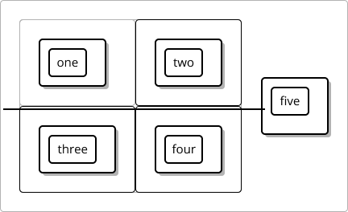
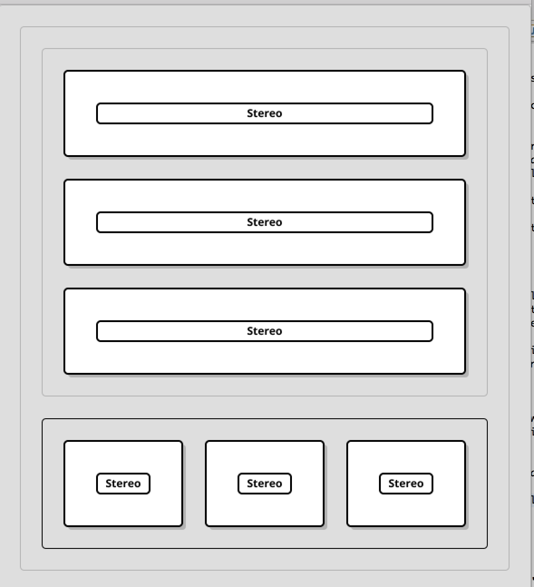
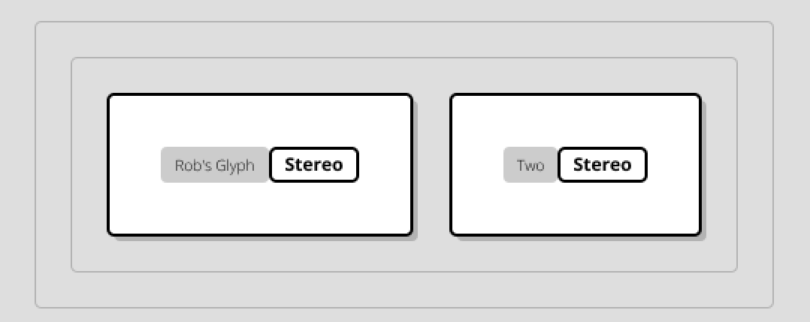
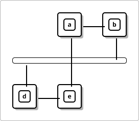

# 1 December 2016 : Sprint 13 - Overhaul Object Model - Glyphs Using Grids

 - Grid layout for Glyphs (i.e. layout=grid ) DONE
 - Removing @Ignores DONE
 - Containers - allowed leaving edges. DONE
 - Stereotype and text content layouts. DONE
 - Default Layout for glyphs (containing a label)  NOT DOING
 
# Step 1: Glyphs Like Containers

Take our example glyph, and try and render it.  The `size()` method should *only* be called on the text (and there should be some).

In order to achieve this, `designer2012.css` needs to change so we are laying out differently:

```css
glyph {
	type: connected;
	sizing: container;		/* Changed this away from text */
}
arrow,
arrow2,
arrow3 {
	type: connected;
	sizing: text;		
}
```

Previously, containers got corner vertices, and everything else didn't.  Now though, it's more complex.  To avoid adding too many pointless elements to the planarization,
we only add corner vertices or regular vertices if an element has connections.   So we have this in `ElementMapperImpl`:

```java

	public boolean requiresCornerVertices(DiagramElement c) {
		if (c instanceof Diagram) {
			return true;
		}
		// does anything inside it have connections?
		if (c instanceof Container) {
			for (DiagramElement de : ((Container) c).getContents()) {
				if (hasNestedConnections(de)) {
					return true;
				}
			}
			
			// are connections allowed to pass through it?
			boolean canTraverse = isElementTraversible(c);
			if (canTraverse && hasNestedConnections(c)) {
				return true;
			}
		}
		
		// is it embedded in a grid?  If yes, use corners
		Layout l = c.getParent() == null ? null : ((Container) c.getParent()).getLayout();
		return (l == Layout.GRID);
	}
	
```	
	
So now, we are using the container layout approach for glyphs.  Now, immediately, this causes problems because we can't correctly size the glyphs: if the elements
inside a glyph don't have connections, the glyph is added as a single vertex (rather than corner vertices).  

# Step 2: Fixing Compaction / Use of `Displayer.size()`

At the moment, we:

 - Planarize
 - Create an orthogonalization
 - Modify glyphs so they have corner vertices
 - Set sizes on the darts, so that the vertices are the right distance apart.
 - Use all that for the compaction process (slidables, etc)
	
This has served us well. What we need to do now is make a few small changes.

First, we need to make this less specific to Glyphs:  All single vertices coming out of the planarization process need to be converted into 
corner vertices.  (This was fairly trivial).

Next, when we get to the Compaction phase, we are going to need to consider the (previously unprocessed) contents of glyphs.  For example, 
they may be a single element of text:  in this case, that needs to be sized, corner vertices created, and attached to the compaction.  It needs to be
be attached in such a way that the padding is respected around the original glyph.

Second, glyphs are probably going to be using the grid system, so we need to make use of this again for displaying their contents.

Finally, it's quite possible now that entire containers have been reduced to just their corners:  sometimes, we need to use a displayer to create the contents
even when we're *not* using the grid system.

## Padding / Margins

One question arising from this is:  where exactly is the vertex?  We might assume for Glyphs that it is 
outside of the padding.  In fact, from a rectangularization perspective, this is a good answer.  It's a shame that 
this in fact means that we've got our grid model wrong for containers.

However, maybe that's not so important, it just means that we're going to unify it for containers and glyphs.

It's not necessary for planarization to have the inside and outside edges of everything.  But, maybe later on it is?

What's the rule here?

- Originally, containers didn't have padding, so they weren't a problem.
- Glyphs, the outside of the glyph was marked by it's vertices.  (During planarization, it was a single vertex, converted to multiple for rectangularization)
- If we already have vertices for the inside of the glyph, we're going to need to add new ones.
- What if we have a nested glyph?  e.g.  a text box, which contains a grid, which has padding, and is within another grid?   This will require two layers 
of vertices to get right.
- If a Glyph has some `text-line`s, then these could have connections.  When we planarize these, those `text-line`s will definitely need corners for the `Connection`s
to attach to.
- This means elements of a grid must be allowed to have links connecting to them.
- Further, this means that the grid elements *cannot be* re-using the vertices from the Container.

To solve this simply:

1.  **Containers need inside and outside vertices.**  This needs to be set up when we create the arrangement.  This really sucks though, as it doubles the 
complexity of the diagrams.
2.  But, **they really only need the inside vertices when a grid is involved**.   Thus, actually, we really only need to create a new set of vertices for grid contents.
3.  But, really we are going to simplify this later so that we only add the grid at the planarization stage when it is populated (see step 3, below)

Where do grid vertices exist?  Are they container vertices?  (yes)   I guess they are just a level deeper than the outer container vertices.
ElementMapper needs to handle all of this properly.

## Grid Corners

So, `GridCornerVertices` represents any grid contents now.  `BaseGridCornerVertices` is the top-level grid.  This represents the grid *contents* of a container.
Elements embedded within this grid use `SubGridCornerVertices`.   `ElementMapper` handles all of this via `getOuterCornerVertices(DiagramElement c)`.

This means that `BaseGridCornerVertices` is kind of hidden - you never really directly access this.  Mainly, the result is that we now have the *outside* vertices
for the grid container, and the *inside*, gridded vertices of the things embedded within the container's grid.

## Nested Grids

This gets a bit complicated when we have nested elements in the grid.  Recall from [Sprint 8](sprint_008.md) that we made a realisation:  *Grouping relies on bisecting the
space, whereas grids don't necessarily do this, if you allow spanning squares*.  (The herring-bone paving problem).

You could solve this problem by not allowing elements in the grid to have directed connections between them.  After all, what's the point?  These just create extra constraints
that we don't really need. **Or, you could say that directed connections can only go between grid elements with the same grid position.**  The algorithm could look like this:

- Group everything up within a cell.   But,
- There is a special CompoundGroup for merging grids, which does both axes at once.  

To avoid this problem (for now), we decided that spanning shouldn't be allowed at the planarization level.   What should happen at other levels?  We have several tests where
we have sub-grids.  There are two options:

1) We roll the whole thing up into a single grid.  However, this is not really the expected behaviour.
2) Grids-within-grids are not special.  

Really, I am thinking that we should be adopting (2), with an eye on implementing spanning separately.

So for now, what we are really talking about is removing everything to do with nested grids.


## Internal Grid Links

Sometimes, we've see odd artifacts like this:



This is caused by containers *internal to a grid* having links.  

This will clear up multiple issues with grid tests, but there are still some issues remaining:  it's not always clear that a side-vertex will align correctly
with something it's joining to, and even if we fix that, we might see an issue where it overlaps an existing corner vertex. 


## Updating `BasicVertexArranger`

So, this required some changes to `BasicVertexArranger`:

 - Ordinarily, this turns a (dimensioned) vertex, representing a `DiagramElement` into corner vertices.  
 - But now, this also needs to delve into the vertex and create corner vertices for any child elements which have been excluded from the planarization phase.
 - And, those children need `DartFace` objects created for their outer faces and inner faces (if they contain more elements).
 
With all that done, the `SubGraphInsertionCompactionStep` will put everything together to create the whole diagram.  This is really a fairly minor change to 
the way we process the diagram.  However, there is one further thing to consider, which is that we need to handle *grid* contents of a Glyph, which works a bit differently.

## Grid Contents Of Glyphs

Now to the gridding of Glyphs.  How should this work?   First, everything within the grid needs to have corner points.  Sometimes, they are shared.  
For this, we'll use the `GridPositioner` again, which is *the* way of working out how to place `DiagramElement`s within the grid.  From this, we should be able
to:
 - Create (or reuse) corner vertices.
 - Re-call the `convert` code of `BasicVertexArranger` to turn these into a face, and then iterate over it.
 
This worked out ok, and I was able to get some tests working again, which looked like this: 



There are two problems with this.  The first is missing labels, and this was easy to fix by stopping the label from implementing `Label`, which 
we are now going to use as a wrapper around actual labels.  



The second issue is that the padding around the glyph is massive.  I don't think we're using padding here.

## Margins?

Do margins make sense with grid layout?  I think, no:  we need to include padding, but the whole point about the grid is that stuff butts up against other stuff.
There can't be margins, since they are outside of the normal area. 

For some reason, `AbstractRectangularDiagramElementDisplayer` thinks margins are *included* in the vertices.  Hmm.  Probably, this needs to be fixed.

## Minimum Sizes

We have changed `size()` to be for leaf elements only, which makes sense I guess.  However, we also need to consider that some elements have a minimum size.  And actually, 
this is what makes sense.  So, `size()`, for a `Container`, will return the *minimum size* for that container.  (I guess most of the time, this is what it does for everything
else anyway).

## Slack / Minimization / Maximization

One issue is, we have the `ContainerSizeOptimisationStep`.  This *maximises* the size of containers in the diagram.  However, even our Glyphs are containers now!  We don't
want to maximise the size of those.  So really, we need to make this a stylesheet option.  Since we already have `DiagramElementSizing`,  I am going to extend this:


```java
public enum DiagramElementSizing {

	MINIMIZE, MAXIMIZE, TEXT, FIXED_SIZE, DECAL, UNSPECIFIED
	
}
```

Whereas before, we had `CONTAINER`, now we have `MAXIMIZE` and `MINIMIZE`, which are two different ways you can size the contents of the container.  There are two places
we do the sizing, currently:

 - `LeafElementSizeOptimisationStep` (for minimizing sizes) and
 - `ContainerSizeOptimisationStep` for maximizing sizes.
 
This is duplication, and we need to simplify this so that there is one thing that does both (probably).  At the moment, we are doing minimization before maximization,
and we should probably stick to that.  But still.

On a closely related note, we have the rectangularization process, which can work out how to set the length of a side. It's important to rectangularize in the right
order, otherwise, glyphs are mis-sized, and there is evidence to say this happens.

Finally, in developing this code, it's evident that there are some problems with `Slideable`, generally.  There's duplication of logic, and I really think it might be
time to just polish this up a bit.  

### Min Distance To...

So the original logic we had for this was:

- Fix the high-end slideable in position.
- This will therefore knock-on and impact the low-end.  
- Work out the distance.  

You could do this either way round:  so long as one of the slideables is fixed, you can *definitely know* the minimum distance to the other slideable.

*However*.  The thing is, min and max positions are *separate*.  The only way to *know* how far the distance (at minimum) should be, is to push on the lower end
*until the higher end moves*.  Alternatively, push the lower end *right up to the higher end*, and see how far the higher end moves, and then look at the deltas.

This means that the whole algorithm we had before is kind of wrong.  (Cue massive rewrite).

Now we have `SingleDirection`, which is one DAG, and represents either minimum positions or maximum positions: same code for both.  On it's own, this is a great way
of working out distances.  However, using *two of them together* to represent maximum and minimum position has been tricky.

My first thought for the minimum distance algorithm is that I could just set any old high-position for the bottom end, and use that to work out the minimum distance.  
However, this doesn't work as soon as we consider the maximum distance.  If you have set the size of the diagram (say) then various max positions are already set.   

*So to figure out minimum distance, you have to look at the DAG*.  (Distance is a DAG, btw.)

So, this now seems tidier, and we have unit tests to cover this complex logic which is good.

# Step 3: When / When Not To Group

We have `LeafGroups` and Containers in the grouping process.   Originally, we treated each `Glyph` as a `LeafGroup`, and then containers were handled separtately, and 
the *links of containers* were also handled by creating `LeafGroup`s for each link.  And, this worked.

However, now that `Glyph`s are `Container`s, it's breaking: Test 27_4 has no containers in it, but each Glyph is treated *like a container*, and it breaks.  

There are two ways to fix this:

1.  We can implement the logic in grouping so that we handle containers and `LeafGroup`s properly.  i.e. we use `LeafGroup` for anything that doesn't have nested elements
containing connections.  
2.  We could actually address the issue and see *why* it's failing now.  It doesn't feel like it should work any differently now that we have changed the way containers work.
Is this worth a diversion?

On the surface, this feels like we are re-using the logic for `requiresCornerVertices`, so the first thing I am going to do is move this to `ElementMapper`, and allow
it to be called in there, so it can be used in `GroupPhase`.

*Can we create the equivalent of 27_4 using containers?*

# Step 4:  Container Leaving Edges

(Test 18_12: This is the one where in order to render correctly, we have a link passing through a container in the middle).

So here, we have a link going through a container.  But, the link has nothing to do with the container at all.  So, how does this group?  Since it's considered 
*the same as a glyph* now, we expect that connections can't pass through it.  And so, contradictions are made.  

However, our algorithm now can't distinguish between this case (which should be a group-container), and the regular glyph-case.   It all depends on whether links 
are allowed to pass through the container or not.  

This seems superficially similar to the idea of "permeability" of the sides of the container.  So much so, I wonder if we should begin to implement this here?
However, there are some differences:

- Contexts are permeable all the time.  However, as a rule, we only want links to *leave* a glyph.  
- This means we actually need to code permeability in kind of a complex way:  LEAVE, TRAVERSE, NEITHER.  
- If the container has LEAVE only, then we can use a leaf group if there are no connections within it.
- We need to allow for some extra rules when considering if a link can pass through a container edge.

So, let's implement this:

```java
public enum BorderTraversal {

	ALWAYS, LEAVE_ONLY, NONE;
	
}
```

```css
context {
	type: connected;
	sizing: maximize;
	traversal: always;
}
```

I added the appropriate `TraversalShorthandManager` to handle this.  Next, I need to change the rules on whether a diagram element gets to be a container:  if
traversal is `always`, it should always be a container, because things may well go through it.  (This is likely to break a lot of stuff, but fix 18_12, hopefully).
This is done in `ElementMapperImpl`:

```
	public boolean requiresCornerVertices(DiagramElement c) {
		if (c instanceof Diagram) {
			return true;
		}
		// does anything inside it have connections?
		if (c instanceof Container) {
			for (DiagramElement de : ((Container) c).getContents()) {
				if (hasNestedConnections(de)) {
					return true;
				}
			}
			
			// are connections allowed to pass through it?
			boolean canTraverse = isElementTraversible(c);
			if (canTraverse && hasNestedConnections(c)) {
				return true;
			}
		}
		
		// is it embedded in a grid?  If yes, use corners
		Layout l = c.getParent() == null ? null : ((Container) c.getParent()).getLayout();
		return (l == Layout.GRID);
	}
```
It works:



Next, we need to add the rules to `ConnectionEdgeRouteFinder` so that it obeys this directive.  Usually, any undirected edge can cross any border edge, 
but now we want to limit this to check the border edge traversal rules.  This was pretty easy:

```java
	protected boolean canCrossBorderEdge(BorderEdge crossing, EdgePath ep) {
		Container insideContainer = ep.insideContainer();
		boolean leaving = (crossing.getOriginalUnderlying() == insideContainer);

		BorderTraversal traversalRule = getTraversalRule(crossing);
		if (traversalRule == BorderTraversal.NONE) {
			return false;
		} else if (traversalRule == BorderTraversal.LEAVING) {
			if (!leaving) {
				return false;
			}
		}
		...
```

Because `BorderEdge`s always go clockwise around the container, we can easily work out which traversal rule is relevant to which border edge;

```java

public class BorderEdge extends AbstractPlanarizationEdge {

	...

	private BorderTraversal calculateTraversalRule() {
		switch (getDrawDirection()) {
		case LEFT:
			return getTraversalRule(underlying, CSSConstants.TRAVERSAL_BOTTOM_PROPERTY);
		case RIGHT:
			return getTraversalRule(underlying, CSSConstants.TRAVERSAL_TOP_PROPERTY);
		case UP:
			return getTraversalRule(underlying, CSSConstants.TRAVERSAL_LEFT_PROPERTY);
		case DOWN:
			return getTraversalRule(underlying, CSSConstants.TRAVERSAL_RIGHT_PROPERTY);
		}
		
		return BorderTraversal.ALWAYS;
	}
```


# Step 5: Complete Old-Style Glyphs

So, I was going to do this as the remainder of this sprint, but in order to test this properly, we're going to need the SVG thing working, so I'm moving this
forward into the later sprint instead.

# Remaining Issues

Labels generally:  we are not displaying these correctly, they are overlapping each other.

## Container Labels

These are now an issue.  They are effectively things that have to "avoid" edges, but otherwise are included in compaction.  So, we are treating them like special 
content within the container.  It would be nice to simplify this, but I'm not sure I can.   We could say that labels can be overlapped, but that's not great form either.  


