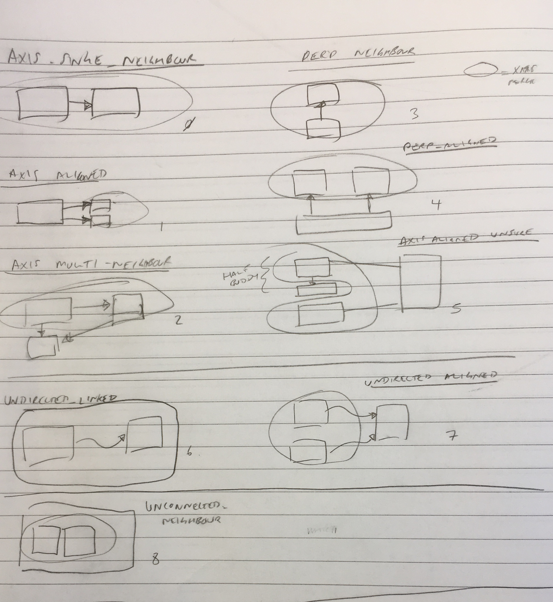
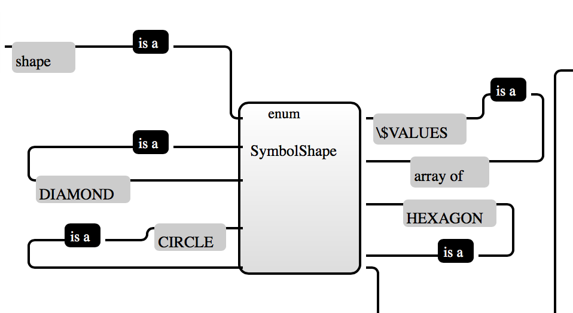

# 20th March 2017: Sprint 14: Labels And Centering

- Refactoring DONE
- A different approach to `VertexArranger` DONE
- Container Labels DONE
- Centering Edges / Rectangularization DONE
- Centering of content within a container DONE

# Thinking

We're currently here:


In order to place connections at the center of a side, we need to know how long the element is going to be, but there are two reasons we don't, at the moment.

The first is that labels get added later.  When we have a label between two connections, this affects the size of the element they are connecting to.
The second reason is that because elements are now often containers, we have no idea how big they are.

One confounding factor now is going to be that things inside the containers will affect the centering.  This means that our centering logic can't just exist on
`BasicVertexArranger`:  it's got to be part of compaction proper.

## Notes on the old algorithm

- Faces are rectangularized one-at-a-time.
- We order the faces first, so that the inner-most ones are ordered first. 
- Once we set dart lengths in `BasicVertexArranger`, we're done - but it shouldn't work like this.

## A New Algorithm

**Size an Outer Face**:  if we have something that can do this, we can run it on the diagram level, and the run it on all the levels below, in order that we can work
out the size of glyphs and so on.  

**Setting Dart Lengths**: Rectangularization works really well, but it relies on us having correctly set the lengths of darts.  

**Container Sizes**: We currently support `MAXIMISE` and `MINIMISE`.  Really, we should also add something to say "if you're the only connection leaving the side, 
make sure it's middle-aligned".  

**Labels**:  When a label appears between two connections, this can expand the size of the element, and prevent mid-positioning.  

**When should Rectangularization Happen?**:  Face-depth is a blunt instrument:  it means that we cannot consider multiple faces at the same time. 
This is an issue because the solution to fixing the size in one face may lie in another.  Can we incorporate container-depth too?

**Running `MINIMIZE`**:  We want to be able to take a couple of faces, and run minimize over them early on, so we can see how big the thing is.
Once you've run minimize over the faces contained within a `Rectangle`, it's then possible to set the dart sizes for that rectangle.

**Running Outer-Face Insertion**:  Linked to the above, but not always.  

## New Lemmas

- A Rectangle will contain some faces.  You should be able to construct a hierarchy of elements to faces.  There will be more than one face any time you have a 
connection.

- Ideally, when using `MINIMIZE`, we should be able to set the minimum length on the `Dart`s and treat the whole element as a black box from then on.

- This means, we want to be able to Compact one element at-a-time.  (Which will be a number of faces).   Once we've done this, we should be able to embed the elements
contents, setting the perimeter dart lengths.

- A vertex can only have *one `Dart` leaving it in any direction*.  

# 1. Refactoring

Each stage of the layout should be the creation of a mapping:

- `Planarization` is about the mapping between `DiagramElement`s and `Vertex`s, `PlanariationEdge`s and `Face`s (with support of `EdgeOrdering`s around a `Vertex`).  It deals with **`Vertex` positioning** and **`Edge` insertion**.
- `Orthogonalization` is about the mapping between `DiagramElement`s and `Dart`s and `DartFace`s.  It deals with **turns**, **vertical and horizontal `Dart` sections** and **elements ignored in `Planarization`**. (i.e. `Label`s)
- `Compaction` is about the mapping between `DiagramElement`s and `Segment`s, with support in layout from `Slideable`s.  It deals with **sizing**.

We should try and enforce this, and not allow things to pollute-through to other layers.  This turns out to be quite a hard thing to achieve, and took * a lot * of
refactoring.   

## `Dart` / `DartFace` 

The big change that I wanted to effect was that `Orthogonalization` was the process of creating `Dart`s.  *No Darts should get created in other steps*.
`Compaction` therefore is the setting of lengths.    

We have fairly immutable structures for `Dart` and `DartFace`, which can only be manipulated through the `Orthogonalization`.  These don't have anything to 
do with the elements constructed during `Planarization`.

`Vertex` is still shared across many layers, though.

`Dart` no longer has any idea about size.  This means that the `VertexArranger` can just concentrate on creating the Darts in the right directions, and leave 
sizing entirely to the compaction process.  


## `PlanarizationEdge`

The effect of gridding is *still being felt* in the engine:  I've finally bitten the bullet on refactoring so that `PlanarizationEdge` no longer has a single underlying.
Instead, we have:

- `BiDirectionalPlanarizationEdge` (representing part of a `Connection`, or `ContainerLayoutEdge`) which has a single underlying.
- `TwoElementPlanarizationEdge` which has two underlyings, because it is the boundary edge between them (`BorderEdge`).

This was a massive change.

Secondly, removing `isReversed()`.  This means that the PlanarizationEdge is a bit more immutable (though sadly, not yet entirely). 

# 2.  `BasicVertexArranger`

This has been completely re-done.  Instead we now have `VertexArranger` interface, which looks like this:

```java
public interface VertexArranger {
	
	public interface TurnInformation {
		
		/**
		 * Direction of dart arriving at this vertex, after orthogonalization.
		 */
		public Direction getIncidentDartDirection(Edge e);
		
	}

	/**
	 * Returns a subset of edges around the Rectangular perimeter which take you from the end of the incoming 
	 * connection edge to the start of the outgoing connection edge.
	 */
	public List<DartDirection> returnDartsBetween(PlanarizationEdge in, Direction outDirection, Vertex v, PlanarizationEdge out, Orthogonalization o, TurnInformation ti);
	
	/**
	 * This is used for any vertex which is unconnected in the planarization
	 */
	public List<DartDirection> returnAllDarts(Vertex v, Orthogonalization o);
	
	/**
	 * In the case of edge-crossing vertices etc.  we don't need to convert the vertex, so return false.
	 */
	public boolean needsConversion(Vertex v);
```

 - `VertexArranger` now returns you a `List` of `DartDirection`s to use between one `PlanarizationEdge` ending and another starting, at a `Vertex`.  This is needed any time
 the `Vertex` has dimension (i.e. maybe has a label, size, content of it's own).  In this case `needsConversion()` would return `true`.
 - In order for this to work, the `MappedFlowGraphOrthBuilder` passes a `TurnInformation` object to the `VertexArranger`, which contains the details of which sides all
 the `PlanarizationEdge`s arrive on.  (Which it can easily calculate from the flow graph).
 - We have subclasses of this for the different `Vertex` types:  `ConnectedVertexArranger` and `MultiCornerVertexArranger`
 - We have a further subclass, `ContainerContentsVertexArranger`, which puts the contents *inside the vertex*, if they are not included in the planarization.
 - There is also `returnAllDarts()`, which is used for vertices not connected in the planarization.
 

## Future

We can further extend the dart creation process to handle terminators and labels (labels are done below).  Again, we will be positioning these at this stage and not worrying about sizing.
I don't even think we really need to worry about the `LabelCompactionStep` anymore - which also simplifies massively the SlackOptimisation process (no more ordering of slack).
These will have `Dart`s and `DartFace`s in the Orthogonalization, and be handled in no different way to anything else.

# 3.  Compact By `Embedding`, with a set of `DartFace`s

- Identify all contained `Rectangular` elements.  
- Order them in smallest-first.
- Compact them (i.e. recurse).
- After each one, do 3 below.
- Find all the `DartFace`s for this layer
- Rectangularize them all concurrently
- Compact and produce `Slideable`s (for now).


## Embeddings

One thing we are currently getting wrong is the we are considering a single `DartFace` at-a-time.   We know this is wrong, because there are probably other
inner faces that could be processed at the same time.  We need to consider a whole `embedding`:  all the faces associated with an outer `DartFace` at once, so some of the stuff
done earlier in the sprint is wrong:

```java
public interface Embedding {

	/**
	 * Used in rectangularization
	 */
	List<DartFace> getDartFaces();
		
	Set<Embedding> getInnerEmbeddings();
	
	public Collection<Segment> getVerticalSegments(Compaction c);

	public Collection<Segment> getHorizontalSegments(Compaction c);
	
	public boolean isTopEmbedding();

}
```

This is how `HierarchicalCompactionStep` should look:  we process a hierarchy of `Embedding`s:
```java

public class HierarchicalCompactionStep extends AbstractCompactionStep {

	...

	@Override
	public void compact(Compaction c, Embedding e, Compactor rc) {
		for (Embedding e2: e.getInnerEmbeddings()) {
			log.send("Compacting: "+e2);
			rc.compact(e2, c);
		}
	}
	
```


# 4. Re-implementing Connection `Label`s

## Extra Tests

There are a few new constraint checks we can perform during layout:

 - Making sure that `Connection`s *meet their `Connected`s*.
 - Making sure that `Label`s are rendered, and, that they touch the `Connection`s at some point, and they don't overlap anything else.
 
This should segue nicely into fixing up the labels again.  

We need to make sure we test out the multiple-edges-on-a-side with labels, and then make sure the links below it are correctly centered.
This means special handling for some labels.  Firstly, though, just getting the labels working.   The good thing now is that a `Dart` can be part of the 
rectangle surrounding a label, and part of the connection which the label is on.  

This works very nicely, and ensures that labels will always be part of connection edges.  

## Problem with Labels and Templating

At the moment, a label in the source looks like this:

```xml
   <toLabel id="auto:2">to</toLabel>
```

The problem with this is that we can only expand it to a single `DiagramElement` - in this case a `LabelLeafImpl`.   It would be better if we could separate out
the XML-importing logic, so that this could work to create a `Container` and a `Leaf` to go inside it.  This way, there would be more shapes for the label to have.

In order to do this, we need to change templates a bit:  they should be allowed to import elements which *could turn out to be* Kite9 elements.  For example:

```xml
<svg:svg xmlns:xlink='http://www.w3.org/1999/xlink' xmlns:svg='http://www.w3.org/2000/svg'><stylesheet xmlns='http://www.kite9.org/schema/adl' href="file:/Users/robmoffat/Documents/adl-projects/kite9-visualization/target/classes/stylesheets/designer.css" xml:space="preserve "/>
<diagram xmlns="http://www.kite9.org/schema/adl" id="The Diagram">
  ...
  <link drawDirection="RIGHT" id="arrow1-g2" rank="4">
    <from reference="arrow1"/>
    <to reference="g2"/>
    <toLabel id="auto:2">to</toLabel>
  </link>
</diagram>
</svg:svg>
```

`<tolabel>` here is using a template, because of the stylesheet (designer.css):  

```css
toLabel, 
fromLabel,
context > label,
diagram > label {
	type: label; 
    ...
	sizing: minimize;
	template: url(template.svg#connection-label)
}
```

This is declaring that labels use a template, from template.svg:

```xml
 <template id='connection-label'>
    <back style='type: decal; sizing: adaptive; '>
      <svg:rect x='0' y='0' width='{x1}' height='{y1}' rx='4' ry='4' style='fill: ccc; ' />
    </back>
    <text style="type: label; sizing: fixed">
      <svg:text>{{contents}}</svg:text>
    </text>
  </template>
```

And this now has 2 elements inside it, the `Decal` and the `Label`.  We can replace the text in at the point of 
inserting the element, but the {x1} and {y1} need to be resolved when we have finally *sized* the label.

This means templating is now two-step (for `Decal`s anyway). 

## Container Labels

Currently, these aren't placed on the diagram, and for that reason, a lot of tests are failing.  A good question right now is, should we fix these, and get the
labels working, or leave them for later?  

Container labels have changed:  we no longer have a single label in a container, and I guess if we are going to persist with this we need to give labels a specific
side.   This is probably not that hard to achieve, but can be left for now.    So, we'll make the simplifying assumption of a single label per container, 
in order that we can get back to having working tests.

We'll come back to this later, and work out exactly how this will work.

In order to implement this, I made the `LabellingEdgeConverter` (which does the Connection labels) handle conversion
of `BorderEdge`s too.  However, it seems like this is already an issue:  putting vertices on the bottom edge of a container to support the label may screw up gridding:
it's possible that the edge may include multiple sub-grids below it, and these of course shouldn't be affected by the label.  Hmmm.

Really, container labels should be outer faces in their own right within the container, but this would mess up `SubGraphInsertionCompactionStep`, which would have to 
know how to insert a DartFace due to a label.  (And not only that, we would have to create an outer face, and add it to some (not yet created) inner face 
within the diagram.

### How Should Container Labels Work, Ideally?

1.  A Container can have as many labels as it likes.  
2.  Labels are different from `Connected`s.  They don't get involved in the gridding.  If you want Connected's, use them?
3.  We should be able to say that a container label occupies a certain place in the container - left, bottom, right, top etc.  (or, maybe, corners).
4.  Labels exist *inside* the element.
5.  Are container labels separate to the edges they are on?  If so, we need to place them inside a `DartFace` within the container.

Ok so:

- Since these needed to be implemented, for now I have done this in almost the same way as connection labels:   
- We add the label between the external and internal vertices in one of the bottom corners of the container label.
- In future, I'll improve this to allow labels at the top, attached to the sides, etc.

## Fanning

Next part of the `BasicVertexArranger` overhaul is to support fanning again.  

In order for this to work, we will need to know whether the edge needs to be fanned up, down or both.   In some future state, we will be allowing multiple edges to meet
a single `Port` on the side of a shape.  When this happens, fanning will be complicated.  But for now it's pretty simple: just look at the index of the edge on the side
and work it out from that:

```java
protected IncidentDart convertEdgeToIncidentDart(PlanarizationEdge e, Set<DiagramElement> cd, Orthogonalization o, Direction incident, int idx, Vertex und, int count) {
		Vertex sideVertex = createSideVertex(cd, und);
		Vertex externalVertex = createExternalVertex(e, und);
		Direction fan = null;
		if (count > 1) {
			Direction lowerOrders = Direction.rotateClockwise(incident);
			Direction higherOrders = Direction.rotateAntiClockwise(incident);

			int lower = (int) Math.floor(((double) count / 2d) - 1d);
			int higher = (int) Math.ceil((double) count / 2d);

			fan = idx <= lower ? lowerOrders : ((idx >= higher) ? higherOrders : null);
		}

		return ec.convertPlanarizationEdge(e, o, incident, externalVertex, sideVertex, und, fan);
	}
```

This shows how fans can go really wrong, as we have them currently:


 - Fan from 5 shouldn't have a dogleg: this happens because of the g1 end, but it's already heading down, so
 it doesn't need it.

So, the algorithm for fans is wrong, it needs to consider:

 - How many connections there are on the side
 - Whether they are turning up or down already
 - If the connection turns up, there's no point in fanning it up as well
 - Therefore, we only need to consider fanning on the subset of edges leaving a side which have no turns already.

In order to support this, I've added an extra method to `TurnInformation`:

```java
public interface TurnInformation {
		
		public Edge getFirstEdgeClockwiseEdgeOnASide();
		
		/**
		 * Direction of dart arriving at this vertex, after orthogonalization.
		 */
		public Direction getIncidentDartDirection(Edge e);
		
		public boolean doesEdgeHaveTurns(Edge e);
		
	}
```

And this now works really well.  

## Fan Bucketing

The final part of the fan algorithm is this:

*All the links to the same element should have the same type of fanning*.  

This avoids problems where we have 3 connections to the same glyph, and they fan up, down and straight.  

This was quite a simple piece of code to write, but fixes 2_6.

## Flow Graph Orthogonalization: Side

There is some logic which tries to get connections to arrive at opposite sides of a `Connected`. This is great when the `Connected` in
question represents a link body, but at other times this looks bad:


Because everything is now controlled by CSS, we've lost the ability to control this.  The function in question is now in `ConnectedVertex`:

```java
	/**
	 * Means that when we try to lay out, we arrange so that different incoming connections
	 * are on opposite sides.
	 */
	public boolean isSeparatingConnections() {
		return true;
	}
	
```

This is now handled by CSS:

```css
/* Arrow */
arrow {
	...
	template: url(template.svg#arrow);
	connections: separate;
}
```

# 5. JaCoCo

The easiest thing here was to add the EclEmma plugin to eclipse, which does excellent code coverage, and takes about 10 mins to run.


# 6. Aligning Content

Aligning is actually *almost* implemented already:  we have code which exists to center pairs of Segments, but it's disabled.   This is what we need to use 
for general centering of text, labels, everything, *since everything is segments now*.

Things to align:

 - Fans should be pushed next to the glyph they are from.
 - Text generally should be aligned left, right, top, bottom or centered along any of those 4 axes.
 - Connections should be centered within their space.
 - Glyphs should be centered.
 
The default, therefore, is to center.  

## Grid Contents

After hashing together a basic implementation, and adding `HorizontalAlignment` and `VerticalAlignment` enums which can be pulled out of a `Rectangular`, the first issue
is grids.  We've been working under the assumption that the *right thing to do* was to make diagram elements *part of the grid*.  That is, when we define a diagram
element and put it in a gridded container, it's the grid itself.  

However, this now seems not-quite-right:  *labels* for example, we really need to 'float' within the grid, so that we can align them left and right.  

It seems like, when we do the gridding (and set up the grid components) what we really need to do is create a set of containers for the grid, and then add to those.

We *kind of* do this already, with the `GridTemporaryConnected` element.  However, I think this should become a much more first-class element, which contains our
other elements.  

In fact, this kind of super-structure really should be handled early on, at the stage where we create the diagram elements.  

*However*

This introduces a *secondary* problem:   what we wanted to do was to define the grid containers, because we wanted to be able to say what layout they would have,
background, etc.  

We need *both* of these mechanisms.   The best way to fix this is to use templates, so we can float the text content inside the container elements.  


# 7.  Rectangularization

## Easy Contradictions

We're rubbing up against a new problem with `SlackOptimisation`:  if we set a maximum distance between two elements, and then also set a contradictory minimum
distance, we end up with a stack-overflow error the next time we optimise anything.   Is there a way to fix this?

One option is that we somehow test the DAG-ness.  But, maybe this is a dead-end and too complex for now.  One thing we can do is work out whether there is space *inside*
a maximum distance for a minimum distance to go.   I've added tests to `SingleDirectionTest` for this:

```java
/	**
	 * A <------- 10 ------ D
	 * |--4->B---4--->C
	 */
	@Test
	public void testCanInsertIncreasing() {
		SingleDirection a = new SingleDirection(createNotifiable("A"), true);
		SingleDirection b = new SingleDirection(createNotifiable("B"), true);
		SingleDirection c = new SingleDirection(createNotifiable("C"), true);
		SingleDirection d = new SingleDirection(createNotifiable("D"), true);
		d.addBackwardConstraint(a, 10);
		a.addForwardConstraint(b, 4);
		b.addForwardConstraint(c, 4);
		
		Assert.assertTrue(c.canAddForwardConstraint(d, 2));
		Assert.assertTrue(a.canAddForwardConstraint(d, 5));
		Assert.assertFalse(a.canAddForwardConstraint(d, 15));
		Assert.assertFalse(c.canAddForwardConstraint(d, 3));
		Assert.assertTrue(b.canAddForwardConstraint(c, 100));
		Assert.assertTrue(c.canAddForwardConstraint(d, 1));
	}
```

However, although I'm documenting this here, I am not sure whether or not it will turn out to be useful.  If not, I'll delete again.

## Existing Rectangularization Method

1.  Pick Priority Turns First.
 - These are ones where the extender-end is a fan turn.   Additionally, it Rs the inner end of the fan first.

2.  Pick Lowest Cost Meets Next
  - This is worked out by looking at the `meets` edge.  Each `meets` has a cost-to-increase.  The lowest cost-to-increase is first, *unless* we can calculate
  that `meets` is so long that pushing `par` onto it won't move it.  `meets` costs look like this:
  
```java
	public static final int EXTEND_IF_NEEDED = 0;
	public static final int CONNECTION_DART_FAN = 2;	
	public static final int VERTEX_DART_GROW = 3;
 	public static final int CONNECTION_DART = 4;	
	public static final int VERTEX_DART_PRESERVE = 5;
```
  
3.  If `meets` Costs Are Same, Pick the One Moving Least

 - This is done by calculating the `pushOut`:
 
```java
		public boolean isRectangularizationSafe() {
			Dart pd = getPar().getUnderlying();
			pushOut = Math.max(0, pd.getLength() - availableMeets);
			
			if ((pd.isVertexLengthKnown())) {
				if (pushOut <= 0) {
					return true;
				}
			}	
			
			return false;
		}

		public double calcAvailableMeets() {
			Dart md = getMeets().getUnderlying();
			
			double minAdd;
			
			if (canBoxout()) {
				// no double-back dart
				minAdd = 0;
			} else {
				// need to include cost of double-back dart
				Direction d = getMeets().d;
				minAdd = getMinimumDistance(c, getPost().startsWith, getExtender().startsWith, d);
			}
	
			return md.getLength() - minAdd;
		}
		
```

4.  If all that's the same, pick the one with the lowest `link` change cost. 
  - Not entirely sure why this would be.    I guess there is the chance that the link cost increases too.


## What Lengths to Set

It seems like actually we have 3 lengths that are important:

```
+-------
|
A
+- - B - +------
|        |
|        C
+--------+
```

- **A must be set from the extender to the end of meets. ** It matters whether it's concave (i.e. it comes back after meets, i.e not safe)
- B should be set to the distance between A and C (link).   Shouldn't change either.
- C is the distance from the extender to link.  This won't change

* Do we really only need to set A?*  Yes, for non-safe turns this must be set.   For *safe* turns, this won't increase.  (So, we should be able to work
out the cost-function based on this).

## Safe Theory

I started with the idea that we could categorize turns into Safe/Not safe.  Initially, I thought that it would be possible to set the maximum sizes for safe elements as we go
along:

```
 ---     ----      ----    ----
    |   |         |       |
     ---           -------
     
Safe (U-Shaped)   Not Safe (G Shaped)
```     
     
The thinking here is that, whenever you rectangularize something safe, you can always do it without increasing the `meet`s length:  the meets
is always the longer one, unless they're the same, in which case fine. 

So, we just need to figure out when it is that the safe-point is reached for a face, and then set the constraints (and mid-points).  In order to process this correctly,
we need to *know* the maximum length of 'par' and 'meets' before we rectangularize.   This way, they can't move against each other.  However.

## Problems with Safe Theory

The real issue with safe theory is that a set of segments can have only safe turns, which evolve to include unsafe turns.  i.e. two `U`s can make a G.  
So, this is no good on it's own.  However, generalizing turns into 'U' and 'G' is helpful, as it allows us to make sure the the lengths of the two parts of the 'U' are 
correct before we rectangularize.   

A second problem with this is that, in order to correctly set the size of everything, we need to do sub-graph insertion before we do R18n.   However, we *rely* on 
R18n first, because that leaves a nice, rectangular gap in the inner faces for us to insert into.   So, that's a problem.  How do we solve this?  

From a cursory analysis, it seems that, with an inner face, there is always a way of processing the face with unsafe turns.  If this is correct, then we really 
only have to worry about unsafes for outer faces, and these don't actually have embedded inner faces anyway.   Let's try this...

Turns out, this is *not quite correct*.  As 16_1 shows, you can have an inner face comprised entirely of glyphs, and then the inner face will have safe turns.

## Summary Of Algorithm

### Part 1. Prioritisation
- First, we *prioritise* the rectangularization options (e.g. we'll want to prioritise fans first.  That's ok.)
- Just aligning according to minimizing the size *doesn't work*.  The problem is when you have two elements leaving an arrow, straight: you want them to be
next to each other, increasing the size of the arrow.  But, we are optimising for *not doing that*. So, we need to look at the type of turn being done.

### Part 2.  Cost
- Some lengths are more important to stay short than others.  Since only the `meets` length changes, we can base it on this.
- We should judge each rectangularization on *how much it moves the `meets` element* (which will depend on whether it's safe or not: U/G shaped)

## Re-thinking Minimization / Mid-Point Setting

Initially, I thought we would need to set the maximum size of a glyph to ensure mid-points, but actually, it's not necessary: instead, you can look at the 
current position of the mid-point and compare to the current size, increasing the size of the glyph or increasing the distance to the midpoint as necessary.

This might make glyphs a bit larger than they otherwise would be.  

This is handled in `MidSizeCheckingRectangularizer`:

- Before processing each `PrioritisedRectOption`, check that it observes correctly any mid-point positions.
- If lengths need increasing so that the connections are mid-side, do it.
- Recalculate the score of the option at this point. 
- If it's changed, throw it back on the stack.

The problem with this is, when we look at a U-shaped turn to decide which side to rectangularize, it's often easy to move the bottom of the U up to meet the two arms.
This is a big problem, as it makes the contents of the Rectangular area (at the bottom larger).  

In order to get around this, when calculating the length of the arms of the U in these cases, we consider the `other side` of the rectangular bottom, which effectively
says, keep the rectangle minimum-sized.  (This was a major breakthrough).  You can see this clearly in 34_3.  

## Known Lengths / GrowthRisk

- If there is a single connection (or fewer) on either side of a `Rectangular`, then we know the size of it.  
- `VertexTurn` is able to keep track of this nicely, with `isNonExpandingLength()`.
- This means we can figure out `GrowthRisk`:  this is comparing the `meets` `ConnectionType` with the `par` `ConnectionType` which will move it:  

| Meets        | Par                     | Risk
|---------------------------------------------
|(any)         | `isNonExpandingLength`  | ZERO
| MINIMIZE_RECT| MINIMIZE_RECT           | LOW
| MINIMIZE_RECT| (anything else)         | HIGH
| CONNECTION   | MINIMIZE_RECT or CONNECTION | LOW
| CONNECTION   | MAXIMIZE_RECT           | HIGH
| MAXIMIZE_RECT| (any)                   | ZERO

- This gives an extra *axis* by which to evaluate the `RectOption`.  We end up with the `TurnType`s looking like so:

```java
static enum TurnType {
		
			
		CONNECTION_FAN(-100000, TurnPriority.CONNECTION, GrowthRisk.ZERO),
		EXTEND_PREFERRED(0, TurnPriority.MAXIMIZE_RECTANGULAR, GrowthRisk.ZERO),

		MINIMIZE_RECT_SIDE_PART_G(20000, TurnPriority.MINIMIZE_RECTANGULAR, GrowthRisk.LOW),    // lines up connecteds joining to a connection

		CONNECTION_ZERO(40000, TurnPriority.CONNECTION, GrowthRisk.ZERO),
		CONNECTION_LOW(50000, TurnPriority.CONNECTION, GrowthRisk.LOW),
		CONNECTION_HIGH(50000, TurnPriority.CONNECTION, GrowthRisk.HIGH),
		
		MINIMIZE_RECT_ZERO(60000, TurnPriority.MINIMIZE_RECTANGULAR, GrowthRisk.ZERO),	
		MINIMIZE_RECT_LOW(60000, TurnPriority.MINIMIZE_RECTANGULAR, GrowthRisk.LOW),	
		MINIMIZE_RECT_HIGH(70000, TurnPriority.MINIMIZE_RECTANGULAR, GrowthRisk.HIGH),	
		
```

Essentially, this allows us to order based (firstly) on making the diagram look nice, but then laterly (40000+ points) on minimizing push-out.

## Changing Rectangularization 1 - No longer one face-at-a-time.

The first, easy change was to parallelize the R18n process so that it considers all the options for all the `DartFace`s in an `Embedding` at the same time.
Having done this, the next step is to generalize the process around setting maximum distances.   When we set these, we set a *minimum* constraint from right to left,
and a maximum constraint from left-to-right:

```java
	public void ensureMaximumDistance(Slideable<X> left, Slideable<X> right, int maxLength) {
		if (left.getSlackOptimisation() != right.getSlackOptimisation()) {
			throw new Kite9ProcessingException("Mixing dimensions");
		}
		
		try {
			log.send(log.go() ? null : "Updating max distance to " + maxLength + " for " + left + " to " + right);
			right.addMinimumBackwardConstraint(left, maxLength);
			left.addMaximumBackwardConstraint(right, maxLength);
		} catch (LogicException e) {
			debugOutput(false);
		}
	}
```

## Changing Rectanglarization 2 - A Two-Stage Process

We can't do `SubGraphInsertion` until R18N is completed on a face (otherwise, we don't have a rectangle to insert into).
But at the same time, to correctly set mid-points, we *need* to insert the embedded faces so that we correctly size the 
contents of things.   This means we now have a 2-stage process:

1.  R18N of basically rectangular inner faces (handled by `InnerFaceWithEmbeddingRectangularizer`).  Followed by sub-graph
insertion for those faces.
2.  R18N of everything else, followed again by sub-graph insertion.

So that sub-graph insertion can keep track of which faces it's done, we have this control logic in the `Compaction`:

```java

	public static final Rectangle<Slideable<Segment>> DONE = new Rectangle<>(null, null, null, null);
	
	/**
	 * For an internal face, returns the empty rectangle in the centre of the space that can
	 * be used to insert subface contents. 
	 * 
	 * Rectangle is in top, right, bottom, left order.
	 */
	public Rectangle<Slideable<Segment>> getFaceSpace(DartFace df);
	
	public void createFaceSpace(DartFace df, Rectangle<Slideable<Segment>> r);
	
	public void setFaceSpaceToDone(DartFace df);
	
```

So, R18N can call `createFaceSpace` and sub-graph insertion can set them to done after inserting things.

## Testing Rectangularization (31_8 No Fan Turn)

At this point, with the extra "safe theory" in place, we are getting really high-quality rectanularization going on, with minimal glyphs.  However, there seems
like there are some error cases we're not dealing with:


- Connection edges shouldn't sit alongside (or inside) rectangulars.

After spending a while on this, I decided it's really hard to test for, and it's better to just eyeball it as a display test.

- It would be nice to add a test to say: if there is only one connection leaving the vertex side, ensure it's leaving in the middle.  
- Secondly, does `TurnLink` work with this stuff?  It would be nice if TurnLink only afforded a *certain number* of turns.
- `Test31Fan` and `Test12LabelledArrows` seem to cover most of the important bases.  We should work with those to start with.


# Other Issues

## 18_25: Issue with Live Containers

For some reason, a new issue with an existing test.  I've extracted out the pertinent details into 18_25, but the 
problem is basically you can end up with a situation where two groups share a live container, but you *shouldn't* merge
them, because there are containers that aren't complete.



In the above diagram, some merges are allowed across container.   However, the issue was, aligned merges shouldn't cross containers, 
as this can lead to us merging the same containers multiple times in the group hierarchy.  
(Prioritisation issue, added some planarization tests)

## New Test Cases

- Segment position?

- Simplify / Remove a load of edge ordering logic (not needed for border edges)
- protected RoutingInfo getPosition(Vertex v) { // AbstractRouteFinder

## Separating Connections

It's nice to be able to make arrow links leave each side of the arrow.  To do this, I've introduced the 
`ConnectionsSeparation` enum.  Previously, it worked by inspecting the class, but now it's CSS:

```css

/* Arrow */
arrow {
	...
	connections: separate;
}
```

And the code:

```java
	/**
	 * Means that when we try to lay out, we arrange so that different incoming connections
	 * are on opposite sides.
	 */
	public boolean isSeparatingConnections() {
		return underlying.getConnectionsSeparationApproach() == ConnectionsSeparation.SEPARATE;
	}
```

## 38_2:  This has multiple issues:
 
  - We are not fanning properly.  If an edge has a turn on it, don't fan (only fan straight edges)
  - Some issues with rectangularization:  we are making glyphs bigger than they need to be
  - We are not minimizing the lengths of edges (test 9)
  


# Conclusion

Ok, at this point, the tests are working ok-ish, and they're all passing.  I've spent since March on this now,
which is almost 6 months on this one piece of work.  Time to move on, and hopefully to something simpler.


