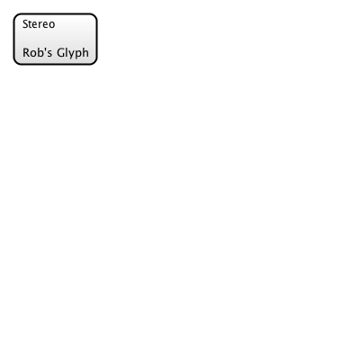
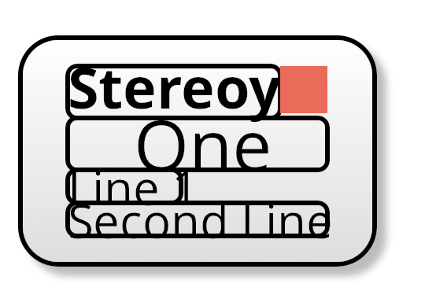
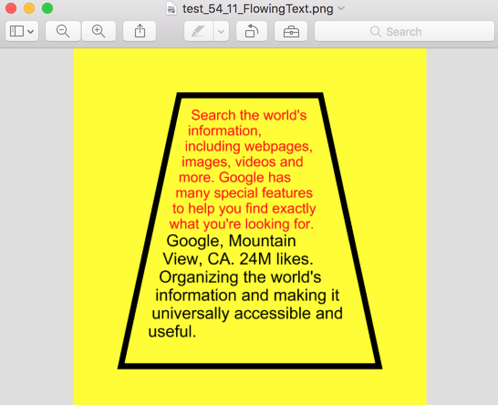
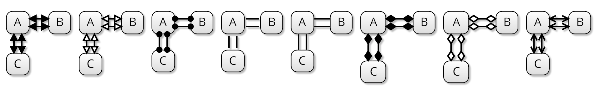
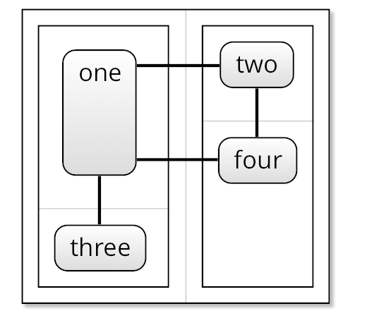
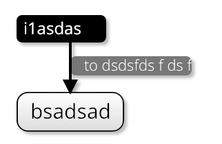
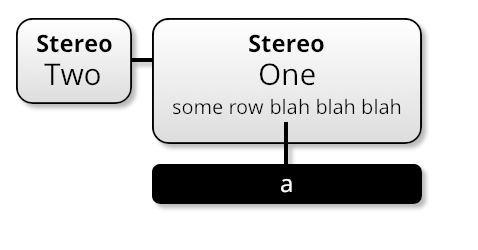

# 21st September 2017: Sprint 16: Looks

- Fonts (DONE)
- Images (DONE)
- Patterns (DONE) 
- Add shadows in (DONE)
- Complete work on the designer stylesheet so we can display everything in high fidelity. (DONE)
- Control Layer ? (Not doing)
- Terminators (DONE)
- Grid (DONE)
- Container Corners (DONE)
- Link Middle Position

# 1. Fonts

We need to be able to specify the font in the stylesheet, and for it to show up *in the test results*.  
This should work pretty much ok with the @font-face:

```css

@font-face {
	font-family: "opensans-light-webfont";
	src: url('../fonts/opensans-light-webfont.ttf') format('truetype');
}
```

Here's the resulting PNG:



So, the font gets rendered correctly, but *this isn't my font*.  This is some Batik-defined system font.
Other people also seem to have this problem in StackOverflow.

- Fonts are correctly loaded into memory
- They are processed by the TextBridge
- They are added to the TextNode instances
- Then, StrokingTextPainter is used.  

So, there are two problems:

1.  Location of the font isn't worked out correctly.  e.g. I am using relative paths, and that's a no, since (I guess maybe) there's no baseURL for the document.
2.  We are overriding the TextLayoutFactory so that we're *not* turning every single character into SVG.  

Once we extract out these two things, stuff works perfectly (so that's nice). 

Issue 2 - is this a non-issue?  If we are rendering PNG/PDF, then we can *of course* use Glyphs to convert.  When we are rendering to SVG it's a different matter, 
but in actual fact, we're not really interested in exact rendering when this happens anyway.  This might be something to leave to tomorrow, now.

## Fonts in SVG / Batik

`Graphics2D` uses the Java `Font` class, which doesn't match SVG.  

- SVG manages all fonts either through built-in fonts, (Verdana, Arial etc), or using `@font-face` (`GVTFontFace` in Batik) 
- All are specified using `font-family` in CSS or as an SVG attribute. (`GVTFontFamily` in Batik).
- From the `GVTFontFamily`, you can `derive` a `GVTFont` instance, in a particular size, etc.  
- There are two GVTFont implementations: AWTGVTFont, and SVGGVTFont.  
- SVGGraphics2D uses the underlying `Font` object, because this is what Java uses.

## Outputting `@font-face`

We've already extended `SVGGraphics2D` to allow for groups, but no we also want to be able to add `<style>` information.  So, generalizing:

```java
/**
 * Marker interface for a `Graphics2D` implementation, to say we are outputting to an SVG file.
 * 
 * Allows creation of named groups and also transcribing XML content into the output.
 */
public interface ExtendedSVG {

	/**
	 * Starts a group within the svg output file.
	 */
	public void createGroup(String id);
	
	/**
	 * Finishes a group.
	 */
	public void finishGroup(String id);
	
	/**
	 * Returns a Java2D font which has a font-family which is resolveable.
	 * Also ensures that the correct @font-face is described in the output SVG.
	 */
	Font handleGVTFontFamilies(List<GVTFontFamily> families);
	
	/**
	 * Adds a font-face to the output.
	 */
	public void addFontFace(GVTFontFace face);
	
	
}

```

Now, when we see an instance of `ExtendedSVG`, we know we are outputting to an SVG document, and we need to add the groups and font faces. 
The rest of the work can happen inside my subclass of `SVGGraphics2D` and inside the `TextBridge`.  All the `TextBridge` needs to do is:

- Ensure that we are outputting as text, rather than vectorized glyphs (we did this already)
- Ensure that the `font-family` is set correctly when we output.
- Ensure the `@font-face` declarations for these families are available in the output document.

The `TextBridge` code to do this goes like this:

```java

	@Override
		public TextSpanLayout createTextLayout(AttributedCharacterIterator aci, int[] charMap, Point2D offset, FontRenderContext frc) {
			return new FlowGlyphLayout(aci, charMap, offset, frc) {

				@Override
				public void draw(Graphics2D g2d) {
					if (g2d instanceof ExtendedSVG) {
						ExtendedSVGGraphics2D eSVG = (ExtendedSVGGraphics2D) g2d;
						...
						
						@SuppressWarnings("unchecked")
						List<GVTFontFamily> gvtFontFamilies = (List<GVTFontFamily>) aci.getAttribute(GVT_FONT_FAMILIES);

				        if (tpi == null) return;
				        if (!tpi.visible) return;

				        Paint  fillPaint   = tpi.fillPaint;
				        
				        
				        if (fillPaint != null) {
					        Font toUse = eSVG.handleGVTFontFamilies(gvtFontFamilies);
				        	...
							g2d.drawString(aci, (float) getOffset().getX(), (float) getOffset().getY());
			            }
			            
			            ...
			        } else {
						super.draw(g2d);
					}
					
					...
```

So, we are kind of "handing off" the choice of `Font` implementation to our `ExtendedSVG` implementation.  

## Inline Styles 

Next, the `ExtendedSVGGraphics2D` can have the functionality for outputting the `<style>` information, with `@font-face`s
in it.

```java

	/**
	 * Adds a <style> tag inside <defs> which contains the new @font-face definition.
	 * We use this in preference to svg <font-face>, which is now deprecated, and
	 * also much more confusing.
	 */
	public void addFontFace(GVTFontFace ff) {
		for (GVTFontFace existing : existingFontFaces) {
			if (existing.getFamilyName().equals(ff.getFamilyName())) {
				return;   // already present
			}
		}
		
		styleInfo.append("@font-face {\n");

		... // add rest of font details here
		
		styleInfo.append("}\n");
		
		existingFontFaces.add(ff);
	}

	/**
	 * Adds custom styling to the SVG document.
	 */
	@Override
	public Element getRoot(Element svgRoot) {
		Element root = super.getRoot(svgRoot);
		if (styleInfo.length() > 0) {
			Element styles = getDOMFactory().createElementNS(SVG_NAMESPACE_URI, SVG_STYLE_TAG);
			root.appendChild(styles);
			styles.setTextContent(styleInfo.toString());
		}
		
		return root;
	}
	
```

In the process of returning a `Font` to the `TextBridge`, we also call `addFontFace()` to set up the style in the document.

## Resources

A second issue we have wrt testing is that our stylesheets refer to fonts by URL (or location, whatever).  However, we 
need to be able to load these up somehow.  This means, we need to take a URL, and then *store the results somewhere else* and translate the URL into something new.

This should depend on context again.  I am *expecting* there will be some way to manage this via Batik.  We'll see.

1.  Preserve the URls as-is.  This might be useful later for some reason.
2.  Remap the URLs.  This will be useful for running offline tests, where we can refer to fonts from the main resource dir or classpath.
3.  Font Server.

- All font locations are resolved relative to the original source document, to start with.  
- We get a set of `ParsedURL` classes for *every* resource we can employ in the system.  
- We're going to need some kind of interpreter for outputting these.

So, this is the `ResourceReferencer`, which can have the different implementations, above:

```java
public interface ResourceReferencer {
	
	static interface Reference {
		
		String getUrl();
		
	}
	
	public Reference getReference(ParsedURL purl);

}
```

So far, I have written a test one, which remaps the URLs and saves the resources into the test ouptut directories.

We can then use this to output `FontFace` information in the stylesheet.  This code is from `ExtendedSVGGraphics2D.addFontFace()`:

```java

	if (ff instanceof FontFace) {
			List<ParsedURL> sources = getFontSourcees((FontFace) ff);
			styleInfo.append("  src: ");
			boolean first = true;
			for (ParsedURL parsedURL : sources) {
				if (!first) {
					styleInfo.append(",\n      ");
				}
				styleInfo.append("url('");
				styleInfo.append(rr.getReference(parsedURL).getUrl());
				styleInfo.append("');");
				first = false;
			}
			styleInfo.append(";\n");
		} 
```

# 2. Images

At the same time, Batik also handles images.  Here is an SVG file, rendered by Batik, which contains a cat image:


So, loading up images (like fonts) is no problem.  Batik outputs the image using (at the moment) a Base64 encoding `ExtensionHandler` 
implementation, which puts the PNG data *inside* our SVG file, which is not a great result.  Ideally (based on the above analysis)
it should put it somewhere *we* decide.   

We need this to use the `ResourceReferencer` too, but it's not so easy:  `Graphics2D` works on 3 types of image:

- java.awt.Image
- java.awt.RenderedImage
- java.awt.RenderableImage

But, none of these have the details of their source file, which means we can't pass the url into the resource referencer.
We solved this problem with fonts, by having our own *special* font-instance, `PlaceholderFont`.  Can we do the same here? No.  

For now, however, I'm just going to handle the paint in a pretty shonky way:

- Added `Kite9ImageElementBridge`, which is going to create the `ImageGraphicsNode`, but keep track of it's URL, and write it into our special `ImageHandler` implementation:

```java

	public static class URLEmbeddedImageNode extends ImageNode {
		
		private ParsedURL url;
	
		...
		
		@Override
		public void primitivePaint(Graphics2D g2d) {
			if (g2d instanceof ExtendedSVG) {
				ExtendedSVGGraphics2D eg2d = (ExtendedSVGGraphics2D) g2d;
				((Kite9ImageHandler) eg2d.getGeneratorContext().getImageHandler()).setLastImageURL(url);
			}
			
			super.primitivePaint(g2d);
		}
		
```

Our `Kite9ImageHandler` therefore has a bit more context about the URLs it receives, and can use the `ResourceReferencer` to process them properly:

```java

public class Kite9ImageHandler extends DefaultImageHandler {
	
	private ResourceReferencer rr;
	
	...

	@Override
	protected void handleHREF(Image image, Element imageElement, SVGGeneratorContext generatorContext) throws SVGGraphics2DIOException {
		handleHREFInternal(imageElement);
	}

	...

	private void handleHREFInternal(Element imageElement) {
		Reference ref = rr.getReference(lastImageURL);
		imageElement.setAttributeNS(XLINK_NAMESPACE_URI,
                XLINK_HREF_QNAME,ref.getUrl());
		this.lastImageURL = null;
	}

	public void setLastImageURL(ParsedURL lastImageURL) {
		this.lastImageURL = lastImageURL;
	}

}

```

# 3. Patterns 

Batik comes with the following `Paint` implementations:

- `LinearGradientPaint`
- `RadialGradientPaint`
- `PatternPaint`

Our extension, `BatikPaintExtensionHandler` only manages the first 2 of these.  If we want the cat-in-a-circle,
we'll need to implement the latter.

This turned out to be not-so-hard.  Batik does all the heavy lifting of creating the `Paint` implementation, all
we need to do is to serialize it so that it's readable in Chrome/Safari.  

Doing this is simply a case of inspecting the `GraphicsNode` inside the `Paint`, and outputting that into a 
SVG `<g>` element.  The code we've already written handles references.

In 54_8, I am able not just to use images in paints, but nested gradients:


# 4. Shadows 

The next thing that would be nice to fix is shadows.  Now, I already know that I want to just implement [box-shadow](https://developer.mozilla.org/en-US/docs/Web/CSS/box-shadow?v=b):

```css

   box-shadow: 10px 5px 5px black;  

```

The Glyph's shadow will be thrown effectively by it's `<back>` element, within the template, which is a Kite9 `Decal` element, 
which is set to the size of the Glyph itself.

So I created:

- `Layer` objects, which handle the creation of `GraphicsNode` elements from `StyledKite9SVGElement` and `DiagramElement`s.
- `BoxShadow` which wraps up all the CSS properties to do with the shadow.
- `ShadowLayer` which implements `Layer`, and deals with the shadow.

But, since `BoxShadow` is only used by `ShadowLayer`, does it really need to be exposed on `DiagramElement`?  No.  
Interestingly, the same is true for margins and padding, which are only exposed by `BatikDisplayer`.

## A Shortcut

There are examples on the internet of people doing SVG drop-shadows with filters:

!(Filter Drop Shadow)[../images/016_4.png]

The great thing about this is that the whole concept of *Layers* goes away, and we're left with just a simple client-side 
transform to handle it.

Although, there's a problem here:

!(Filter Drop Shadow)[../images/016_5.png]

Drop-shadows would overlap each other.

But, if we apply the filter to a `<g>` tag, surrounding both elements, we get this:

!(Filter Drop Shadow Fixed)[../images/016_6.png]

Which fixes it.

## The "Epiphany"

But, this brings us right back around to the "Epiphany" I had earlier:

One thing that occurred to me in this sprint was that translating from SVG to SVG is a waste of time, and actually, all we really needed to do 
is translate the Kite9 elements into SVG:  theoretically, we should just be able to *pass through* the other elements.

I tried to do this but failed, really.  The problem was a simple one:  namespaces.  I couldn't simply copy from a whatever-prefixed namespace
in the original document to an unprefixed namespace in the output document.

Am I going out of my way to implement a drop-shadow here?  Maybe, but the solutions I have come up with so far are clearly fragile, since this
is the first test of them I've tried.  The problem is, we've ended up with a destructive transform of the original SVG..
if I copied the XML of the SVG I can avoid the destruction.   

This means changing the nature of the Transcoder - instead of writing to an SVGGraphics, we are going to need something else.  Every time we 
come across a Kite9 element, we need to convert it to use an SVG element.  We can do this by creating the SVGGraphics2D at the point we need to
write out some Kite9, and then convert back to using SVG for everything else. 

### Attempt 1:  Manipulate the `GraphicsNode` Tree 

However, sometimes, we are manipulating the output XML at the top level.  So, maybe this isn't the way to go.  So how about:

1.  *Every* element in the DOM is associated with a `Bridge` instance, so we can process them all.  
2.  We wrap `GenericBridge`s into  `GraphicsNodeBridge`s, so that they are all in the `GraphicsNode` model hierarchy.
3.  For outputting the XML, generally, we rely on the `GraphicsNode`s to call their `primitivePaint` methods in depth-first order.
4.  However, we don't need to do that:  we can recurse through the `GraphicsNode`s and output XML elements for anything with an SVG XML element attached.
5.  For anything *without* an element, we're going to need to do some drawing.
6.  However, we can't call `paint()` on the node, because it might have embedded SVG elements, which would get painted... 
7.  Except, we have our own special 

I tried this, but the `GraphicsNode` tree is not our friend.

### Attempt 2: Output via DOM Tree

Obviously, we need GraphicsNodes.  But, we need an entirely different approach to outputting them:

- The only elements of Kite9 that can be inserted into the SVG doc have bridges.  So, we can get from graphics back to Kite9.  
- We have to create the GVT tree, that's a given.
- Links too, we rely on Batik to output these.

So, as well as a `GraphicsNode` tree, I need to parse through and output using the DOM:

- For each element in the input DOM, copy to the output DOM.
- If we come across a Kite9 node, we need to convert to a `<g>` element, and output that.  
- We'll need to transform the position of the node at this point too (which we'll have).
- Similarly for XML, just output these straight.
- We're going to have to manage the transform ourselves.  We can put this on the group elements.
- When it comes to outputting a link, this is just a path at the top level of the diagram, rendered by Batik into XML. 

What happens to references?  In my examples, I use references for images, fonts, pattern-fills and for the gradient filter.

- This is only going to be an issue for outputting links.  It's perhaps easier to create our own output method for this, rather than rely on `SVGGraphics2D` *at all*.  
- So, we paint into an element, and then from there, output into the XML document *in some other way*.
- Other URLs (for example, in stylesheets) we might be able to manipulate on the way through: they're either in the form of stylesheet `url()`s, or they're `xlink:href`s.

So, in summary:

- We're expanding templates to create *more XML*.
- We're converting all Kite9 elements into `<g>`s.  We'll translate them ourselves.
- We're creating `<path>`s using connections, using Batik. (although technically, we don't need to, we have the code for this already).
- We only allow for two namespaces - Kite9 and SVG (at least, for now)

One 'wrinkle' in this is stylesheets.   Specifically, we created our own Kite9 `<stylesheet>' element. Turns out, we don't need it if we do this:

```xml
<svg  ...>
  <defs>
    <style type="text/css" xml:space="preserve"> 
      @import url("file:/Users/robmoffat/Documents/adl-projects/kite9-visualization/target/classes/stylesheets/designer.css");</style>
  </defs>
  ...
```

So, more code deleted.  

#### Stylesheets Issue

So, we are now translating our kite9 elements into _classes.  THere is a problem with this:  nothing works on the client side anymore.   How to fix it?

- Ok, we could use `<g>` elements in Kite9 too, instead of having different elements for each thing.  That would work, but it would be really sucky.   Ruled out. 
- We could adopt the .tagname in the stylesheet, and add the extra classes to our (kite9) XML elements (automatically).  At least that would work.
- We could transliterate the stylesheet, but then we would need two separate versions.
- Ideally, we need to keep the stylesheet looking nice.  ._blah looks bad, and is confusing.  
- Maybe we keep the parts separate?   That might be the most sensible answer.  *I.e do nothing*

What's the principle of least surprise?  I guess, one day, Kite9 elements *might* be allowed in the browser.  What would be future-proof?  I don't know.
The usual approach is that if a single browser supports a feature, it gets a prefix, e.g. `-webkit-`.  We should do this for Kite9, too, and then it would be 
easy to separate out the styles for the different things.

*I want to use elements* in Kite9 to mean what people want them to.  There are 2 reasons for this:
 - Unlike `class`, you can give only *one* element name, so it's specific in a way that class isn't.
 - XMLSchema
 
 
Ok, so after this change, our stylesheet looks a bit like this:

```css


glyph {
	kite9-type: connected;
	kite9-sizing: minimize;
	kite9-layout: grid;	
	kite9-grid-size: 1 2;
	kite9-template: url(template.svg#glyph);
}

...

.glyph .label .contents {
	font-size: 15px;
	fill: black;
	font-family: "opensans-regular-webfont";
}

```

So, I'm keeping the two parts separated.  This seems to work fine.... Mostly.   However, before the elements are transformed into SVG, we still need to be able to
look at the styles of them, and this doesn't work:  The Kite9 XML elements *don't* end up having the right classes. 

One additional issue in this is that it's just confusing to have both Kite9 elements and SVG elements contributing classes.  I've therefore tried so simplify this,
at the cost of somewhat increased template complexity:  *only SVG elements should use classes*.  Otherwise, everything just gets too confusing.


#### Templates Issues

What to do about `<defs>` from the template?  In our stylesheet (and in SVG generally) it's perfectly fine to reference something in either a def, or a completely
separate document.  In fact, we do this, and use the `xml:base` directive to specify 'foreign' URLs to use.  

Problem is, only Batik supports `xml:base`.  I've tried with Chrome and it doesn't seem to work.  Chance with IE seems tiny.  In 
Sprint 11, we looked at `<svg:use>` as an option, but this doesn't really support the requirements we have around 
templating, so it's not really a goer.  Also, the *performance* around loading in multiple, remote XML documents seems like it 
would be dreadful, plus, caching.

Limitations:

- If we're going to refer to things, they need to be in *this* SVG document, not a remote one.
- This means, any `<defs>` need to also be included in this document.
- However, we might run into name clashes between dfferent URLs: there's nothing to stop the stylesheet importing multiple templates.
- Ideally, we should only import the `<defs>` we use, not just all of them.  (Althugh, that might be simpler).

So:

- Whenever we 'go off' to a template, and do some templating, we need to ensure that the defs from the template are in our
expanded XML.  *However*, in a template (or any SVG doc), `<defs>` are *scoped*.  Let's ignore this for now: if we 
are just generating content with Kite9, it *might* be ok.

#### Shadows, Then

It's still not easy to get the shadow working.   Obviously, we can get the `<filter>` included in the output SVG, but 
how to reference it?  `filter=` attribute cannot be represented as CSS, so that means we can't add the property.

Also unfortunately, the way templating works, we don't template the `<diagram>` element, we can only add contents to it.

This might be a mistake.  There was a reason we did this, but actually, it doesn't *quite* make sense.  We need 
templating to template the element it's replacing, not just it's contents, *and* we need to use {{contents}} not just
for text, but for *inner XML element contents too*.

A diagram template should look like this, then:

```xml
  <template id="diagram">
    <g filter="url(#dropshadow)">
      {{contents}}
    </g>
  </template>
```

This way, we can add whatever **containing** elements we like, and also place the contents wherever we like.

Perhaps we could go further, and allow the `{{contents}}` to be more complex, perhaps allowing some kind of XPath
transformation?  But, this sounds a bit mental, a bit complicated.  

First, let's create something that just copies, and then we can worry about the content later.  Instead of relying on 
`TextNode`, we should make `{{contents}}` an XML node instead, so that we *can* attach logic to it later. 

This might be problematic too, as we could end up with *the same* `DiagramElement` in multiple XML elements (or something).


# Templating, Reconsidered

Currently, we're using templates for different things, all over the shop:

- We are using them to resolve the templates (obviously).  This happens just after we *load up* the Kite9 diagram:  we resolve the templates, and
along the way add a whole bunch of new elements to the XML structure.   The top-down process of resolving means we end up with a much more complex
diagram (which maybe should be SVG-only?)

- Secondly, we use the copier functionality to *output* our diagram to SVG at the end.   This is only used in SVG mode, not in PNG mode.  However,
we should try and be consistent here, I think.  (So, we have two things that can be produced out of our Kite9 `DiagramElement`s:  A `GraphicsNode` and 
XML `Element`s.  There is approximate mapping between the two.

- Third, we are also using the templater for the process of resolving variables, which happens *just prior* to the second step there.   

That's maybe one-too-many steps.   The production of the (correct) XML or `GraphicsNode`, this part should only need a single templating step.  However, 
this happens for `FIXED` size graphics nodes before other, variable sized nodes, so there's that.

Somehow, we should combine this all into a single step. Whatever we do needs to make complete sense too:

## Stage 1

- Expanding out the template should be done in the first stage.
- As should taking care of `<defs>`.
- We have to do some templating here, as we end up with extra Kite9 elements (which form the Diagram hierarchy)

## Stage 2

- Removing prefixes
- Parameter replacement should be done later.  

### Sizing (Again)

So, sizing is not *quite* right:



This image shows bounding boxes being correctly used (I adjusted the template to put boxes round text elements),
but the problem is, we are considering the space the text takes up, rather than also including the space *around* the
text which should also count as part of it.

How to fix this?  Problem is, this is just not something Batik is going to care about: it just draws glyphs, and, it can
do text at any angle, so baseline and descender depth are kind of irrelevant to it.  

How can we solve this issue?  

- I could measure using the baseline, and set the baseline position somewhere.  However, we'd still have the problem of 
descenders, unless I also set the line height.
- Since this is basically a problem of *line height*, how about we consider how to solve the issue of multi-line `text` elements, 
first, since these might even be supported in Batik?
- The obvious way to have done this would be `flowPara`, but this is not supported in Chrome/Safari.  Also, it's *really* complicated.
- Although it's a stated *aim* of Kite9 to support flowing text...  so it looks like we're going to need a Kite9 element for this.
- Which, has always been something I was thinking about doing...

So..  a Kite9 text element then, how should it work?

The main issue is going to be sizing..  or perhaps enthusiasm.  To keep this simple, let's split lines only on 
line-breaks.  We can get to word-wrapping later.  

Now, where should this go?  Maybe it's a `Label` and a `Connected`... it's definitely not a `Container` in the 
general Kite9 sense... so I guess that means it's part of the `DiagramElementType` family.

But... you would want it to be a label or a connected.  That makes things more tricky.

- Ordinarily, it'd just be an XML element, and that'd be fine.   So the element type, (strictly) would be `TEXT`. 
- But, we conflate the approach to layout (whether a `Label` or a `Connected`) with the type, which is messy.
- We also conflate whether or not it's a `Container`, but actually, this is a much more type-y thing to include.

So, it looks like the way we lay out the element is the odd-man-out here.  `LABEL` and `CONNECTED` shouldn't be part of 
`DiagramElementType`.  But, this is quite a big change, now, and there are lots of other broken bits and pieces we 
should probably tidy up first.

### Revisiting `DiagramElementType` and `DiagramElementSizing`

At this point, the inheritance heirarchy is struggling to contain all of the different diagram types and sizes.
Somehow, we need to rationalize this so that we don't end up in lots of trouble.

Sizing really needs to be broken into 2 parts - decal sizing (`Scaled` or `Adaptive`) and container sizing (maximise or 
minimize, where minimise is the default).  These are *secondary* concerns, therefore shouldn't be part of the 
heirarchy.  

At the moment, we can't have decals that are containers - we just don't support that.  But, eventually, we could.
Generally speaking, only rectangular elements have a 

Things to sort out then:

1.  Fix `Connection`s back up  DONE
2.  Move `Label` and `Connected` out of the class hierarchy, they are properties.  DONE
3.  Add text. DONE
4.  Symbols: we were part-way through this, should finish it off DONE
5.  Sort out the old `ExtendedSVGGraphics2D` stuff- I don't think we need this anymore.

### Painters

In figuring this out, a *lot* got changed in the inheritance hierarchy.  And, perhaps simplified:

- `DiagramElement`s are `Connection`s and `Rectangular`s, at the basic level. This was true before. 
- We added in a CSS property, `kite9-usage`, which corresponds to `RectangularElementUsage`.
- This can be `Regular` (i.e. something that takes up space in a container), `Decal` ( a background/overlay) or `Label` meaning, it's attached to something else.
- This simplifies `Label`s, in a way:  they are generally going to be `Container`s of regular stuff, now.
- *Sizing* is now a property solely of `Container`s.  
- `Leaf` is the opposite of `Container`, and you can size `Leaf`s.
- All of this is handled (slightly badly) by the `DiagramElement` inheritance hierarchy.
- That leaves the new class, `Painter`.

We have `ConnectionPainter` and `RectangularPainter`s.   These are going to cope with outputting straightforward SVG, lines of text, containers, whatever.
Also, they now handle *sizing* of `Leaf` elements.

All of this is just moving round the existing code, and deleting stuff.  The interesting new bit is `TextRectangularPainter`.  What this needs
to do is break text onto separate lines and correctly separate those lines.


```java
public class TextRectangularPainter implements RectangularPainter<Leaf> {

...


}
```

Now, we are back on the *real* problem again:  how to adequately size the text-box.  We can't just look at the
*shape* of the text, because it might just be a comma or something.  We have to look at the space the text 
*reserves*.

How to do this?  In Java, we use `FontMetrics` to do this.  So, the question is, how to get hold of these?

- Batik includes the `TextPainter` classes:  these do a lot of the work of outputting characters into text format, 
although as we've seen, this leaves a lot to be desired, and we ended up extending it quite a lot before.
- But Batik also includes code for wrapping text in the same place.  This would be nice to have.
- However, even with this, we don't get to see the font details.
- I think there is a way around this though:  we could use a temporary `SVGGraphics2D` implementation (we've done this before)
in order to turn our `GraphicsNode`s back into XML (for the output method).
- And, if we are using `GraphicsNode`s of our *own*, we can add the `FontMetrics` to them...
- So, in conclusion:  instead of converting from XML (text) -> XML (lines) -> XML (out), we are going to convert from
 XML (text) -> XML (lines) -> GraphicsNode (lines) -> XML (out).
- To measure the lines, we have to get hold of `GVTLineMetrics` implementation, which is the equivalent of `FontMetrics`
for the lines in the GVT.

 
### Batik `FlowPara/FlowRoot`

Now, although Safari and Chrome don't support `flowRoot`, Batik *does*.  This is interesting:  essentially, it means
I can use Batik to handle my flowing text issues, and, if we are using the above approach, we are going to *convert them
to SVG 1.1* as part of the process.

Now, this seems like a random diversion to go on at this point, and maybe it is, but it's quite cheap:  all I need to do
is to get the *old* `PNGTranscoder` working again (which is something I need to do anyway) and write a test to see
how `flowRoot` works.  

Once I've done that, I can start to hook into the logic that does the flowing text.  It's going to *have* to consider 
`line-height` as it goes, right?  

And, since I have already extended `FlowGlyphLayout` as part of my (now-unused) `TextBridge`, I can add my code to 
output sizing in there.  

So, that actually wasn't very hard to do:



This is based on the following XML: 

```xml
<?xml version="1.0"?>
<svg xmlns="http://www.w3.org/2000/svg" xmlns:xlink="http://www.w3.org/1999/xlink" 
  width="100%" height="100%" viewBox="0 0 300 310" version="1.2">
  <title>Basic textflow</title>
  <rect x="0" y="0" width="100%" height="100%" fill="yellow"/>
  <flowRoot>
    <flowRegion>
      <path d="M100,50L50,300L250,300L200,50z" fill="none" stroke="none"/>
    </flowRegion>
    <flowDiv>
      <flowPara stroke="none" fill="red" font-size="12">
      Search the world's information, including webpages, images, videos and more. 
      Google has many special features to help you find exactly what you're looking for.
     </flowPara>
     <flowPara font-size="14">
     Google, Mountain View, CA. 24M likes. Organizing the world's information and making it universally accessible and useful.
     </flowPara>
    </flowDiv>
  </flowRoot>
  <path d="M90,40L40,270L260,270L210,40z" fill="none" stroke="black" stroke-width="5"/>
</svg>
```

This so completely takes care of *everything* to do with line-wrapping, breaking etc.  So, now we just need
to get that applied to our `TextRectangularPainter`.  Earlier, to output Pattern Paints, we added this code that
takes a graphics node and is able to write it into any given G element:

```java

		// paint the pattern inside a group element
		PatternGraphicsNode patternNode = (PatternGraphicsNode) paint.getGraphicsNode();
		Element groupElem = genCtx.getDOMFactory().createElementNS(SVG_NAMESPACE_URI, SVG_G_TAG);
		ExtendedSVGGraphics2D esvg = new ExtendedSVGGraphics2D((ExtendedSVGGeneratorContext) genCtx, groupElem);
		esvg.transform(patternNode.getInverseTransform());
		patternNode.paint(esvg);
		groupElem = esvg.getTopLevelGroup(true);
		
		// add the group to the pattern
		patternElem.appendChild(groupElem);
		
		return new SVGPaintDescriptor("url(#" + id + ")", SVG_OPAQUE_VALUE, patternElem);

 ```
 
Turns out, this is exactly what we need here.   Also, our earlier work on the `TextBridge` is useful again, 
because we are using the `SVGGraphics2D` again, even though a lot of our XML is just pass-through.

So one question that occurs to me now is - what about the `ResourceReferencer`, do we still need that?  I think
the answer may eventually turn out to be *yes*, so let's keep this for now.

So, whereas to start with, we had passthrough XML within `SVGGraphics2D`, now we have reversed this and we're using 
passthrough by default, and SVGGraphics2D as the exception.

### Baselines

- Seems like generally, the text baseline (bottom of the text) is the origin coordinates for text.   However, this doesn't
seem to apply for my rendered text, in two ways:
- 1.  When I output text into the Graphics node, it has a bounds starting around 0,0.  If it truly was using the 
baseline correctly, it should be negative in the y position.
- 2.  However, when I draw on the screen, the baseline is correct... e.g. with `test_54_7_fontTranscoding`.
- This looks fine both as PNG and SVG, and the SVG baseline is auto, i.e. whatever is the default.
- Does this mean it's something set inside the graphics context?   One explanation is that somehow, it always outputs
text as 'hanging' and has code for this.  But no, looking at the code, it just generates some XML.
- Does it mean that calculating the text size is wrong?  Maybe..  
- However, it seems like the shape it uses to bound the text must be being ignored, otherwise it would start lower... But then
that would break 54_11, the flowing text example, and the text wouldn't be correctly in the box.
- Except that 54_11 uses the built-in graphical text model, and I don't.

Turns out the solution to this was to *observe* the positions that the glyphs had been put, and use these to 
determine `drawString()` function calls.

### Symbols

Ok so yes, we *were* starting to make progress with symbols, and now we're ready to call this complete.  However, *key symbols* are a touch more complex,
and it's now time to roll out the XPath expressions as detailed before.  

When we define a symbol in XML, we want to render just `theChar` attribute as it's text, and that sounds tricky.

However, Java by default handles XPath expressions, so let's see if we can get that in there.

### Templates Again

A *second* issue with templates is that it is currently done when we create the `DiagramElement`.  However, this leads to trouble: because we instantiate
`DiagramElement`s as soon as they are used, the templating seems to run awry with the `Connection`s.  These *also* instantiate `DiagramElement`s.  

So, to avoid all of this, I now do templating up-front (to create the expanded XML view) and then parse through and create the `DiagramElement`s after this.

There is a certain appeal to this now:

- Load XML
- Apply Templating Logic / Add Defs  (CSS: `kite9-template`)
- Convert into Kite9 elements  (CSS: `kite9-*`)
- Arrange
- Turn back into *pure* SVG (CSS: all the SVG stuff)
- Allow browser to apply styles

So, the *stylesheet* can reflect this arrangement of work too.

# Terminators

After a lot of thought about this, I've decided that the best thing to do with these is to use `<marker>`s:

```svg
<svg width="500" height="100">
    <defs>
        <marker id="markerCircle" markerWidth="8" markerHeight="8" refX="5" refY="5">
            <circle cx="5" cy="5" r="3" style="stroke: none; fill:#000000;"></circle>
        </marker>

        <marker id="markerArrow" markerWidth="13" markerHeight="13" refX="2" refY="6" orient="auto">
            <path d="M2,2 L2,11 L10,6 L2,2" style="fill: #000000;"></path>
        </marker>
    </defs>

    <path d="M100,10 L150,10 L150,60" style="stroke: #6666ff; stroke-width: 1px; fill: none;
                       marker-start: url(#markerCircle);
                       marker-end: url(#markerArrow);
                     "></path>
</svg>
```

Will display something like this:


Two things: 

1. It seems like we are able to use CSS for `marker-start` and `marker-end`, which might be useful.
2. Somehow, we are going to need to embed this logic into our template, like we do with other `#defs` (and we're doing that already, so yay).
3. This might just work out-of-the-box: Just adding this to the `link` template gives us this:

```xml
  <template id="link">
    <contents />
    <svg:path d="{path}" class="link" style="marker-start: url(#markerCircle); marker-end: url(#markerArrow)"/>
  </template>
```


So, that's not bad.  There are obviously issues with this:

- We want (now) to be able to select our terminators, so we really need to have something on top of them that allows selection (this is where the terminator class comes in)
- Second, we want to be able to see the ends of the arrow, which currently overlap the body, plus, give enough space for other things around the terminators.
- We also want to keep the definition of the terminators with the markers, I would think.  

## Defining Terminators

So, within our `<link>` object, we will have the two `<terminator>` references.  These are going to have IDs, and be rendered on-screen as rectangles.  However, 
their size will be *informed* by the definition of the marker.  So, can we get terminators to work properly?

First thing, adding back terminators to the test code.  I've added a new `LinkTerminator` class to the test ADL classes, which turns into XML like this:

```xml
 <link id="g4-meets" rank="8">
    <from reference="g4"/>
    <to reference="meets"/>
    <fromDecoration shape="ARROW" id="auto:1"/>
  </link>
```

*However*, this *already* feels wrong.  Shouldn't the terminator shape be an attribute of from/to? So:

```xml
  <link id="g4-meets" rank="8">
    <from reference="g4" markerReference="ARROW" id="auto:1"/>
    <to reference="meets"/>
  </link>
```

So, we no longer need to specify the element type of `terminator` in `DiagramElementType`, because it's job is done by `link-end` instead.
Even `link-end` isn't quite right, but never mind - when you specify the `link-end`, you get a `Terminator` instance. 

Now, I can render this as part of the diagram (in the wrong place):

```xml

  <g xmlns="http://www.w3.org/2000/svg" kite9-elem="link" id="g4-meets">
    <g kite9-elem="from" id="auto:1" transform="translate(10.0,10.0)">
      <rect x="0" width="10.0" height="10.0" y="0" style="fill: none; stroke: red; "/>
    </g>
    <g kite9-elem="to" transform="translate(10.0,10.0)">
      <rect x="0" width="10.0" height="10.0" y="0" style="fill: none; stroke: red; "/>
    </g>
  
    <path style="marker-start: url(#ARROW); marker-end: " class="link" d="M125 68 L105 68"/>
  </g>
```

So, link-ends can use templates, and the `path` of the link is correctly using the `marker-start`.

Terminators *may as well* use a lot of the existing plumbing:  we have `margin` and `padding`, which for containers, specify the whole size.   We can reuse
margin in the usual way: other elements (e.g. other terminators) need to be this far away.   `padding` is used for containers to set the size.  

I am not 100% happy with the way we are using the reference.  Ok, it's consistent with the way links work (i.e. reference the element ID), but it's *inconsistent*
with the way *templating* works.  And, I don't like that:  the problem is, we can't use CSS classes or inheritance like this.  So, let's change it.

We could use `kite9-template` again, but then we're going to end up with duplication of all the XML for the template, which is totally not what we want.
Actually, this works fine, but what we really want is to use the markers.  So perhaps we should add something specific for that?

```css

from.circle,
to.circle {
	kite9-marker-reference: url(#CIRCLE)
}

```

This is really what I'm after, I think:  I can set the margins and padding within the class definition, but also have the marker for something else in the 
document.  This means, for example, that you can override the margins/padding for a given terminator *at that point* in the diagram, without needing to change
everything everywhere.

Problem with the above is that the URL will be resolved within the CSS document, whereas what we need is just the ID to be passed through,
so, it's wrong either way.  So, after a bit of re-working, both `BasicTemplater` and `TerminatorImpl` use some common code within `Kite9DocumentLoader`, which
handles importing `<defs>`:

```java
public class TerminatorImpl extends AbstractRectangularDiagramElement implements Terminator {
	
 	...
 	
	@Override
	protected void initialize() {
		reference = theElement.getCSSStyleProperty(CSSConstants.MARKER_REFERENCE);
		if (reference != ValueConstants.NONE_VALUE) {
			Kite9DocumentLoader loader = (Kite9DocumentLoader) ctx.getDocumentLoader();
			markerElement = (SVGOMMarkerElement) loader.loadElementFromUrl(reference, theElement);
			
			...
		} 
	}
```

Sizing the terminators turns out to be tricky.  We have 3 concerns:

1.  How much *longer* should a link be when it has a terminator.  i.e. what is the extra space reserved that the
link would take up between two `Connected`s, because it has a terminator?
2.  When drawing the terminator itself, how big should we draw that thing?
3.  When using `marker`s for the ends of the terminator, how much *shorter* should we draw the link?

So, the size of the terminator is governed by `padding`.  That has to be the case, to make it consistent with
everything else.  

And, the separation of terminators along the side of a `Connected` is going to be about `padding` and `margin`.

However, we are also going to need something for the third item:  when we have a circle-terminator, this would be zero,
but when we have agap, it could be the size of the gap.  So, it's independent on the other values:

```css

from.gap,
to.gap {
	kite9-marker-reserve: 2px;
}

```

And actually, the gap is the only one that ends up needing this.  Now the terminators are complete:



And, it's great that you can mess around just in SVG and CSS to set these up.

# Grids 

Surprisingly easy to do.   Added some extra tests in the display section so we can benchmark what these look like.

I added two new elements to ADL for this, `<grid>` and `<cell>` and the extra java classes for the same.  Surprisingly 
easy to set up.



Divisions between cells are handled by a `<path>` element, which seems to work out ok.

One upshot of this is that I'd always imagined that grid elements must be able to support links.  However, it's clear now that this wasn't needed after all.
*On the other hand*, although it's not *needed*, perhaps it would be confusing *not* to support it?  hmm.

# Remaining Issues

## 13_10

For some reason, this is massively wide: turned out to be an error in the mid-size checker that thought labels were the edges of the containers, and invoked the 
mid-sizer for not-quite-the-full-width `VertexTurns`.

## Margins (12_3)

There is a problem now, with margins.  When we are inserting an outer face inside an inner face, we consider only the margins on the outermost rectangularized
elements.  However, if these margins are small compared to the ones rectangularized within, then the inner rectangularized ones are going to be ignored.

Glyphs have a margin of 10, but labels have a margin of 4.  On 12_3, since the label is the more outer edge, it's the margin that's used.  This was fixed in the 
`SubGraphInsertionCompactionStep` by keeping track of not just the outermost slideable, but the other slideables on the side.   To do this, I introduced a new class:

```java
public class FaceSide {
	
	private final Slideable<Segment> main;
	
	private final Set<Slideable<Segment>> all;

	public FaceSide(Slideable<Segment> main, Set<Slideable<Segment>> others) {
		super();
		this.main = main;
		this.all = others;
	}

	public Slideable<Segment> getMain() {
		return main;
	}

	public Set<Slideable<Segment>> getAll() {
		return all;
	}
	
	...
}
```

Which is added to the compaction `FaceSpace`, rather than just a single slideable.  `getAll()` is populated for outer faces.

## Label Padding (12_1)

Problem is, the *contents* of a label is pushed away from the connection, because the connection has a margin:



Somehow, we need to say that the margin doesn't apply to the contents - margin should only apply on the outer level.
How to do this?  

- If A is a DiagramElement, and it is contained by PA, and PA is contained by C, then we shouldn't use margins between A and C.

So, we use: *padding* for immediate parent and *margin* for not-a-parent (seems to work ok).


## End Lengths (39_3)

Perhaps something due to margins, but the fans don't line up on this one now.  Turned out to be just a stylesheet issue.

# Text Links / Link middle position

I want to add now some tests for links connecting to `TextLine`s.  So, I created test_57_1 which is a glyph containing a couple of text lines, one of which has a link to 
an external arrow.

However, immediate problems:  

- the text line is set to `maximize`, but this means links don't get aligned to the middle position.
- because the glyph now contains a link embedded within it, it shifts the content over because the link has a minimum 
length within the glyph.  (That's actually weird - I wasn't expecting that to be enforced... think it's because of padding).

## CSS Properties for Mid-Point

So, how to address this problem?   First, it would be better if the decision of whether to align-to-middle was not tied to 
maximize/minimize.  Although, I don't know if it's necessarily going to work if we allow element maximization, we probably need a
test for this.  So, that's number 1. We can do that and see what happens.

Also, we wanted to be able to set where the mid-point should be.  e.g. should it be 50%, or somewhere else?  I think we can
probably sort this out, right?   Actually, this functionality probably requires the correct implementation of *ports*, so 
maybe we should leave that for now.

Fine:  but what *should* Ports look like, in final form?  This is discussed in [Sprint 10](sprint_010.md).

Mid-Point checking is not the same as ports, it has different applicability:  you can either use ports, of use mid-points, or use nothing.
Probably, we need to say:  if there are ports on a side, we'll use them, and mid-point is disabled.  Otherwise, mid-point *can* be used, optionally.

```css


kite9-connection-align: 50%;  /  none;
 
kite9-connection-align: 50px 20%;	/* horiz / vert align  */

kite9-connection-align-horiz: 50px;

kite9-connection-align: 50px 20% -50px 10%; 

kite9-connection-align-top: 50px 20% -50px 10%; 


```

For now, we'll just implement the setting of 50% (as this is all we've coded).  So far, it looks ok.  However, 
sometimes, the elements don't expand as expected:



Here, I've set the arrow "a" to be as large as possible, but it's not filled the width at all.  This points to a prioritisation 
problem in the rectangularization.  We also have the issue of 39_6 still outstanding.

The problem with rectangularization basically boils down to the fact that we are not rectangularizing inside-to-out:  because we don't handle
the inner elements of 57_3 first, (i.e rectangularizing the grid inside 'One', and 'One' itself, we don't know how big it is when we rectangularize it 
against 'Two'.  

Now, really, we should be able to say that since the grid is within 'One', don't worry about the fact that 'One' is set to minimize:  that's only pertinent
when you're outside 'One'.  That would fix it.   However, we've played with this inside-outside logic before in R18N, and it's not worked.   But, I can't 
find any notes related to it, so it seems we're going to have to revisit this.  

Weirdly, as a solution, this seemed to do the job, except that now the key is often in the wrong place - on the right side instead of at the bottom.


## Embedded Link Distance

This can be solved in the stylesheet:  we need to give the cell containing the stereo/label the padding, rather than the
actual glyph.  That way, the text-lines can be full-width, and push right to the edges.  This may screw up some other stuff, 
we'll have to see.  

How do we get the terminator to appear at the edge without screwing it all up?  Somehow, we need to be able to override the link minimum
length at the `end` level.  However, if we do this, the space for the terminator might not get reserved properly outside the glyph.


 


  
  


 


